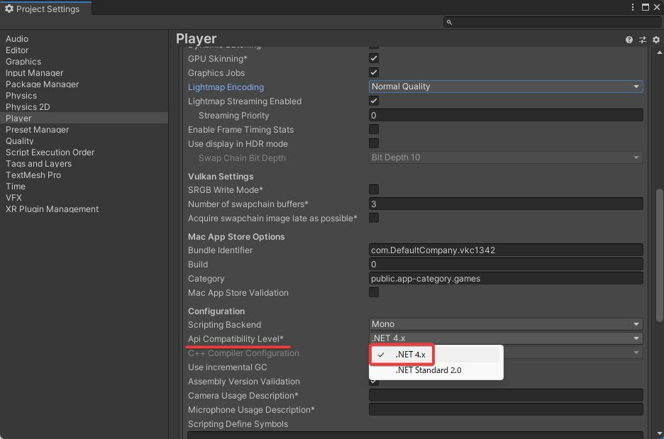
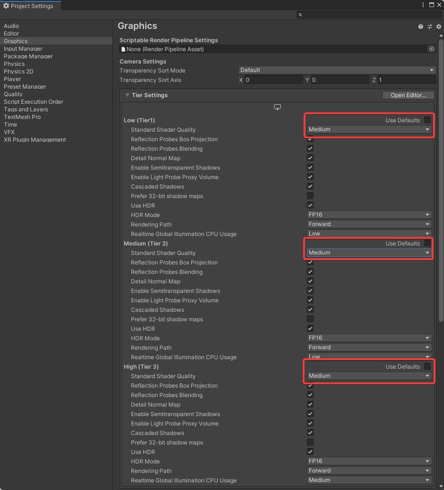

# VketCloudSDKの動作環境

VketCloudSDKは、以下のUnity環境が必要です。

- **Unity 2019.4.31f1** (SDK13.7.7以前)
- **Unity 2022.3.6f1** (SDK13.7.7以降)

* SDK13.7.7では両方のバージョンをサポートしています。

該当のUnityをお持ちでない方は[こちら](https://unity.com/releases/editor/archive){target=_blank}より対応バージョンをダウンロードしてください。

また、上記Unityバージョンを動作させるPC環境は以下を推奨します。

- Windows 10, 64-bit
- macOS 10.12+.

ならびに、VketCloudSDKでビルドしたワールドに入室する端末スペックは以下を推奨します。

- PC: Chrome / Firefox / Safari / Edge等のWebブラウザが使用できるもの。
- iOS: iPhone X以降、iPhone SE（第2世代）以降
- Android: Android 11.0以降、RAM 8GB以上（Google Pixelなら Pixel 5以降）
- IDE: HeliScriptを編集する際は Visual Studioは非推奨となり、Visual Studio Codeをご使用ください。

!!! note warning
Visual StudioでUnity VketCloudSDKで作成されたheliscriptを開き保存するとANSIになり、ビルドが出来なくなってしまう場合があります。

---

!!! note warning
    以下の項目は、SDKが自動で設定しますが、稀に設定が無効化されてしまう場合があります。
    その場合、手動で設定しなおしてください。

    **API Compatibility Level (API互換性レベル)の変更**

    1. UnityのメニューバーのEditからProject Settings...をクリックしてください。  

    2. Project Settingsウインドウが表示されたら、一覧からPlayerをクリックしてください。

    3. Project設定中にあるConfigurationを確認し、API Compatibility Levelの項目をプルダウンメニューから「.NET 4.x」に変更してください。

    

    **LightMapEncodingの変更**

    上記と同じくPC設定内のOther Settingsにある、Lightmap Encodingの項目をプルダウンメニューからNormal Qualityに変更してください。

    

    **Color Spaceの変更**
    
    Edit > Project SettingsよりColor SpaceをLinearに変更します。
    

    SDK Ver12.3以降は以下の設定も必須となりました：

    **StandardShaderの設定の変更**

    VketCloudの物理ベースレンダリングは、UnityのMediumレベルのものと同じアルゴリズム(GGX)を使用しているので、設定を揃える必要があります。

    1. Graphicsの設定画面の中で、「Tier Setting」の「Low (Tier 1)」の項目の中の「Use Defaults」のチェックを外し、「Standard Shader Quality」の項目を「Medium」 へと変更します。
      
      
    2. 上記を「Low(Tier 1)」の下にある「Medium(Tier 2)」、「High(Tier 3)」の3つの項目とも行います。
      