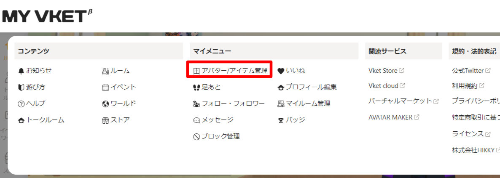
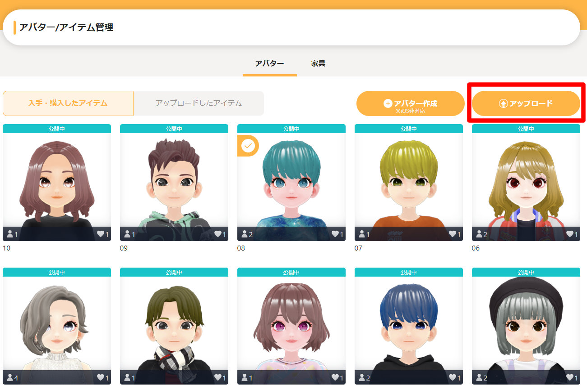
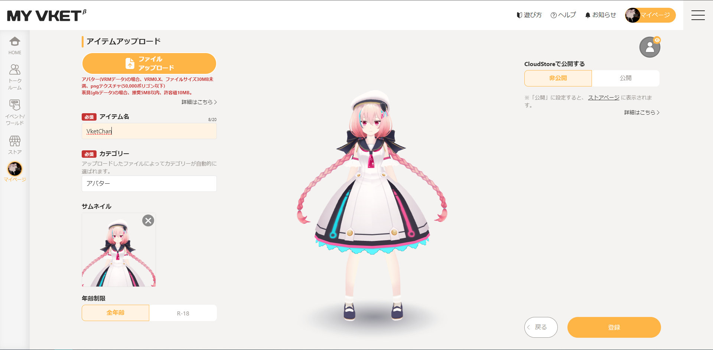

# アバターの使用方法

Vket Cloudでは、**①MyAvatarを使用する方法**と**②[ワールド内にプリセットアバターを追加する方法](../WorldMakingGuide/PresetAvatar.md)**の二つを提供しています。ここでは、MyAvatarを使用する方法について説明します。

1. My Vketのトップページ（[こちら](https://vket.com/){target=_blank}）よりログインします。

2. トップページ右上のメニューを展開し、「アバター/アイテム管理」を選択します。

3. 「アップロード」からVRMファイルをアップロードします。

4. アップロードページではアイテム名（アバター名）、サムネイル、カテゴリーなどを設定します。

5. ワールド一覧（[こちら](https://vket.com/world){target=_blank}）やSDKを使ったローカルビルドなどでワールドに入室します。

6. 入室後、設定メニューから「マイページ」を開き、「アバター」のメニューに先ほどアップロードしたアバターが表示されます。

7. アバターを選択すると、ワールドにアバターが反映されます。

!!! note tip
    Avatar Maker（[こちら](https://avatarmaker.vket.com/edit/){target=_blank}）を使用して自作VRMを作成することもできます。モデリングソフト等で作成が難しい方は、ぜひこちらのサービスをご利用ください。 
    また、ワールド内にて選択できるプリセットアバターを追加したい場合は[プリセットアバターを追加する](../WorldMakingGuide/PresetAvatar.md)をご参照ください。
