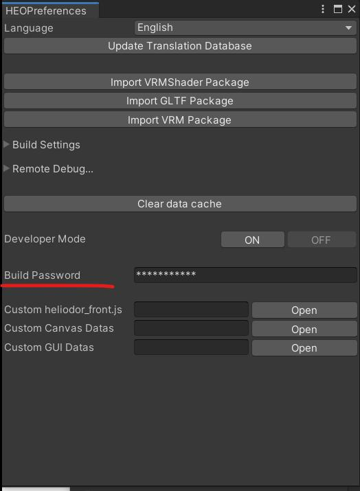

# **How ​​to install VketCloud SDK**

Install using Package Manager of Unity.
  
### Step 1. Open a project in Unity
---
Open a project of a supported version ([Unity Pre-prep](https://vrhikky.github.io/VketCloudSDK_Documents/3.1/Unity/OperatingEnvironment.html)) or create a new project.
Select "3D" as the template.
  
* Complete the pre-settings on the [Unity Pre-prep](https://vrhikky.github.io/VketCloudSDK_Documents/3.1/Unity/OperatingEnvironment.html) page.

* If you put a space in the project name, the build may fail.
OK) My Project NG) My Project
  
  
### Step 2. Configure Package Manager
---
Open the "Project Settings" window from the Unity menu Edit > Project Settings.
  
Select "Package Manager" from the left tab in the window and describe as follows.
  
| item | value |
| ---- | ---- |
| Name | VketCloud SDK |
| URL | https://registry.npmjs.com |
| Scope(s) | com.hikky.vketcloudsdk |

   
  Finally, press the "Save" button to save the settings.
    
  
  
### Step 3. Install VketCloudSDK package from Package Manager
---

  
Open the "Packages" window from Unity's menu Window > Package Manager.

Select "My Registries" from the dropdown at the top of the window.

   

Select VketCloudSDK from the displayed list and press the “Install” button to start the installation.
  

Installation is complete if the item "VketCloudSDK" is added to the Unity menu.

   

### Step 4. Register Pass
---

Unity menu VketCloudSDK>Preferences

Enter the password in the "buildpassword" field
*The password is described in "Build Lock Password" on [My Page](https://lab.vketcloud.com/en/mypage/sdk/).
   　　

Installation is now complete. Conglatulations!