# How to install Vket Cloud SDK

To install the Vket Cloud SDK, the Unity Package Manager and the Vket Cloud SDK install wizard is required.
  
## Step 1. Open a project in Unity

Open a project created using a supported Unity version ([Unity Pre-prep](OperatingEnvironment.md){target=_blank}) or create a new project.
Select "3D" as the template.

!!! caution "Notes about project names and path (directory) names"
    If a space is included in the project / project path (directory) name, it may cause build errors and other unexpected issues.  
    Also avoid using full-width characters such as CJK characters.

    OK) MyProject　　NG) My Project , マイ　プロジェクト

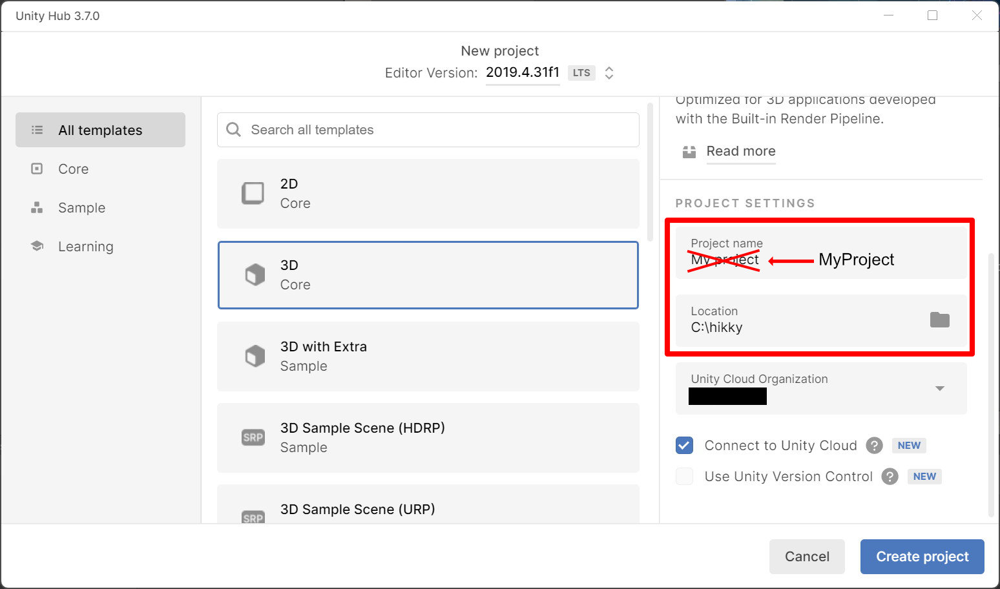

---

## Step 2. Register Registry information

!!! note caution
    On the release of Version 9.3, the SDK installation registry has been changed to the install wizard. 
    If you want to install the install wizard on an existing project, you **must** create a new registry by selecting "+", and **do not overwrite** the existing SDK registry. 
    After installing the install wizard, proceed to [Installing a specified version / Updating an existing SDK](#installing-a-specified-version-updating-an-existing-sdk).

Open the "Project Settings" window from the Unity menu Edit > Project Settings.
  
Select "Package Manager" from the left tab in the window and describe as follows.
  
| item | value |
| ---- | ---- |
| Name |Vket Cloud SDK Install Wizard|
| URL |https://registry.npmjs.com|
| Scope(s) |com.hikky.VketCloudSDK-install-wizard|  

Finally, press the "Save" button to save the settings.
  
!!! note
    If the registry contains a space or any unneeded characters, the error below may appear. 
    If the error appears, please check if a space is contained by mistake.

---

## Step 3. Install the Vket Cloud SDK Install Wizard via Package Manager
  
Open the "Packages" window from Unity's menu Window > Package Manager.

Select "My Registries" from the dropdown at the top of the window.

Select the Vket Cloud SDK Install Wizard from the displayed list and press the “Install” button to start the installation. 

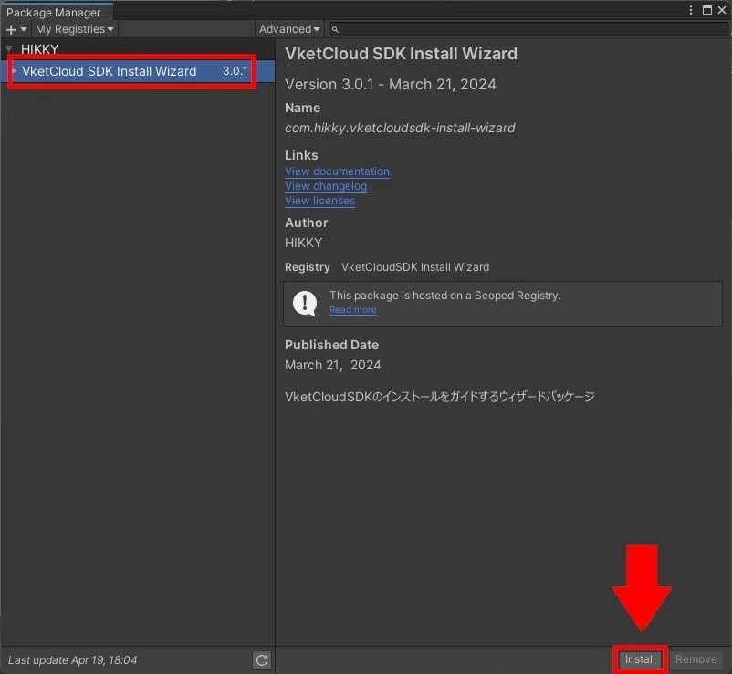

Installation is complete if the window and Unity menu is displayed as below:

If the project path contains a space or full-width characters, the following warning will appear at startup.

## Step 4. Install the SDK using the Vket Cloud SDK Install wizard

To install the SDK on a new project, use the SDK Install Wizard.

1\. Use the wizard window opened by the above steps, or select the SDK Installation Wizard on the Unity menu.

By opening the Install Wizard, the window will appear as below.

2\. Select the "Next" button to select the preferred language. This language will be used throughout the Installation Wizard.

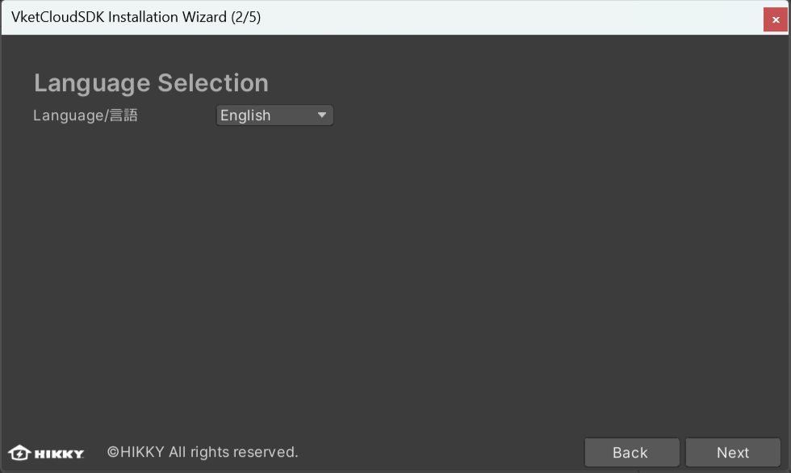

3\. The window for setting the recommended initial settings will appear. Complete all four settings to proceed.

If Unity 2019 is installed, complete the following settings:

If Unity 2022 or later is installed, complete the following settings

### Setting Standard Shader Quality

!!! caution "Setting Standard Shader Quality"
    On Ver12.3 and later versions, setting the standard shader quality has been added as a required setting. 
    If not set the SDK will cause a build error, so make sure to set on install.

The physically based rendering on Vket Cloud uses the same algorithm (GGX) as Unity's Medium level, so you will need to make some changes in the settings.

1. Click Project Settings... from Edit in the Unity menu bar  

1. Open Edit/ProjectSettings/Graphics

  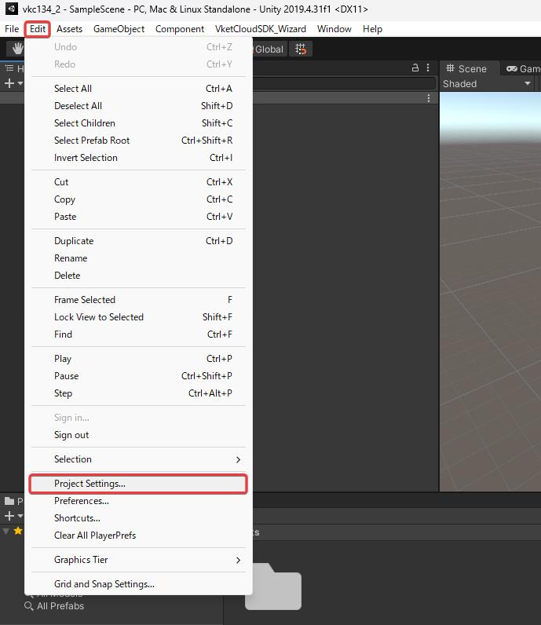

2. Once the Project Settings window opens, in the Graphics settings tab, under "Tier Settings," uncheck "Use Defaults" for the "Low (Tier 1)" option, and change the "Standard Shader Quality" setting to "Medium."

  

3. Repeat the process for "Medium (Tier 2)" and "High (Tier 3)" options located below "Low (Tier 1)."

  

### Setting Color Space

From Edit >Project Settings, set the  Color Space as Linear.

  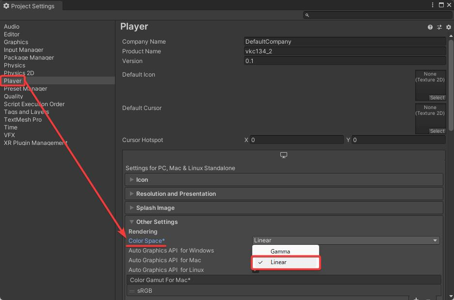

### Setting LightMap Encoding

Likewise above, check the Configuration in the Project Settings and change the Lightmap Encoding to "Normal Quality" from the pull-down menu.

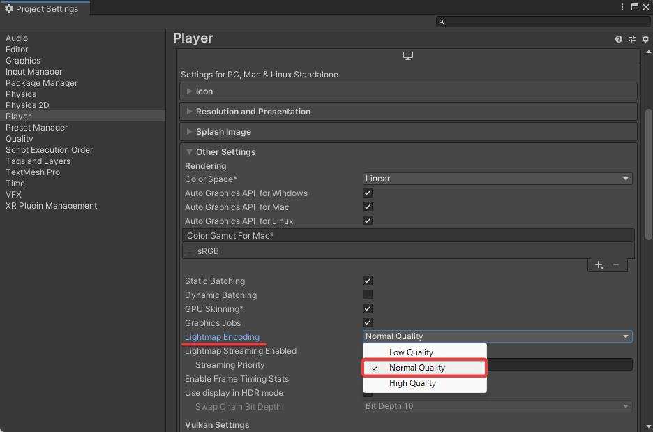

### Setting API compatibility level (Only for Unity 2019.4)

!!! note caution
    For Unity 2022 or later, this setting is not required.
    SDK 13.7 and later versions support both Unity 2019 and Unity 2022.

1. When the Project Settings window appears, click Player from the list.  

2. Check the Configuration in the Project Settings and change the Api Compatibility Level to ".NET 4.x" from the pull-down menu.

---

4\.  By finishing each setting, a check mark will appear on each article.    By ignoring the settings and selecting the "Next" button, a window of warning will appear.

  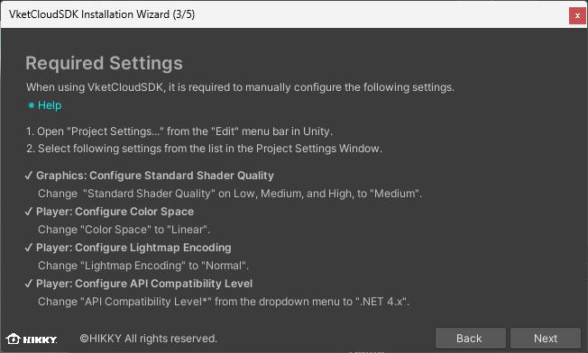

5\. By selecting "Next", the version selection window will appear.  The SDK version can be chosen from stable, latest, archive versions.

!!! note caution
    The archive versions are deprecated and planned to be unaccessible in the near future. 
    Do not use these versions for setting up new world projects.

  

6\. After selecting version and proceeding by selecting the "install" button, the package import will begin.

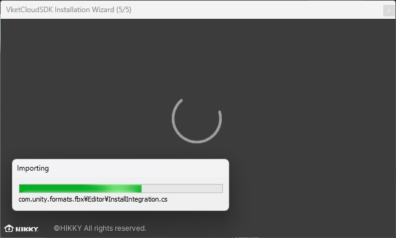

7\.　After waiting approx. 2~5 minutes, the installation will be completed with the window below. 
The SDK manual and community discord server can be accessed from this window.

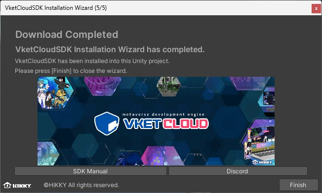

8\. In the Unity menu, click on "Login" under the "Vket Cloud SDK" item. 
A Web browser will open automatically.

9\. Log in to your Vket account through the web browser, then click the "Open Unity Editor" button.

!!! warning "After installing the SDK, error CS0234: 'EditorCoroutines'"
    In some cases, due to a Unity issue, the EditorCoroutines package that the SDK depends on may not be installed correctly. If this occurs, we kindly ask you to install the EditorCoroutines package manually. Open the Package Manager, select "Unity Registry," and enter "EditorCoroutines" in the search box. Install the package that appears, and this should resolve the issue.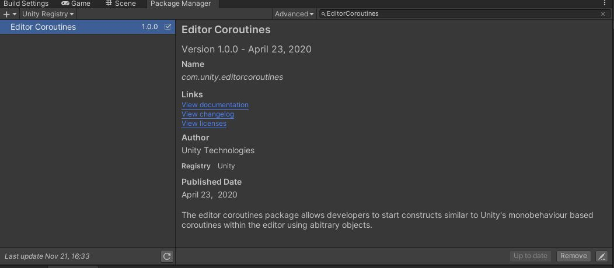

## Installing a specified version / Updating an existing SDK

For a project with an existing SDK, the SDK Version Manager can be used for switching and updating SDK versions. 

### Version switch via SDK Version Manager

1\. By selecting VketCloudSDK_Wizard > SDK Version Manager, the version selection window will appear.

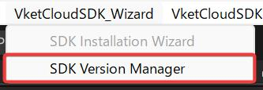

2\. Select the new version to be installed, and press the "Install" button.

!!! note caution
    The archive versions are deprecated and planned to be unaccessible in the near future. 
    Do not use these versions for setting up new world projects.

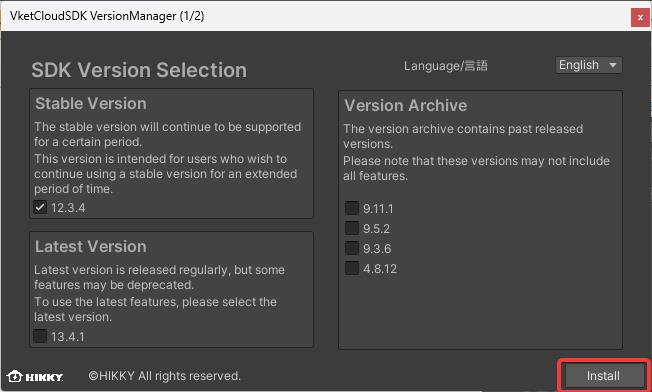

3\. By selecting the install button, the import window will appear as below.

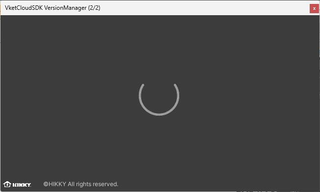

4\. As the installation is completed, the version completion window will appear as below.

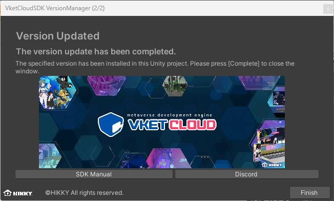

The SDK manual and community discord server can be accessed from this window.

!!! note caution
      On updating an existing SDK, Components may be gone missing after the update. 
      We strongly recommend to take a backup of the pre-update project by duplicating files.

!!! note caution
    If issues such as build errors appear on updating the SDK, please refer to the page below: 
    [Version Update Troubleshooting](../troubleshooting/VersionUpdateTroubleshooting.md)

!!! note caution
    The version switching methods below remains to be usable, using the version manager is recommended.

### Version switching via Package Manager

After registering the registry information on [Step 2.](#step-2-register-registry-information), open the Package Manager via "Window" --> "Package Manager". 
In the Package Manager, make sure that the Vket Cloud SDK shows up on switching the registry view to "My Registries". 

On selecting "See all versions", all released SDK versions will be listed. 
Select the SDK version to be installed, then proceed by selecting the "Install" or "Update to [Version]" on the bottom right to install the SDK.

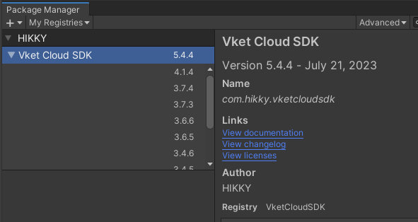

### Version switching via manifest.json

Editing the manifest.json is also available for switching versions. 
To open the project's manifest.json, right click on the Project window and select "Show in Explorer", which enables to locate the file in "Projects"-->[Project Name]-->"Packages".

By editing the version number on the right side of `"com.hikky.VketCloudSDK"`, the installing / updating version will be switched.

!!! caution "Solution to Vket Cloud SDK not showing on Unity menu"
      If Vket Cloud SDK fails to show on the Unity menu, it may appear by rebooting the editor. 
      One of the reasons may be the lack of essential SDK packages, as the Deeplink package may fail to be imported automatically. 
      If such cases occur, please try a [manual package import](../troubleshooting/InstallingDeeplink.md). 

      As the EditorTutorialSystem may also rarely fail to be imported automatically, add the package below following the instructions on [Step 2.](#step-2-register-registry-information) on such occurence.

|  item  |  value  |
| ---- | ---- |
|  Name  |  EditorTutorialSystem  |
|  URL  |  https://registry.npmjs.org  |
|  Scope(s)  |  com.hikky.editortutorialsystem  |
