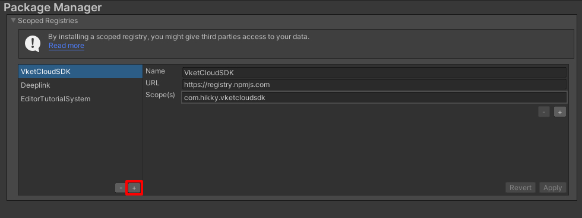
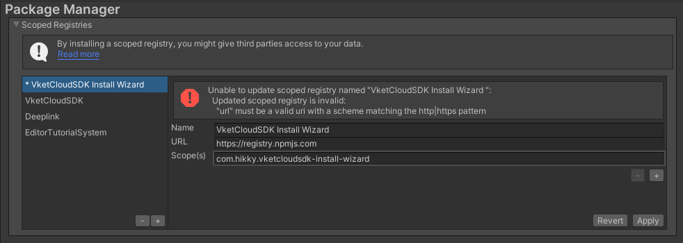
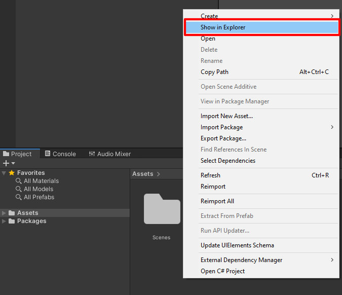

# VketCloudSDKの導入方法

VketCloudSDKをインストールするには、はじめにUnityのPackage Managerを使用し、SDKインストールウィザードを導入します。  

## Step 1. Unityでプロジェクトを開く

対応しているバージョン（[動作環境](OperatingEnvironment.md){target=_blank}）のプロジェクトを開く、またはプロジェクトを新規作成します。テンプレートを使用する場合は「3D」を選択してください。

!!! caution "プロジェクト名・プロジェクトパスの名前について"
    プロジェクト名およびプロジェクトディレクトリにスペースを入れるとビルドに失敗する場合があります。 
    また、日本語など2バイト文字の使用も避けることをおすすめします。

    OK例) MyProject　　NG例) My Project , マイ　プロジェクト

---

## Step 2. レジストリ情報を登録する  

!!! note caution
    Version 9.3リリース以降、VketCloudSDK導入時に入力するレジストリがインストールウィザードのものに変更となりました。 
    既存のプロジェクトにインストールウィザードを導入する際は**必ず**「+」ボタンを選択して新規のレジストリを追加し、SDKのレジストリを上書きしないようご注意ください。 
    インストールウィザードをインストールした後、[任意のバージョンの導入・既存バージョンSDKのアップデート](#sdk)に移行してください。

Unityのメニュー Edit > Project Settings から「Project Settings」ウィンドウを開きます。ウィンドウ左側のタブから「Package Manager」を選択し、以下のように記載します。  
  
|  項目  |  値  |
| ---- | ---- |
| Name |VketCloudSDK Install Wizard|
| URL |https://registry.npmjs.com|
| Scope(s) |com.hikky.vketcloudsdk-install-wizard|  

   

  最後に「Save」ボタンを押して設定内容を保存します。

!!! note
    上記レジストリをコピー&ペーストした際にスペース等不要な文字が含まれている場合、以下のようなエラーが出る場合があります。 
    以下のエラーが出現した際はスペースが含まれていないかご確認ください。

---

## Step 3. Unity Package ManagerよりSDKインストールウィザードをインストール

Unityのメニュー Window > Package Manager から「Packages」ウィンドウを開きます。ウィンドウ上部のドロップダウンより「My Registries」を選択します。

   

表示されたリスト内から VketCloudSDK Install Wizard を選択し、「Install」ボタンを押してインストールを開始します。 

Unityに以下のインストールウィザード画面とメニュー表示がされれば導入は完了です。

## Step 4. インストールウィザードを使用してSDKをインストールする

新規にSDKをインストールする際はSDKインストールウィザードを使用します。

1\. Unityのメニューから SDK Installation Wizardを選択します。

    インストールウィザードを開くと、以下の画面が起動します。

2\. 「次へ」ボタンを押して、言語設定画面に移動します。言語設定画面でWizard内で使用する言語を設定できます。

3\. VketCloud SDKの初期設定をガイドする画面です。主に三つの設定を完了させてください。 初期設定しないことも可能ですが、その場合、SDKの動作保証はできません。

### API Compatibility Level (API互換性レベル)の変更

1. UnityのメニューバーのEditからProject Settings...をクリックしてください。  

2. Project Settingsウインドウが表示されたら、一覧からPlayerをクリックしてください。

3. PCの設定中にあるConfigurationを確認し、API Compatibility Levelの項目をプルダウンメニューから「.NET 4.x」に変更してください。

### LightMapEncodingの変更

上記と同じくPC設定内のOther Settingsにある、Lightmap Encodingの項目をプルダウンメニューからNormal Qualityに変更してください。

### Color Spaceの変更

Edit > Project SettingsよりColor SpaceをLinearに変更します。

4\. 設定が完了されるとそれぞれの設定項目の左にチェックマークが表示されます。 設定されない状態で「次へ」ボタンを押すと以下警告画面が表示されます。

5\.「次へ」ボタンを押すと、バージョン選択画面が表示されます。 安定版、最新版、バージョンアーカイブからバージョンを選択できます。

!!! note caution
    バージョンアーカイブ内のバージョンは廃止が予定されております。 新規のワールド制作には使用しないようご注意ください。

6\. バージョンを選択し、インストールボタンを押すとパッケージのインポートが開始します。

7\.　およそ２～５分待つと、インストールが完了して以下の画面が表示されます。この画面からSDKマニュアルやコミュニティDiscordサーバーへとアクセスできます。

## 任意のバージョンの導入・既存バージョンSDKのアップデート

既にSDKを導入しているプロジェクトについては、SDKバージョンマネージャーを使用してバージョンの切り替え・アップデートが可能です。 

### SDK Version Managerによるバージョン切り替え

1\. VketCloudSDK_Wizard > SDK Version Managerを押して、バージョン選択画面が表示されます。

2\. バージョン選択画面でバージョンを選択し、インストールボタンを押してください。

!!! note caution
    バージョンアーカイブ内のバージョンは廃止が予定されております。 新規のワールド制作には使用しないようご注意ください。

3\. インストールボタンを押すと、インポート画面に移動します。

4\. インストールが完了すると、バージョン選択完了画面が表示されます。

この画面からSDKマニュアルやコミュニティDiscordサーバーへとアクセスできます。

!!! note caution
      既存のSDKのバージョンアップを行う際、アップデート後にComponentが欠落する現象が確認されています。 
      バージョンアップを行う際はプロジェクトの複製などによってバージョンアップ前の状態のバックアップを取ることを強くおすすめします。

!!! note caution
    SDKアップデート後にビルドエラー等の不具合が発生する場合は以下のページをご確認ください。
    [バージョンアップ後によくあるトラブル](../troubleshooting/VersionUpdateTroubleshooting.md)

!!! note caution
    以下にて解説しているPackage Managerあるいはmanifest.jsonの編集によるバージョン切り替えは引き続き利用可能ですが、基本的にはSDKバージョンマネージャーの利用を推奨します。 

### Package Managerによるバージョン切り替え

Step 2.にてレジストリ情報を登録した後、「Window」-->「Package Manager」からPackage Managerを開きます。 
Package Managerではレジストリ表示を"My Registries"に切り替え、VketCloudSDKが表示されることを確認します。 

ここで"See all versions"を選択すると、現在リリースされているバージョンの一覧が表示されます。 
インストールしたいバージョンを選択し、ウィンドウ右下の"Install"または"Update to [任意のバージョン]"を選択するとSDKがインストールされます。

### manifest.jsonによるバージョン切り替え

バージョンの切り替えはmanifest.jsonを直接編集することでも可能です。 
プロジェクトのmanifest.jsonを開くには、Projectウィンドウにて右クリックした上で"Show in Explorer"を選択し、「Projects」-->[任意のプロジェクト]-->「Packages」から開きます。

manifest.json内の`"com.hikky.vketcloudsdk"`の右側を使用したいバージョンに書き換えると、インストール時(インストール済みの場合は読み込み時)のバージョンが切り替わります。

!!! caution "UnityメニューにてVketCloudSDKが表示されない場合は"
      UnityのメニューにVketCloudSDKが表示されない場合は、再起動すると表示される場合があります。 
      上記の原因の一つであるSDK付随のDeeplinkパッケージが自動インポートされない現象が発生した場合は[手動での導入](../troubleshooting/InstallingDeeplink.md)をお試しください。

      また、稀に必須パッケージであるEditorTutorialSystemも自動インポートされない場合があるため、その際はStep 2.と同じ手順で以下のパッケージを導入してください。

|  項目  |  値  |
| ---- | ---- |
|  Name  |  EditorTutorialSystem  |
|  URL  |  https://registry.npmjs.org  |
|  Scope(s)  |  com.hikky.editortutorialsystem  |
