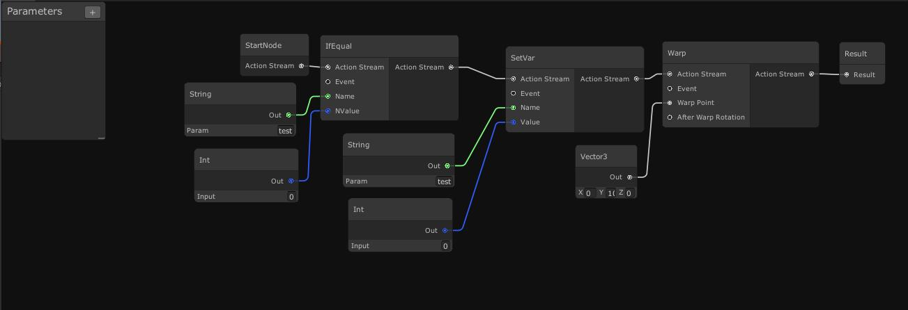
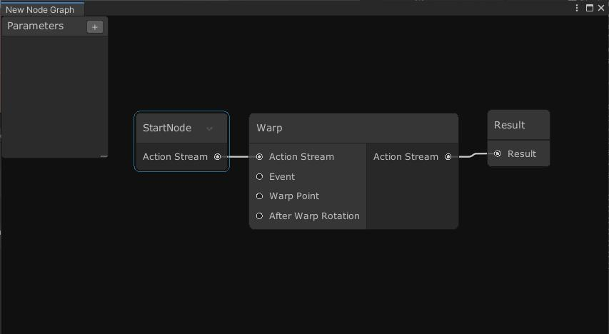
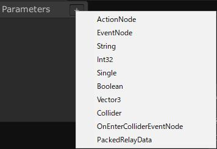
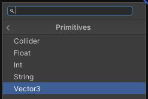
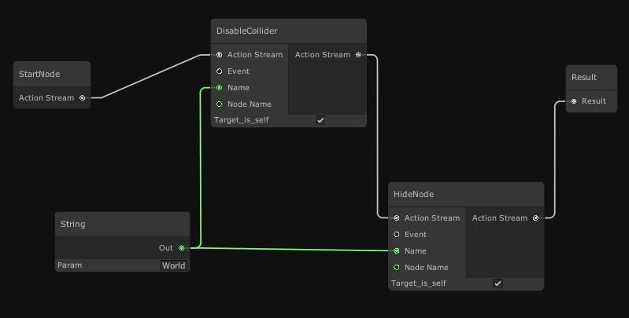
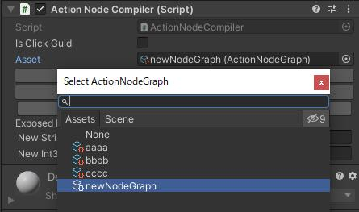

# ActionNodeGraph

ActionNodeGraphの使用方法について、解説します。 
※この機能はβ機能です。お気づきの点がございましたら、お問い合わせにてご連絡いただけますと幸いです。

## 概要

本コンポーネントは[VKC Attribute Action Trigger](../../VKCComponents/VKCAttributeActionTrigger.md)の代替として使用できるコンポーネントです。 
HEOActionTriggerと比べ、

- アクションをノードで視覚的に管理することが可能
- アクション実行順の変更が容易
- 別オブジェクトにアクションリストを容易に移植可能

といった特徴があります。

## 使用方法

①クリック時にアクションを実行したいオブジェクトにActionNodeCompilerをアタッチします。 
 
 
②"Create New Action Graph"を選択し、ActionNodeGraphを作成します。 
クリックすると保存画面が立ち上がるので、お好きな名前を付けて保存してください。 
 
 
③Openをクリックすることで、ノードグラフ編集画面が立ち上がります。 
初めからStartNode、Resultの2ノードが入っています。 
 
 
④右クリックで"Create Node"を選択することで新しいActionNodeGraphを作成することができます。 
 
 
 
Create Node > Actionsにアクションノードが入っています。 
上部の検索枠から検索することもできます。 
 
⑤Start NodeからResultまでAction Streamを接続します。 
 
StartNodeのAction StreamからアクションノードのAction Streamへノードを繋ぎます。 
○をクリックしたまま接続先のノードへドラッグ&ドロップすることで接続可能です。 
Start NodeからResultまでの間にあるノードが実際に発生するアクションの対象となります。 
 
接続を削除する場合、 
 
1.接続している線をクリック 
2.Deleteキーを押す 
 
ことで可能です。 
接続先を変更する場合にお使いください。 
 
ノードを削除する際は、 
削除したいノードを選び、Deleteを選択します。 
 
⑥左上Parametersタブで変数を作成することができます。 
 
「+」ボタンをクリックすることで、作成する変数の種類を選択できます。 
 
 
作成すると上記のようなノードが生成されます。 
作成した変数はInspector上で値を設定することができます。 
"Hide in Inspector"にチェックを入れるとInspector上で非表示となります。 
 
 
右クリックで変数の改名、削除ができます。 
 
変数はノード空間にドラッグ&ドロップし、対応する○に繋げることで使用可能です。 
 
 
■例：HEO Object名"music"の1番目のアニメーションを再生する(再生は1度きり)　を作る場合■ 
 
 
"music"をString型の変数で、"1"をint型の変数で作ります。 
 
IfequalのNameに"music"、NValueに"1"を接続します。 
これで、「musicの中身が1の場合、先の処理を発生させない」処理が完成します。 
 
PlayItemのNameに"music"、Indexに"1"を接続します。 
これで、「HEO Object"music"のIndex番号"1"に登録されたアニメーションを再生する」処理が完成します。 
 
SetVarのNameに"music"、Indexに"1"を接続します。 
これで、「変数musicの中身を1にする」処理が完成します。 
 
初回はPlayItem以降の処理が発生しますが、2回目以降はSetVarにより変数musicの中身が1となっているため、 
IfEqual以降の処理が発生しません。 
 
変数ノードは複数のノードにつなぐことが可能なので、同じ数にしたい箇所に接続することで管理が容易になります。 
 
Primitivesタブ内には、ノード空間上で編集できる変数を作成することができます。 
 
 
Parameter上で作成する変数と同様の使い方をすることができます。 
 
 
## Tips
 
①Target_is_selfについて 
一部のアクションノードには"Target_is_self"というチェックボックスがついています。 
これにチェックを入れることで、動作の対象をActionNodeCompilerがアタッチされたオブジェクト自身にすることができます。 
 
例：クリックされたときに非表示にする 
 
 
クリックした際に非表示となるオブジェクトを複数個用意する際、 
HEOActionTriggerであれば1つ1つ当たり判定と表示を消す対象を変更する作業が必要がありますが、 
この例の場合、NodeNameの部分にActionNodeCompilerがアタッチされたオブジェクトが自動で入るため、 
ActionNodeCompilerにこのActionNodeGraphをアタッチしたものを非表示にしたいオブジェクトにアタッチするだけで、 
当たり判定と表示を変更する作業を行うことなく実装することができます。 
 
②ActionNodeGraphの切り替え 
ActionNodeGraphではアクションリストを保存することができます。 
 
ActionNodeCompilerのAssetでActionNodeGraphを選択することができます。 
HEOActionTriggerでは困難なアクションリストの変更を容易に行うことができます。 