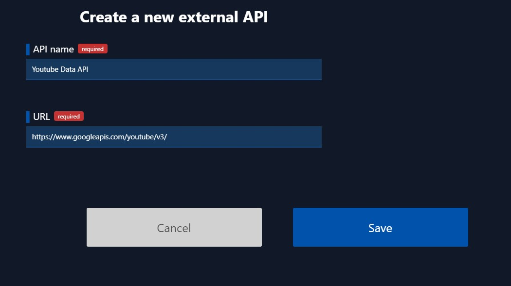
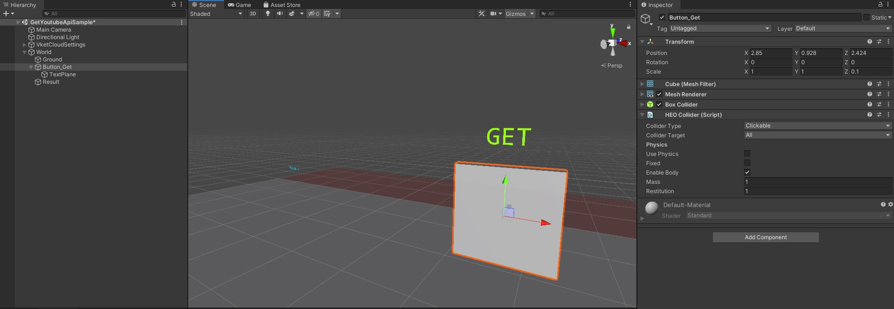
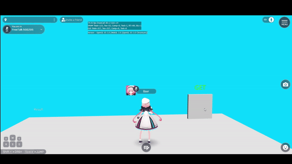

# About Broker API

The Broker API is an API feature for Vket Cloud, which is intended to register external APIs to an allowlist and verify the connection inside Vket Cloud worlds.

!!! caution "API feature schedules"
    On SDK Ver12.3.4, the Broker API is currently available only for GET requests.<br>
    Other features such as POST, PUT, and DELETE are scheduled to be enabled on future updates.

## How to Use

!!! caution "External API feature availability"
    The external API feature is currently under open test for Vket Cloud developer community members.<br>
    If you wish to try this feature, join the [Vket Cloud Community Discord](https://discord.com/invite/vsFDNTKdNZ){target=_blank} and obtain a "Developer Community" role in the [Roles channel](https://discord.com/channels/900943744575103017/1178589689393975317){target=_blank}.<br>
    In the developer community, instructions for allowlisting API and other new updates will be announced. Feel free to join us!

1\. Add an external API to the allowlist located in the Vket Cloud official website.

Login to the [Vket Cloud official website](https://cloud.vket.com/){target=_blank}'s MyPage, and move to the external API list page.<br>
This page will show the allowlist of external APIs for the Broker API.


Select **Add external API** to register the name and URL of API to be used. <br>
The API name can be named at choice, and the URL should be designated according to the using API. Select save to confirm edit.<br>
As an example, the [Youtube Data API](https://developers.google.com/youtube/v3/getting-started?hl=ja){target=_blank} is registered as below to be used in the later mentioned sample code.



To use an external API, authorization such as API keys must be setup and obtained beforehand.

2\. Setup a world, and create a HeliScript to call the API using [JsVal](JsVal.md).

As an example, a [cube for receiving player clicking](../VKCComponents/VKCNodeCollider.md) and [TextPlane](../VKCComponents/VKCItemTextPlane.md) for showing API results are placed as below:




Also, a HeliScript for displaying a Youtube Data API search result on the TextPlane when a designated cube is clicked is described as below.

This script must be attached to the World object using [VKC Attribute Script](../VKCComponents/VKCAttributeScript.md).


```c#
delegate void fJsValCallback(JsVal); //Method for callback
extern api.broker //declaration to call a Broker API method
{
    bool registerAgreement(string url, string spatiumCode, string worldCode, string guestUuid);
    bool connectExternalApi(async fJsValCallback, string method, string url, string spatiumCode, string worldCode, string guestUuid, JsVal data);
}
extern console
{
    void log(JsVal); //For checking JsVal content. Can be viewed on the browser console
}
component BrokerAPI
{
    Item thisItem;// Item which BrokerAPI component is allocated
    Item resultTextPlane;//TextPlane to show results 
    //Constants
    const string GET_SWITCH_NAME = "Button_Get";// Name of GameObject which will be clicked by the player in world
    const string API_URL = "https://www.googleapis.com/youtube/v3/search";//URL for API access and confirmation dialog
    const string YOUTUBE_API_KEY = "XXXXXXXXXXXXXXX";//API key for the youtube API
    const string SPATIUM_CODE = "Default";//this value should be Default unless explicitly changed by worldsettings
    const string SEARCH_WORD = "VketCloud";//Word to be searched by API
    const int MAX_RESULTS = 10;//number of search results to be obtained
    const string RESULT_ITEM_NAME = "Result";//Name of TextPlane to show the obtained search results. May cause text corruption if FontSize value is enlarged on Ver12.3
    //----------------------------------------
    public BrokerAPI()
    {
        //Get the Item where BrokerAPI.hs is allocated.
        //The BrokerAPI.hs must be allocated by a VKC Attribute Script component, which should be added to the Field where the button GameObject mentioned by GET_SWITCH_NAME exists
        thisItem = hsItemGetSelf();
        resultTextPlane = hsItemGet(RESULT_ITEM_NAME);
    }
    public void OnClickNode(int NodeIndex)
    {
        string clickedNodeName = thisItem.GetNodeNameByIndex(NodeIndex);//Get the Node name of the object clicked by player
        switch (clickedNodeName)
        {
            case GET_SWITCH_NAME://Button for calling GET API
                if(!hsCommonDialogIsOpened())
                {
                    ComfirmApiAccess();
                }
                break;
            default://else
                hsSystemWriteLine("Unregistered NodeName:" + clickedNodeName);
        }
    }
    void ComfirmApiAccess()//Setup and display a common dialog to get API access permission from the player

        //See the manual below for details about common dialog *English version WIP        
        //https://vrhikky.github.io/VketCloudSDK_Documents/latest/en/hs/hs_system_function_commondialog.html#hscommondialogsettitle
        hsCommonDialogSetUseTitle(true);//Show title
        hsCommonDialogSetUseYesNoButton(true);//Set a YES/NO button
        if(hsIsLangJA())//If browser language is Japanese *Use hsIsLangEN() to explicitly implement texts in EN browser
        {
            hsCommonDialogSetTitle("Youtube検索");//Title of dialog
            hsCommonDialogSetText(API_URL + "\nにアクセスします。よろしいですか?");//Main text *meaning: Are you sure you want to access to API_URL?
        }
        else // For EN browser
        {
            hsCommonDialogSetTitle("Youtube Search");//Title of dialog
            hsCommonDialogSetText("Do you allow access to \n" + API_URL);//Main text
        }
        hsCommonDialogSetTextAlignment(HSAlignLM);//Alignment of main text. Aligned to right middle
        hsCommonDialogSetTextOverflowWrap(true);//Set text wrapping
        hsCommonDialogSetTextURLClickable(false);//Disable clicking on URL
        hsCommonDialogSetYesButtonText("YES");//Set text for YES button
        hsCommonDialogSetNoButtonText("NO");//Set text for NO button
        hsCommonDialogSetYesButtonDelegate(YesButtonCallback);//Run YesButtonCallback if YES button is clicked
        hsCommonDialogSetNoButtonDelegate(NoButtonCallback);//Run NoButtonCallback if NO button is clicked
        hsCommonDialogOpen();//Open dialog
    }
    void NoButtonCallback()//Run this is NO button is clicked
    {
        hsCommonDialogClose();//Close common dialog
    }
    void YesButtonCallback()//Run this is YES button is clicked
    {
        APIGetTest();
        hsCommonDialogClose();
    }
    void APIGetTest()//GET search results from youtube
    {
        hsSystemWriteLine("APIGetTest");
        string url = GetAPIUrl();
        string worldID = hsGetCurrentWorldId();

        //For future implementations, uuid must be obtained here if player is a guest. Constant value is used for now
        /*
        string SelfUserType = GetSelfUserType();
        string guestUuid = GetSelfGuestUuid();

        //Terminate if guest does not have a uuid, or SelfUserType is empty. This may happen when world is running on a local host.
        if (guestUuid == "" && SelfUserType == "guest" || SelfUserType == "")
        {
            hsSystemWriteLine("UserInfoError");
            return;
        }
        */
        string guestUuid = "Uuid";

        //Register the allowlisted URL
        bool result = api.broker.registerAgreement(url, SPATIUM_CODE, worldID, guestUuid);
        BoolLogOutput("registerAgreement: ",result);// see the result of agreement procedure in log

        string method = "get";//HTTP request method. GET is used for this method.
        JsVal data = makeJsNull();//JsVal for 7th argument in connectExternalApi. Null value is allowed for GET

        //Connect to API. Returned data will be entered to the method designated in 1st argument
        api.broker.connectExternalApi(GetCallback, method, url, SPATIUM_CODE, worldID, guestUuid, data);
    }
    string GetAPIUrl()
    {
        string apiUrl = API_URL;//API URL
        apiUrl += "?key=" + YOUTUBE_API_KEY;//Designate API key
        apiUrl += "&part=snippet";
        apiUrl += "&type=video";//Designate type to search
        apiUrl += "&q=" + SEARCH_WORD;//Enter the search word after "="
        apiUrl += "&maxResults=" + MAX_RESULTS.String();//Designate number of search results
        return apiUrl;
    }
    void BoolLogOutput(string logStr, bool flag)
    {
        string resultStr = flag ? "true" : "false";
        hsSystemWriteLine(logStr + resultStr);
    }
    string GetSelfGuestUuid()
    {
        //For future implementations, uuid must be obtained here if player is a guest. Constant value is used for now
        string guestUuid = "Uuid";
        return guestUuid;
    }
    string GetSelfUserType()
    {
        string SelfUserType = "";//Set an empty string as method to obtain UserType is not public 
        return SelfUserType;
    }
    void GetCallback(JsVal data)//Process search result from youtube
    {
        hsSystemWriteLine("GetCallback");
        console.log(data);//log to see content of JsVal
        string outputText = "";
        if (!IsDataValid(data)) return;//Check if data is valid

        int resultsPerPage = data.GetProperty("data").GetProperty("data").GetProperty("pageInfo").GetProperty("resultsPerPage").GetNum();//Get number of results
        for (int i = 0; i < resultsPerPage; i++)//Put video titles to outputText
        {
            string title = data.GetProperty("data").GetProperty("data").GetProperty("items").At(i).GetProperty("snippet").GetProperty("title").GetStr();
            //hsSystemWriteLine(title);
            outputText += title + "\n";
            if (i != resultsPerPage - 1) outputText += "\n";
        }
        resultTextPlane.WriteTextPlane(outputText);
    }
    bool IsDataValid(JsVal data)
    {
        bool result = true;
        if (data.IsNull())
        {
            result = false;//false if data is null
            hsSystemWriteLine("Data is Null");
        } 
        string status = data.GetProperty("status").GetStr();
        if (status == "ng")
        {
            //false if status is ng. This may happen when world is running on a local host
            result = false;
            hsSystemWriteLine("Data is NG");
        }
        return result;
    }
}
```

3\. Upload the world data to see if API operates as intended.

!!! warning "Testing BrokerAPI implementations"
    By feature, BrokerAPI will not function on local **Build And Run** results.<br>
    To test the function, please upload the world data (in private if needed), and access the uploaded world.<br>
    For instructions on how to upload the world data, please refer to [World upload](../FirstStep/WorldUpload.md).


