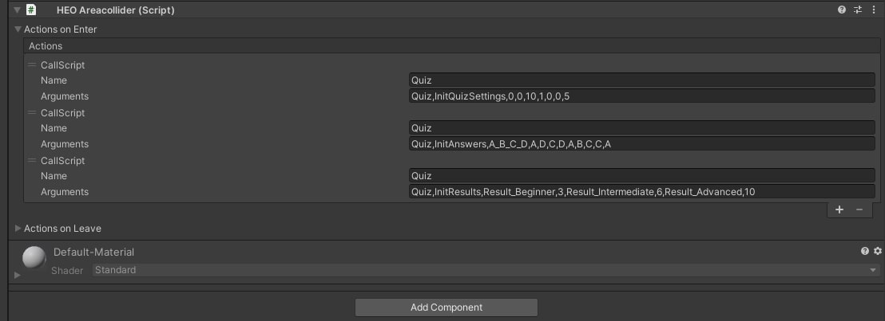

# About the Split Function  

The Split function has been available as a standard feature of the String type in HeliScript since Lib10.0.  

If you want to use the Split function in earlier versions, please open the section below and use the provided method.  

When executing a CallScript and registering multiple variables in the parameter, you can use the Split function below to divide them into a list. By selecting each item by its index and assigning it to variables, you can increase the number of variables configurable in Unity.  

Additionally, it becomes easier to set variables according to their respective roles. (The example screenshot shows variables being split using a comma `","`.)  

  

```
// Splits the first argument string using the second argument character and returns a list.
    public list<string> Split(string str, string separator)
    {
        list<string> result = new list<string>();
        int startIndex = 0;
        int separatorIndex = str.IndexOf(separator);
        if(str.IndexOf(separator) == -1)
        {
            result.Add(str);
        }
        else
        {
            while (separatorIndex != -1)
            {
                result.Add(str.SubString(startIndex, separatorIndex - startIndex));
                str = str.SubString(separatorIndex + 1, str.Length() - separatorIndex + 1);
                separatorIndex = str.IndexOf(separator);
                if(separatorIndex == -1)
                {
                    result.Add(str.SubString(startIndex, separatorIndex - startIndex));
                    break;
                }
            }
        }          
        return result;
    }
```