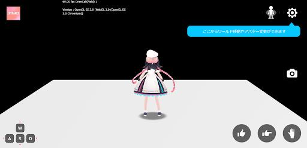

# How to build
We will explain how to build a scene.

## Build and Run
To build a scene with VketCloudSDK, make sure you have placed the [required components](WorldBasicComponents.html) and initiate the build from VketCloudSDK > Build And Run.
  

!!! note question "If you can't build"
     Please try the following.

     - VketCloudSDK > Clear Cache

     There may be various other reasons for build failures. If the error persists, please refer to [Troubleshooting](../troubleshooting/BuildError.md) that summarizes error cases.

If the build succeeds, the browser will automatically open. Please check if the contents of the scene are properly reflected.

!!! note tip "What happens in "Build and Run""
     Hitting Build and Run will convert the object with the HEOField component and all its child objects into a .heo file. ".heo" is a dedicated 3D format used by VketCloud's drawing engine.
     The built files are copied to the `[project name]\release\data` folder. This folder will contain all the assets you need to run the 3D world in your browser.
    
    ## Outline of release folder  
    |  Location  |  File  |  Description  |
    | ---- | ---- | ---- |
    |  \release  |  main.html  |  Open this html in your browser to start the 3D world  |
    |  \release\data\Field\ [world name]\ [object name]  |  [object name].heo  |  3D object in the world  |
    |  \release\data\Scene  |  [world name].json  |  Scene data that describes the world setup  |

     Note that the act of uploading the contents of the **release folder that has been been directly edited is strictly prohibited by the license terms**. Please use it only as one of the debugging means.