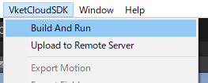

# ビルド方法
シーンのビルド方法について解説します。

## ビルドと実行
VketCloudSDKでシーンをビルドするには、[必要コンポーネント](WorldBasicComponents.html)を配置したことを確認し、VketCloudSDK > Build And Run からビルドを実行してください。  
  
  

!!! note question "ビルドが出来ない場合" 
    以下をお試しください。

    - VketCloudSDK > キャッシュクリア

    このほかにもさまざまな要因でビルドに失敗している可能性があります。ビルドエラーが解消しない場合は、エラー事例をまとめた[トラブルシュート](../troubleshooting/BuildError.md)をご覧ください。

ビルドが成功したら、自動的にブラウザに遷移します。シーンの内容が反映されているかテストしてください。

  

!!! note tip "「ビルドと実行」で起きること"
    Build and Runを押すと、HEOFieldコンポーネントが付いたオブジェクトとそのすべての子オブジェクトが.heoファイルに変換されます。「.heo」はVketCloudの描画エンジンで使われている専用の3Dフォーマットです。  
    ビルドされたファイルは`[プロジェクト名]\release\data`フォルダにコピーされます。これにより、3Dワールドをブラウザで動かすのに必要なアセットがすべてこのフォルダに入ります。
    
    ## releaseフォルダの概要
    |  場所  |  ファイル  |  説明  |
    | ---- | ---- | ---- |
    |  \release  |  main.html  |  このhtmlをブラウザで開いて3Dワールドを起動  |
    |  \release\data\Field\[ワールド名]\ [オブジェクト名]  |  [オブジェクト名].heo  |  ワールドの3Dオブジェクト  |
    |  \release\data\Scene  |  [ワールド名].json  |  ワールド構成を記述したシーンデータ  |

    なお、**releaseフォルダの中身を直接書き換えたものをアップロードする行為はライセンス規約で固くお断りしています**。あくまで、デバッグ手段の一つとしてご利用ください。