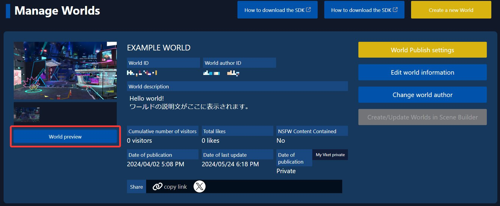

# World upload

Using the SDK, the world can be uploaded to the Vket Cloud / My Vket server for publishing.

Uploading is also needed for private world testing with multiple people.

## How to upload
  
1. Open the "VketCloudSDK" tab and select "Upload to Remote Server".

    

2. By selecting "Upload to Remote Server", the World Uploader window will open.

    On this window, the World ID and related information (world name, thumbnail, world description) registered on the [Vket Cloud](https://cloud.vket.com/en/account/world){target=blank} official website will be shown as a list.

    Select the world ID to upload the data.

    

    Also, if the creator is subscribed to [Basic Plan](https://cloud.vket.com/en/plan){target=blank} and higher licenses, team collaboration features will be accessible. The team and world can be switched via the upper left team name display.

    

    By selecting "World Preview", the uploaded world can be entered for testing purposes. 
    Please note that nothing will be shown before upload.

    

    On selecting "Upload", a confirmation window will appear. 
    Selecting "Yes" will begin the upload process.

    

    

3. A dialog will appear when the upload is complete.

    

4. To enter the uploaded world, click `World Preview` from the [World ID management page](https://cloud.vket.com/en/account/world){target=blank}.

    

    Also, the "World Preview" button in the World Uploader will open the uploaded world as well.

    

!!! caution "Update timing of the uploaded world"
    Updating the uploaded world may cause 5 ~ 15 minutes depending on server process and network environment factors. 
    If the world hasn't been updated on after upload and selecting `World Preview`, please wait shortly until the update process is completed.

!!! note "Build Options on World Upload"
    In [VketCloudSDK Settings](../SDKTools/VketCloudSDKSettings.md), there is a feature for [configuring build options](../WorldEditingTips/BuildOptions.md) to enable engine-side file compression on Build & Run and world data upload. 
    Using this feature will improve performance on tight-spec environments such as smartphones. 
    If upload time seems long, or build fails repeatedly, please reconsider this settings, or see [Build Error / How to troubleshoot issues](../troubleshooting/BuildError.md).

## Publishing the World

The published world will be listed on My Vket's [World List](https://vket.com/en/play/world){target=blank}.

Also, if a private world URL is shared, the world can be accessed while it is not public on My Vket. 
This is useful for world testing with multiple people or to create a closed-community world. 
When you create a new World ID, it is initially set as a private world. If you want to make it public, go to the World Management screen, select "World Publish Settings", and choose "Publish".

!!! note caution
     To upload the world data, the world ID must be created in advance on the account management screen. If you don't see your world name in the list, please create a world ID from [here](https://cloud.vket.com/en/account/world){target=blank}.

!!! caution "Issues when uploading multiple scenes"
    If a single Unity project contains more than two scenes, which may be uploaded to different worlds, the first uploaded world may be duplicated, or cause 404 / build errors when entering. 
    To prevent this, consider containing only one scene/world per project. 
    Also, if this issue happened, it can be fixed by closing the project and deleting the `upload` folder located in the project files, and reboot/reupload the world.
