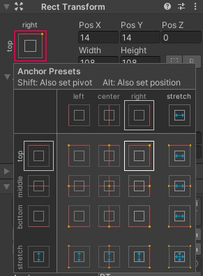
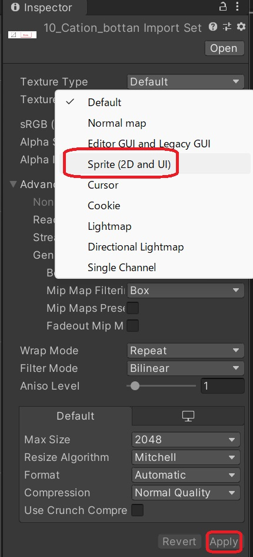
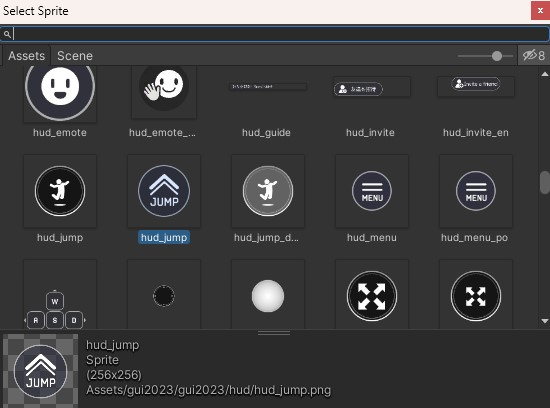
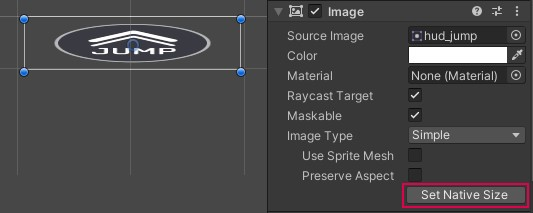

# 応用実装

GUIToolsの導入と準備が済んだらいよいよ実際にUI素材を配置してみましょう。

## 大まかな流れ

1. 既存のJsonファイルを読み込ませる

2. 素材の配置やサイズを調整する

3. **エクスポートする**

GUI Exporter の機能を使わないのは、元々あるJsonファイルのフォーマットを崩したくないのと、マスクなど一部機能が対応していない、コメントが削除されてしまう等の問題があるためです。  
ゼロから画面を作成したい場合はExportを利用してもいいかもしれません。

## Inspectorについて

素材のサイズや位置の調整はScene上で直接行うか、InspectorのRect Transformで数値入力することで行えます。

赤枠部をクリックすると、素材のアンカーの位置を変更することができます。

## 素材を追加したい時

Unity上で新たに素材を追加して配置したい場合の方法です。

まずは2のべき乗サイズで書き出した画像素材を用意します。

Projectタブを開き、素材を入れるために指定したフォルダを選択し、右クリックメニューからShow in Explorerをクリックします。

立ち上がったExplorerのフォルダに追加したい素材を入れます。

追加した素材をProjectタブで確認すると、△の矢印がついていない状態になっています。

追加した素材をクリックし、Inspectorで  
Texture Type を Sprite (2D and UI) に変更します。

その後**Applyボタンを押して適用**します。

適当なパーツをHierarchy上で複製します。

そして複製したパーツのSource Image横の◎ボタンをクリック。

表示されたウィンドウから差し替えたい画像素材を選択

画像の比率がおかしい時は、Image内の  
Set Native Size ボタンをクリックして、素材の元のサイズを適用すると比率が正しくなります。

後は配置したい場所とサイズを調整して完了です！

## Jsonエクスポート

上部メニュー > **VketCloudGUITools** \> **GUI Exporter**からGUI Exporterウィンドウを開き、修正作業を行ったCanvasオブジェクトをVketCloud上で扱う**Jsonファイル**として出力します。

### **Heliodor Data Path(必須項目)**

「jsonの出力先のフォルダ」（CanvasフォルダやFieldフォルダがあるところ）を指定します。**必ず「data」フォルダを指定してください。**

### **Unity Data Path(必須項目)**

「Unityプロジェクト内のテクスチャ保存先のフォルダ」を指定します。  
上記の**Heliodor Data Pathの「data」フォルダに対応する場所を指定してください**。

### **Target Canvas(必須項目)**

出力したい**Canvasオブジェクト**を指定します。これの子となっているアイテムが１つのjsonとして出力されます。  
非対応コンポーネントなどはこのウィンドウでエラーとして表示されます。（対応しているものは下記の「対応コンポーネント」を見てください。）

### Auto Generated Layer

変換元のUIにレイヤーがない場合、ここで指定したレイヤーに割り当てられます。  
未設定の場合は「Auto Fix」から対応されます。

### Auto Fix Settings

後述する「エラーの自動解決」を自動で実行するルールを指定します。

### エラーの一覧

**自動解決**が可能な場合は「**Auto Fix**」ボタンがあるため、押してください。  
**Undoに対応している**ため、間違って押した場合は、あわてずに「Ctrl＋Z」を押して巻き戻してください。

黄色文字：どの順番でAuto Fixしても問題ありません。

赤文字：Heliodorでは再現できない、あきらかに見た目が変わる要素。**できれば手動で解決したい**内容です。  
　　　　無視してExportできますが、**大きくデザインや挙動が変わる可能性**があります。

**赤背景赤文字**：致命的な問題。**これを解決するまでExportはできません。**  
　　　　　　　自動解決が不可能だったり、**Auto Fixの順番で結果が変わる可能性があります。**

任意のCanvasを指定して「**Export .json**」を押すと出力できます。

この際、Data Pathが適切に設定されている場合はImageなどに設定されているアセットが自動的にコピーされます。（例：Assets/gui\_test/test.png → UnityDataPathで指定した場所/gui\_test/test.png）

