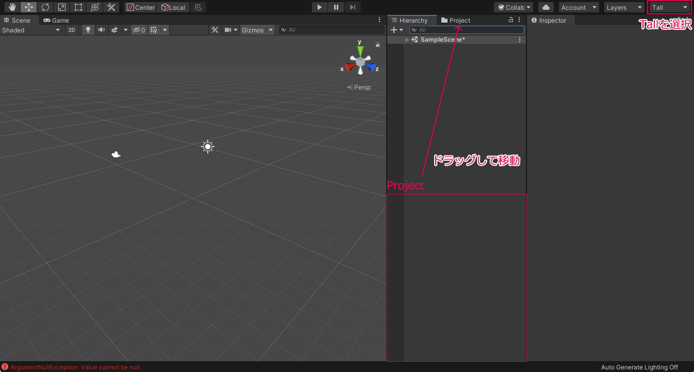
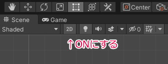
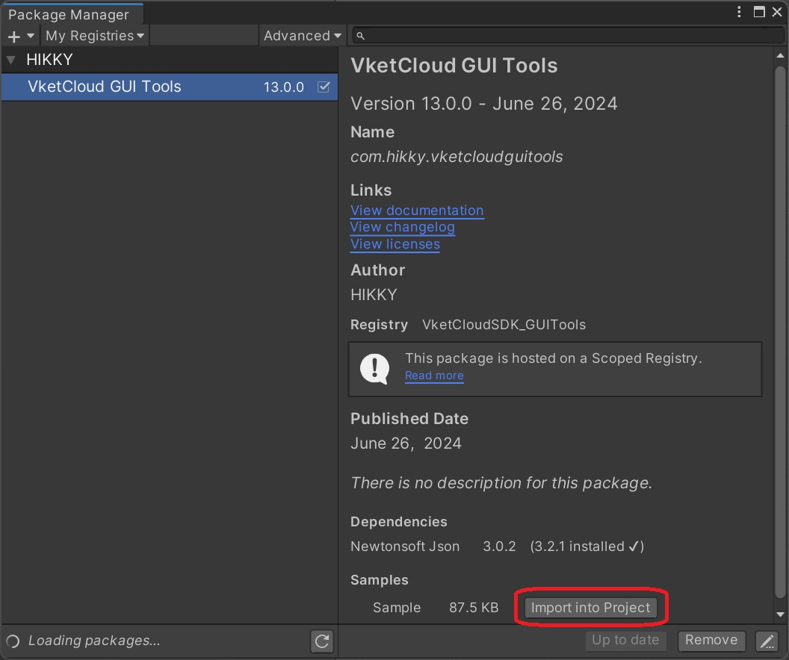
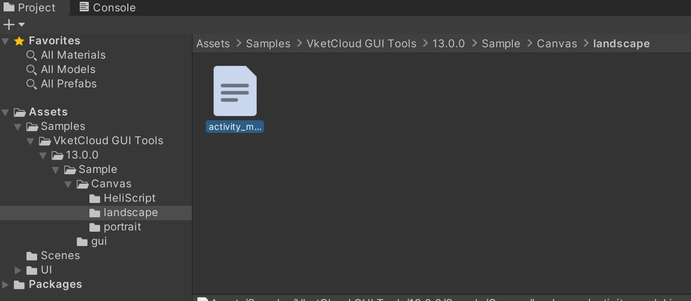
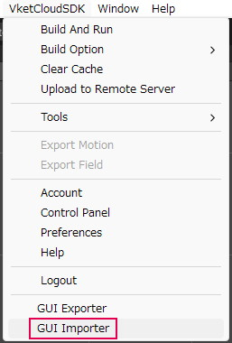
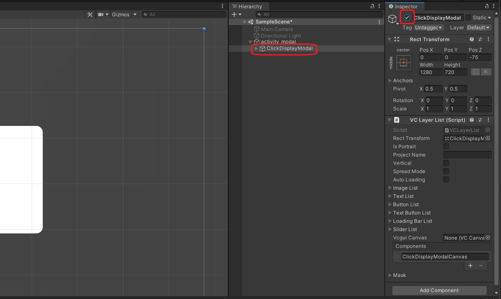
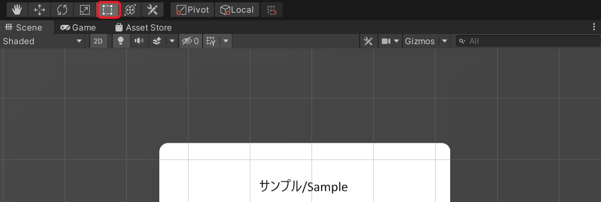
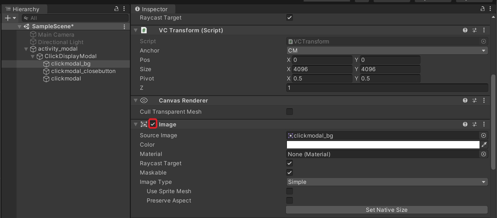

# 基本的な使い方

## 作業前の準備

Unityで作業をする前にUIの編集をしやすいレイアウトに変更しましょう。  
右上のドロップダウンメニューからTallを選択し、上下に分かれたHierarchyとProjectのProjectのタブをドラッグして、Hierarchyの隣に持っていきます。

左上の方の「2D」と書かれたボタンをオンにします。

2Dの3つ隣にあるキラキラマークがついたボタンをクリックしてオフにします。

オフにする

Main CameraとDirectional Lightは選択した後、Inspectorに表示されるチェックボックスのチェックを外して一旦非表示にしておきます。

Projectタブを開き、Assetsを右クリックしCreate → FolderでUIの画像素材を入れるフォルダを作成します。一時的に素材を入れる場所なので名前は任意でOK。(ただし全角NG)

## サンプルActivity Canvasの読み込み（テンプレート）

Import Into Projectでインストールします。

その後、Assetsにインストールされます。

## Jsonファイルのインポート

メニューの VketCloudGUITools → GUI Importer をクリック

インポート用のダイアログで読み込みたいjsonファイルと素材のコピー先とスケールの設定をしてインポートします。

サンプルActivity Canvasのjsonファイルは以下の場所にありますのでそちらを選択してください。

`C:\{UnityProject}\Assets\Samples\VketCloud GUI Tools\13.0.0\Sample\Canvas\landscape\activity_modal.json`

Importをクリックして100%の表示が出ていれば完了していますのでダイアログを閉じてください。

読み込まれたはずなのに何も表示されない！となりますが、慌てずHierarchy内の読み込まれたひとつ下の階層を開いて選択し、Inspectorの一番上のチェックボックスにチェックを入れると表示されます。

Inspector一番上のチェックボックスで表示非表示がコントロールできます

## Unityの操作方法

Hierarchyはレイヤーのような構造ですが、Photoshopなどとは違い、上にあるものほど下に描画されるので注意です。

**マウスホイール**  
画面の拡大縮小  
**マウス右クリックのドラッグ**  
ハンドツール  
UI編集の際は**Rect Tool (四角いアイコン)**にしておくと編集しやすいです。

Inspectorの一番上にチェックを入れているにも関わらず、何も表示されていないという場合は、Inspector内のImageの所にチェックを入れると表示されます。
