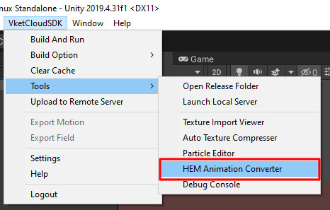
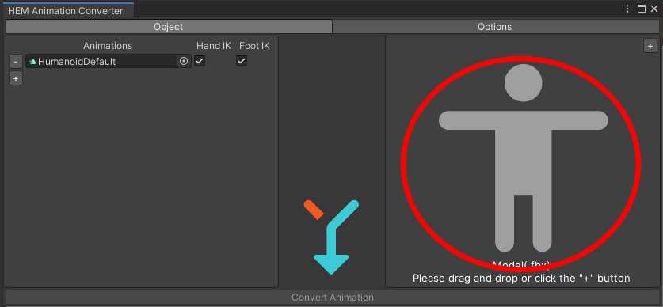
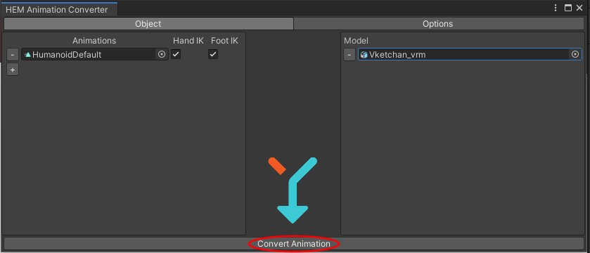
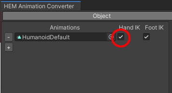

# How to Use HEM Animation Converter

In VketCloud, the type of animation must be Legacy in Unity. 
Normally, the conversion from Humanoid to Legacy animation in Unity can only be done on the same character model due to differences in bone names and the structure.  
HEM Animation Converter can convert the Humanoid animation of a certain character to a Legacy animation for the targeted character model.

## HEM Animation Converterの起動方法

「VketCloudSDK」タブから「Tool」-->「HEMAnimationConverter」を選択します。

## HEM Animation ConverterのGUIの説明

### オブジェクトタブ

オブジェクトタブでは、変換対象のアニメーションと変換先のモデルを指定します。

初期状態のUI：

オブジェクトをドラッグ＆ドロップした後のUI：

| 番号 | 名称 | 機能 |
|-----|-----|-----|
|1| オブジェクト　| アニメーション出力に使用するオブジェクトを取り扱う画面のタブ |
|2| 設定 | 詳細設定画面を表示するタブ |
|3| 変換対象のアニメーション | 変換対象のアニメーションを指定します。  HumanoidタイプのClipのみ受け付けます |
|4|「+」 | 追加ボタン。クリックするとデフォルト値としてT-poseのAnimationClipを追加します |
|5| 変換モデル | HEMアニメーションで動かしたいキャラクターモデルを指定します。 　AnimationTypeがHumanoidのFBXとそのプレハブのみ受け付けます |
|6|「+」 | 追加ボタン。クリックするとデフォルト値としてSDKに内蔵されるvketchan_vrm.fbxを追加します |
|7| アニメーションを変換する |コンバート実行ボタン。デフォルト設定だとAssets/HEMAnimationConverter/exportにHEMアニメーションを出力します|
|8| 「-」 | 削除ボタン。クリックすると登録したアニメーションを解除します |
|9| Animations | 3. 変換対象のアニメーションにて登録されたアニメーションクリップ |
|10| Hand IK | アニメーションに対してIKを設定するトグル。チェックを入れるとIKが適用されます |
|11| Foot IK | アニメーションに対してIKを設定するトグル。チェックを入れるとIKが適用されます |
|12| 「-」 | 削除ボタン。クリックすると登録したFBXアセットを解除します |
|13| Model | 5. 変換モデルにて登録された変換対象のFBX |

###　設定タブ

| 番号 | 名称 | 機能 |
|----|-----|-----|
|1| オブジェクト　| アニメーション出力に使用するオブジェクトを取り扱う画面のタブ |
|2| 設定 | 詳細設定画面を表示するタブ |
|3| 保存先フォルダ | HEMファイルを保存するフォルダパス |
|4| Prefix | 保存名の前に付ける名前 |
|5| Suffix | 保存名の後に付ける名前 | 
|6| 出力名のプレビュー | Prefix_アニメーションClip名_Suffixを表示します |
|7| Animation Clip | チェックを入れるとLegacyタイプのアニメーションクリップを出力します 出力先は保存先フォルダ/AnimationClipです |
|8| モーションのRootノード | Humanoid AnimationClipに紐づけられたRootT,RootQを適用するノード  Noneの時、Hipsを選択します |
|9| 階層 | Humanoid AnimationClipに紐づけられたRootT,RootQを適用するノード  Noneの時、Hipsを選択します |
|10| アニメーション | 各アニメーションクリップの[InspectorView](https://docs.unity3d.com/ja/2019.4/Manual/class-AnimationClip.html)を表示します。|

| 番号 | 名称 | 機能 |
|----|-----|-----|
|10.a| StartTime | AnimationClipの開始時間 |
|10.b| StopTime | AnimationClipの終了時間 |
|10.c| Orientation Offset Y | ルートの回転値に対するオフセット（指定する値は回転値）|
|10.d| Level | ルートの高さに対するオフセット |
|10.e| Cycle Offset | ループモーションの開始フレーム |
|10.f| Loop Time | チェックが有効な時、ループ再生します |
|10.g| Loop Blend | シームレスなループアニメーションを有効にします |
|10.h| Loop Blend Orientation | ルートの回転をボーンの動きに焼き付けることができます ルートの回転値をルート モーションとして保存するには無効にします |
|10.i| Loop Blend Position(Y) | ルートボーンに垂直方向の動きを焼き付けることができます ルートの垂直方向の移動値をルート モーションとして保存するには無効にします |
|10.j| Loop Blend Position(XZ) | ルートボーンに水平方向の動きを焼き付けることができます ルートの水平方向の移動値をルート モーションとして保存するには無効にします |
|10.k| Keep Original Orientation | チェックが有効な時、ソース ファイルで作成されたままの回転を保持します。 無効な時、0F目の回転値を(0,0,0)に設定します |
|10.l| Keep Original Position(Y) | チェックが有効な時、ソース ファイルで作成されたままの高さを保持します。 無効な時、0F目の高さを原点に設定します |
|10.m| Keep Original Position(XZ) | チェックが有効な時、ソース ファイルで作成されたままの水平位置を保持します。 無効な時、0F目の水平位置を原点に設定します |
|10.n| Height From Feet | チェックが有効な時、Keep Original Position(Y) の基準点を足に設定します。 ※Keep Original Position(Y) が有効な時、この項目は適用されません |
|10.o| Mirror | チェックが有効な時、YZ平面を軸としてモーションを左右反転させます |

!!! note
        **10.アニメーション**の各項目の詳細は公式に記載されたエリアCの項目を参照してください。 
        [Animationタブ - Unity マニュアル](https://docs.unity3d.com/ja/2019.4/Manual/class-AnimationClip.html)

## 使い方

### 1. コンバートしたいアニメーションクリップをドラッグ＆ドロップする

### 2. アニメーションさせたいキャラクタをドラッグ＆ドロップする

### 3. 細かい設定を変更する場合は設定タブを開いて変更する

### 4. 変換ボタンを押す

### 5. HEMの保存ダイアログが表示されるので任意の名前を指定後、保存ボタンを押す

### 6. 変換が成功したダイアログが出てくるのでOKを押す

## FAQ

- Q1. アニメーションをコンバートしたら腕が曲がりました。バグですか？

- A. 安心してください。バグではありません。 HandIKのチェックを外してコンバートすれば治ります。

!!! note
        IKの性質上、相対的に腕の長さが短いキャラのモーションを腕の長いキャラに移植する時、 
        HandIKを適用すると今回のような症状が発生します。