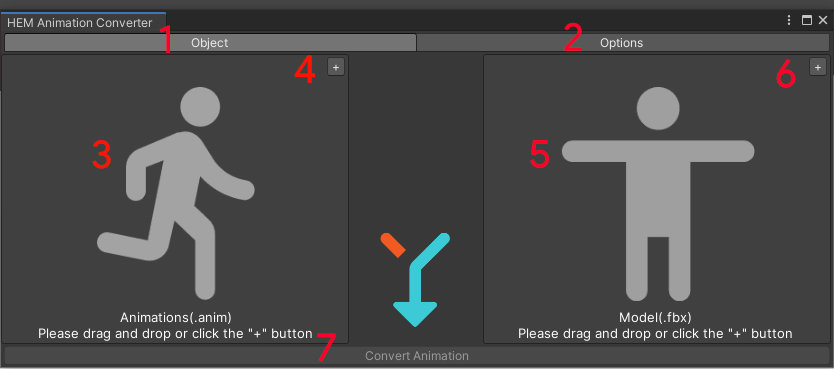
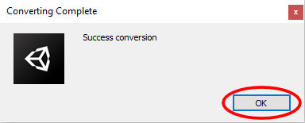

# How to Use HEM Animation Converter

In Vket Cloud, the type of animation must be Legacy in Unity. 
Normally, the conversion from Humanoid to Legacy animation in Unity can only be done on the same character model due to differences in bone names and the structure.  
HEM Animation Converter can convert the Humanoid animation of a certain character to a Legacy animation for the targeted character model.

## How to start HEM Animation Converter

Select [Tools] --> [HEMAnimationConverter] from [VketCloudSDK] tab.

## Description of GUI of HEM Animation Converter

### Object tab

On the Object tab, specify the animation to convert and the model to convert.

Initial state of UI:

UI after dragging and dropping objects:

| Number | Name | Function |
|-----|-----|-----|
|1| Object | Screen tab for handling objects used for animation output |
|2| Settings | Tab to display detailed settings screen |
|3| Animation to convert | Specify the animation to convert.   Only Humanoid type clips are accepted |
|4|“+” | Add button. Click to add T-pose AnimationClip as default value |
|5| Conversion model | Specify the character model you want to move with HEM animation.  Only FBX with AnimationType Humanoid and its prefabs are accepted |
|6|“+” | Add button. Click to add vketchan_vrm.fbx, which is built into the SDK as a default value |
|7| Convert animation |Convert button. With default settings, HEM animation will be output to Assets/HEMAnimationConverter/export |
|8| “-” | Delete button. Click to cancel the registered animation |
|9| Animations | 3. Animation clip registered in the animation to be converted |
|10| Hand IK | Toggle to set IK for animation. If checked, IK will be applied |
|11| Foot IK | Toggle to set IK for animation. If checked, IK will be applied |
|12| "-" | Delete button. Click to cancel the registered FBX asset |
|13| Model | 5. FBX to be converted registered in the conversion model |

###　Settings tab

| Number | Name | Function |
|----|----|----|
|1| Object | Screen tab for handling objects used for animation output |
|2| Settings | Tab to display detailed settings screen |
|3| Destination folder | Folder path to save the HEM file |
|4| Prefix | Name to prefix the save name |
|5| Suffix | Name to be added after the save name |
|6| Preview output name | Display Prefix_Animation Clip name_Suffix |
|7| Animation Clip | If checked, a Legacy type animation clip will be output. The output destination is the save folder/AnimationClip |
|8| Motion Root node | Node that applies RootT and RootQ linked to Humanoid AnimationClip  When None, select Hips |
|9| Hierarchy | Node that applies RootT and RootQ linked to Humanoid AnimationClip  When None, select Hips |
|10| Animation | Displays [InspectorView](https://docs.unity3d.com/ja/2019.4/Manual/class-AnimationClip.html){target=_blank} for each animation clip. |

| Number | Name | Function |
|----|----|----|
|10.a| StartTime | Start time of AnimationClip |
|10.b| StopTime | End time of AnimationClip |
|10.c| Orientation Offset Y | Offset to the root rotation value (the specified value is the rotation value) |
|10.d| Level | Offset to root height |
|10.e| Cycle Offset | Start frame of loop motion |
|10.f| Loop Time | When checked, loop playback |
|10.g| Loop Blend | Enable seamless looping animation |
|10.h| Loop Blend Orientation | Root rotation can be baked into bone motion Disable to save root rotation values as root motion |
|10.i| Loop Blend Position(Y) | Allows you to bake vertical movement into the root bone Disable to save the vertical movement value of the root as root motion |
|10.j| Loop Blend Position(XZ) | Allows you to bake horizontal movement into the root bone Disable to save the root horizontal movement value as root motion |
|10.k| Keep Original Orientation | When checked, keeps the rotation as created in the source file.  When disabled, set the 0F rotation value to (0,0,0) |
|10.l| Keep Original Position(Y) | When checked, keeps the height as created in the source file.  When disabled, set the 0F height as the origin |
|10.m| Keep Original Position(XZ) | When checked, keeps the horizontal position as created in the source file.  When disabled, sets the 0F horizontal position as the origin |
|10.n| Height From Feet | When checked, sets the reference point of Keep Original Position (Y) to the foot.  *This item does not apply when Keep Original Position(Y) is enabled |
|10.o| Mirror | When checked, mirrors the motion horizontally around the YZ plane |

!!! note
         For details on each item in **10. Animation**, please refer to the officially listed Area C items.  
         [Animation Tab - Unity Manual](https://docs.unity3d.com/ja/2019.4/Manual/class-AnimationClip.html){target=_blank}

## How to use

### 1. Drag and drop the animation clip you want to convert

### 2. Drag and drop the character you want to animate

### 3. If you want to change detailed settings, open the settings tab and change them.

### 4. Press the convert button

### 5. The HEM save dialog will be displayed, so specify any name and press the save button.

### 6. A dialog indicating that the conversion was successful will appear, so press OK.

## FAQ

- Q1. When I converted the animation, my arm became bent. Is it a bug?

- A. Don't worry. It's not a bug.  The problem can be fixed by unchecking HandIK and converting.

!!! note
         Due to the nature of IK, when transferring the motion of a character with relatively short arms to a character with long arms,  
         When HandIK is applied, the following symptoms occur.