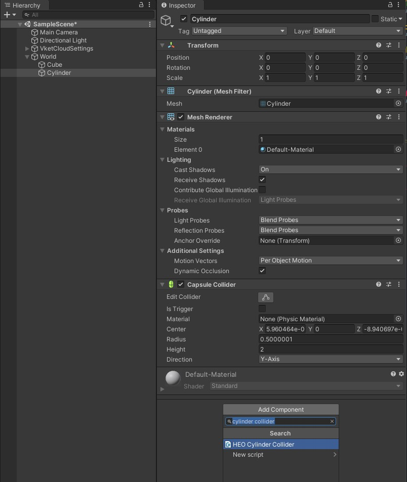
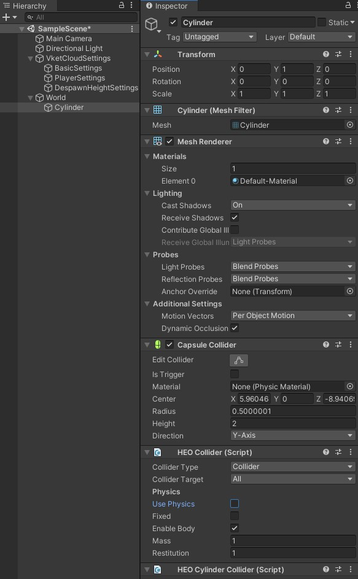

# HEOCylinderCollider

HEOCylinderCollider will generate cylinder collider based on CapsuleCollider of the object by attaching with the HEOCollider.

Normally in Unity there is no cylinder collider, and it is substituted by a capsule collider, but in VketCloud, as shown in the image below, by attaching an additional "HEOCylinderCollider" to an object with a "Capsule Collider", you can use it as a cylinder collider exclusively in the VketCloud physics engine.

!!! note "Notes"
    Due to the implementation of collision detection in the physics engine, capsule colliders and cylinder colliders, and cylinder colliders and cylinder colliders do not collide. 
    When using a cylinder collider, thin colliders like Plane may penetrate, so you need to use a box for the ground.

## How to Use

1. This component is intended to use on an object with Unity Mesh Renderer / Capsule Collider components. 
To use, select the object and add a new HEOCylinderCollider component in the Inspector / Add Component.

    

1. When setting a HEOCylinderCollider component, [HEOCollider](./HEOCollider.md) will be automatically attached. This component is essential for HEOCylinderCollider and cannot be removed.

    

1. Build and Run world to see the collider generated according to the Capsule Collider.
