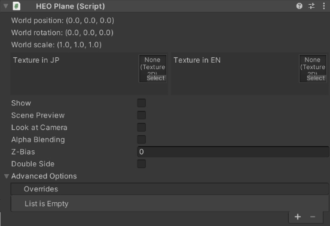

# HEOPlane

HEOPlane lets you instantiate image files.  
The file format needs to be in png format.

For details, please refer to the [specification limit](../WorldMakingGuide/UnityGuidelines.md).

|  Label | Initial Value | function |
| ----   | ---- | ---- |
| Texture in JP / EN | Blank | Specify the image texture. Texture in EN is the image shown when your browser's language setting is set to English. Leave it blank if unncessary.  |
| World Position | Same value as Transform's Position value | Set the position for displaying text |
| World Rotation | Same value as Transform's Rotation value | Set the rotation for displaying text |
| World Scale | Same value as Transform's Scale value | Set the scale for displaying text |
| Alpha Blending | false| Lets you use cutout/transparency. |
| Show | true | Enable if you want the image to appear from the beginning. |
| Z-bias | 0 | Higher z value will make the image show in front of other objects. |
| Look at Camera | false | Make the image face towards the camera at all times. |
| Double Side | false | Enable/Disable display on double sides |
| Overrides | | On Entering the world, the `Material` and `Texture` set in the Overrides will be used instead of textures set in HEOPlane. |

!!! note caution
    The Overrides property is currently under progress. 
    Further usage are to be added by future updates.

!!! note
    The `Billboard` setting in pre-Ver9.3 components has been renamed to `Look at Camera`. 
    If the scene data is migrated from past SDK versions, the `Billboard` setting value will be reflected to `Look at Camera`.