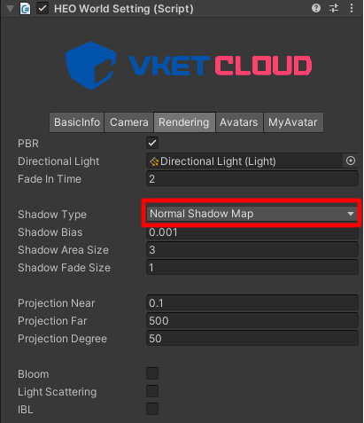
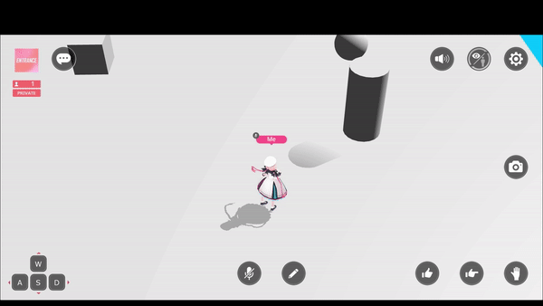
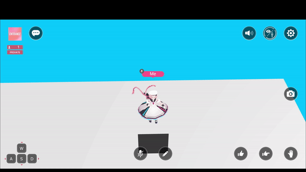

# HEOShadow

HEOShadow is used to display dynamic shadows(shadow maps). 
Using this component, shadows synchronizing to avatar and object movement can be displayed.

| Label | Function |
|----|----|
| Shadow Caster | Set object to cast its shadow |
| Shadow Receiver | Set object to recieve shadow |

## How to Use

1\. Change the Rendering setting in [HEOWorldSetting](HEOWorldSetting) from `Round`(round shadow) to `Normal Shadow Map`.

2\. Attach HEOShadow to the object to cast its shadow, and select `Shadow Caster`.

3\. Attach HEOShadow to the object to receive shadows, and select `Shadow Receiver`. 
For example, the HEOShadow is attached to the floor object to receive shadows. 
Note that a single shadow can be set both to Caster and Receiver.

4\. On world build, the shadows of the objects with HEOShadow attached will be displayed dynamically.

Shadows have a designated display distance, which fade outs / disappears when becoming distant.

!!! note caution
        Only the objects with HEOShadow attached will have their dynamic shadows drawn. 
        If `Normal Shadow Map` in [HEOWorldSetting](HEOWorldSetting) is enabled, objects without HEOShadow will not have their shadow casted/ recieve other shadows.

Also, objects without `Shadow Reciever` selected will not have their shadow casted.

