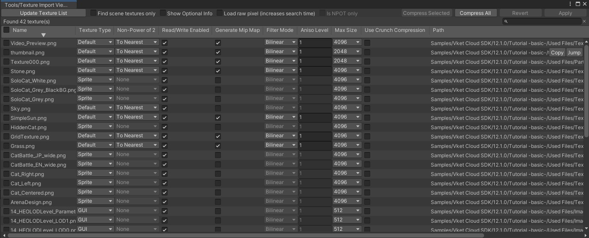
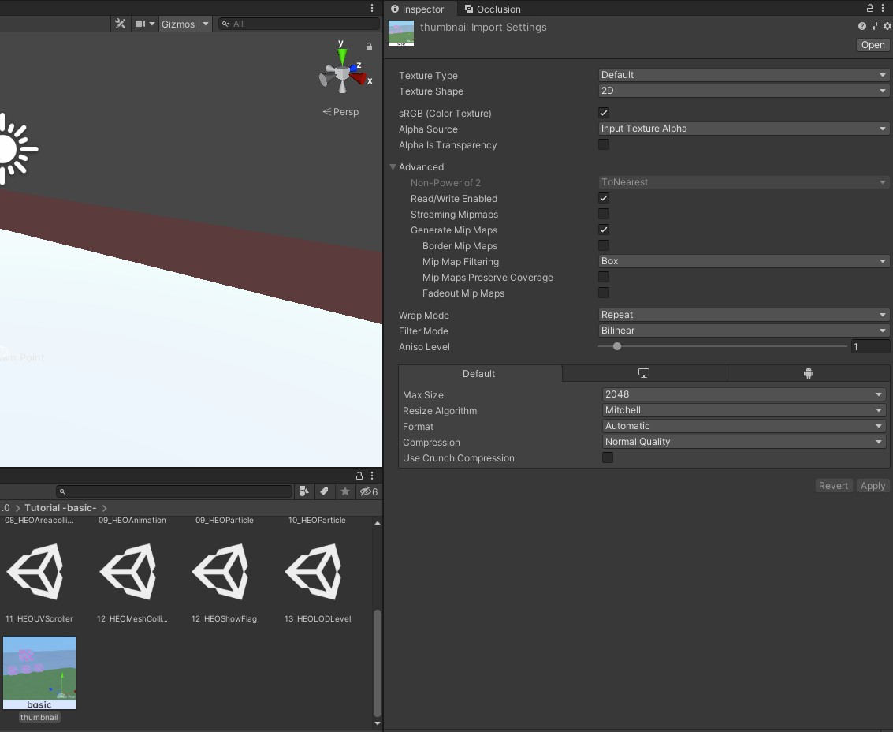
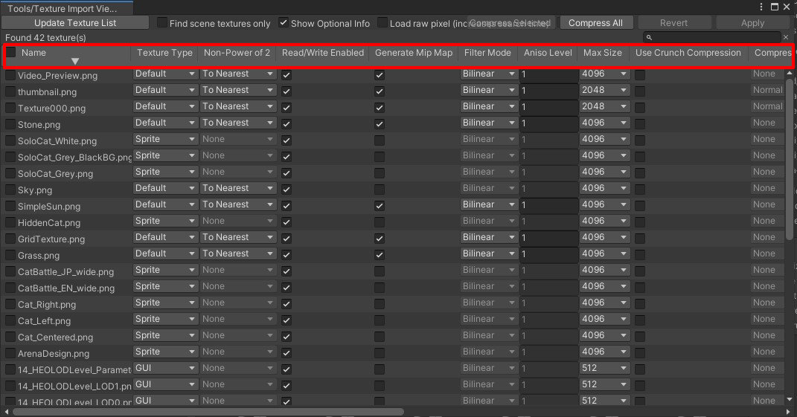

# Texture Import Viewer

## Overview

Texture Import Viewer is a SDK Tool dedicated to view the project's texture import settings and compressed size as a list.

On the Viewer, the texture can be sorted by size, name, etc., which import settings can be edited / exported by once. 
This allows the texture settings to be reformatted at once, which can either be saved or exported/replaced by same procedure as [Export Compressed Texture](./ExportCompressedTexture.md).

Therefore, this tool is handy when multiple texture files needs reformatting.

## How to Use

On the Unity Menu, select VketCloudSDK > Tools > TextureImportViewer to open the Viewer's window.

The Viewer is displayed above on opening the window.

By setting the search options below and pressing "Update Texture List", the textures in Scene/Project will be shown in a list.

### Search Options

| Label | Initial Value | Function |
| ---- | ---- | ---- |
| Ignored Folders (Size / Element)| 1, Assets/IgnoredFolderName | Designates a folder by name to be excluded on updating the texture list. By increasing Size, the number of folders to be excluded can be increased. |
| Find scene textures only | true | Enables/Disables search mode to only include the textures used in the current scene. If the checkbox is empty, all textures in the Assets folder will be counted(which may lead to longer update time)|
| Show Optional Info | true | Enable/Disable display of texture details (Compression, Compressor Quality, Compressed Size(KB), Compressed Pixel) |
| Load raw pixel (increases search time) | false | Loads raw pixel size of the texture before compression (caution: may lead to longer search time) |
| Is NPOT only | false | Enable/Disable search only for pre-compressed texture in NPOT format.  This can be enabled only when `Load raw pixel` is true.|

By enabling `Load raw pixel`, the texture's original pixel size can be displayed. However, as this leads to longer load time, handle with caution when loading textures outside the Scene as well.

### Viewer Maneuvers

By selecting each texture on the Viewer, the selected texture is selected in Assets and displayed on the Inspector. 
Multiple selection can be done by selecting files while holding Shift or Ctrl key.

By selecting categories in the texture list header, the textures can be sorted in ascending/descending order.

By editing Texture Type ~ Use Crunch Compression settings and selecting "Apply", the settings of each texture can be saved at once. 
Also, selecting "Compress Selected" on selected textures or selecting "Compress All", the texture files can be exported/replaced as the same method of [Export Compressed Texture](./ExportCompressedTexture.md).

---

## Texture Import Viewer Features

| Label | Function |
| ---- | ---- |
| Compress Selected | Compress/Exports the designated texture files according to procedure of [Export Compressed Texture](./ExportCompressedTexture.md). |
| Compress All | Compress/Exports all texture files according to procedure of [Export Compressed Texture](./ExportCompressedTexture.md). |
| Revert | Reverts the applied texture settings |
| Apply | Saves the applied texture settings |
| Copy | Copies the texture path onto clipboard  |
| Jump | Opens the folder where the designated image is saved |

For details of Export Compressed Texture, refer to [this page](./ExportCompressedTexture.md).
