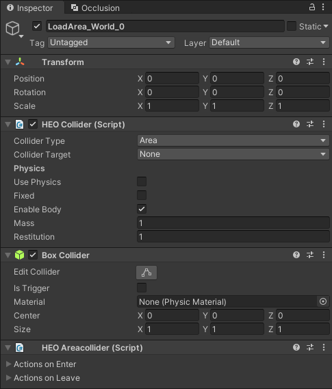

# HEOField

HEOFieldがアタッチされたオブジェクトは、BuildAndRun時に.heoとしてパックされます。.heoファイルに含めたいオブジェクトは、必ずHEOField以下に配置してください。

HEOFieldの詳しい配置方法については[HEOFieldの使い方](../WorldMakingGuide/HEOFieldTips.md)を参照ください。

| 名称 | 初期値 | 機能 |
| ---- | ---- | ---- |
| Auto Loading | true | 動的ローディングの有効/無効を切り替えます |
| Look at Camera | false | カメラ方向に対して常に正面を向くようになります |
| Load Collider |  | 範囲に入った際に特定のオブジェクトをロードするコライダーを生成します |
| UnLoad Collider |  | 範囲に入った際に特定のオブジェクトをアンロードするコライダーを生成します |
| Overrides | | ワールド入場時に`Overrides`にて設定された`Node Name`に指定したオブジェクトにアタッチしている[HEOVideoTrigger](HEOVideoTrigger.md)に紐づいた動画を、`Video Clip`に指定した動画で上書きします。 |

!!! note caution
    Overrides項目は現在実装中の機能です。 
    本機能については今後のアップデートで使い方が更新される予定です。

!!! note info
    HEOFieldはシーンに複数配置することができます。

!!! note info
    Ver9.3以前の`Billboard`設定は`Look at Camera`に名称が変更されました。 
    以前のSDKバージョンからシーンデータを移植した場合、`Billboard`の設定は`Look at Camera`に引き継がれます。

---

## 動的ローディング設定方法

VketCloudでは、ワールドに入った後に特定のエリアへ侵入した時にオブジェクトをロードさせることができます。これを、「動的ローディング」と呼びます。設定方法は、以下のとおりです。

### ロード発火側

1. ロードされるオブジェクトが持つHEOFieldコンポーネントの「動的ローディング」のチェックを外す。
2. ロードコライダーの項目を開き、「ロードコライダー生成」を押してロードに使うエリアコライダーを生成する。
3. 生成されたロード用のコライダーを最初から読み込まれるHEOFieldの子オブジェクトにし、位置や範囲を調整する。

### アンロード発火側

1. アンロードコライダーの項目を開き、「アンロードコライダー生成」を押してロードに使うエリアコライダーを生成する。
2. 生成されたアンロード用のコライダーをHEOFieldの子オブジェクトにし、位置や範囲を調整する。

!!! note caution
    設定されたコライダーは、各項目の右側にあるXボタンを押すことでリストから消すことができますが、オブジェクトは残ったままになるので、そちらは手動で削除が必要になります。
