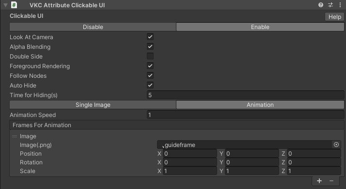
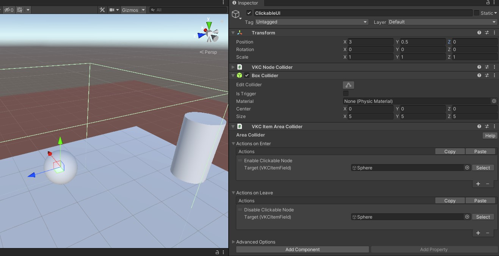
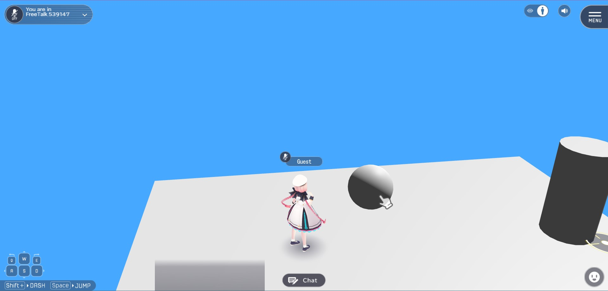
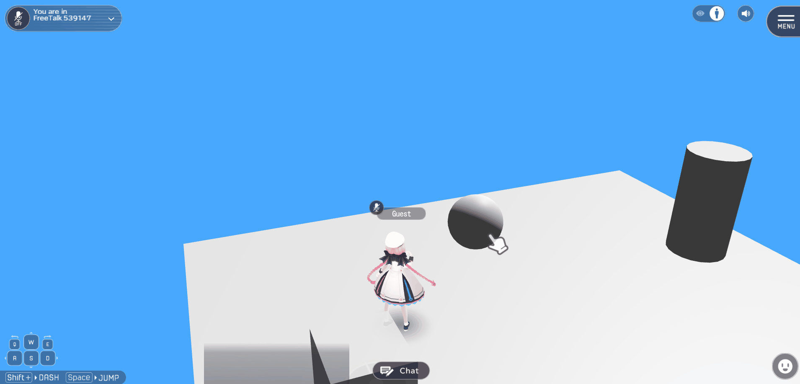

# VKCAttributeClickableUI

VKCAttributeClickableUIコンポーネントは、ワールド内のオブジェクトが「クリックできる」状態を強調するためのガイドUIを設定するためのコンポーネントです。

!!! note "VKCAttributeClickGuide (旧：HEOClickGuide)について"
    本コンポーネントはVKCAttributeClickGuide (旧：HEOClickGuide)の一般化を意図したコンポーネントです。 
    今後のアップデートでVKCAttributeClickGuideは徐々に廃止される予定であるため、基本的には本コンポーネントをお使いください。

## 基本設定

### Single Image

| 名称 (英語) | 名称 (日本語) | 初期値 | 機能 |
|----|----|----|----|
| Look At Camera | カメラに正面を向ける | true | カメラ方向に対して常に正面を向くようになります |
| Alpha Blending | 透過表示 | true | 半透明やカットアウトを使用できます |
| Double Side | 両面表示 | true | 両面表示するか否かを切り替えます |
| Foreground Rendering | 最前面に描画 | true | 最前面に描画するか否かを切り替えます |
| Follow Nodes | ノードに追従 | true | ノードが動的な場合UIも動かせるか否かを切り替えます |
| Auto Hide | 時間経過で非表示 | true | エリアに侵入後、時間経過で非表示にするか否かを切り替えます |
| Time for Hiding(s) | 非表示になるまでの時間(秒) | 5.0 | エリアに侵入後、何秒表示させるかを設定できます |
| Single Image/Animation | シングルイメージ/アニメーション | Single Image | 表示する画像を静的なPng画像にするか、コマ送りのアニメーション画像を設定するかを決められます |
| Image(.png) | 画像（.png） | .guideframe | Guideframeの画像を設定できます |
| Position | 位置 | [0.0, 0.0, 0.0] | 同じGameObject内のTransformコンポーネントのPosition値からの相対位置を設定できます |
| Rotation | 回転 | [0.0, 0.0, 0.0] | 同じGameObject内のTransformコンポーネントのRotation値からの相対回転を設定できます |
| Scale | スケール | [1.0, 1.0, 1.0] | スケール値を設定できます |

### Animation

| 名称 (英語) | 名称 (日本語) | 初期値 | 機能 |
|----|----|----|----|
| Animation Speed | アニメーションスピード | 1.0 | コマ送りするスピードを決められます。1の場合、1秒ごとにフレームが切り替わります。 |
| Frames For Animation | コマ送りアニメーション | - | コマ送りする複数のアニメーションを設定できます。一番上から、コマ送りの画像が設定できます。 |
| Image(.png) | 画像（.png） | .guideframe | Guideframeの画像を設定できます |
| Position | 位置 | [0.0, 0.0, 0.0] | 同じGameObject内のTransformコンポーネントのPosition値からの相対位置を設定できます |
| Rotation | 回転 | [0.0, 0.0, 0.0] | 同じGameObject内のTransformコンポーネントのRotation値からの相対回転を設定できます |
| Scale | スケール | [1.0, 1.0, 1.0] | スケール値を設定できます |

## 使い方

1. 空のゲームオブジェクトにVKCAttributeClickableUIコンポーネントをアタッチします。 
    このとき、VKCNodeCollider, BoxCollider, VKCItemAreaColliderが必ずアタッチされます。

    

1. BoxColliderの範囲内において、クリックが可能である旨がUIによって示されます。 
    この時オブジェクトをクリック可能とさせたい距離に応じてBoxColliderのスケールを変更しておきます。

    

1. クリックの対象であるオブジェクトをVKCItemAreaCollider OnEnter / OnExitにて指定し、クリック可能と不可能を切り替えることができます。 
    ここでは一例として、Sphereオブジェクトを[Enable / DisableClickableNode](../../Actions/Node/EnableDisableClickableNode.ja.md)アクションを使用してクリック可能と不可能を切り替えます。

    

1. ワールドをビルドして見た目を確認します。 
    プレイヤーがBox Colliderに侵入した際にオブジェクトがクリック可能となったガイドUIが表示され、同時に該当のオブジェクトがクリック可能となります。 
    Single Imageモードの時、設定された画像を「Time for Hiding(s)」にて設定された秒数分表示します。 
    プレイヤーがBox Collider内にいる際に常にガイドUIを表示させたい場合は「Auto Hide」を無効にします。

    

1. UIを強調したい場合はAnimationモードを使うと有効です。 
    ここでは一例として、1コマごとに`1.0 → 1.2 → 1.5 → 1.2 → 1.0`とスケールが伸縮するアニメーションを設定し、コマ送りのスピードを5.0に設定します。 
    また、アニメーション表示が途切れないように「Auto Hide」を無効にします。

    

1. ワールドをビルドすると、以下のようにガイドUIが拡大・縮小して表示されます。

    
