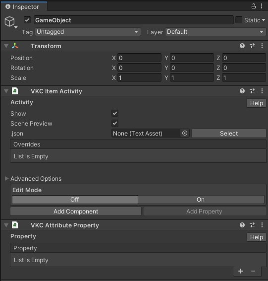

# VKC Attribute Property


## Overview

By using VKC Attribute Property on SDK Ver9.x and later versions, each Item can have a "Property" when in Vket Cloud worlds.

Property is a set of key and value attributed to an Item, which can be used to pass-by-value between components, customize implementation on the Unity editor, and many other usages.

This page will introduce the concept of Property in Vket Cloud, and how to use VKC Attribute Property.

## How to setup VKC Attribute Property

### 1. Attach VKC Attribute Property to an Item object



Attach VKC Attribute Property to an object that will be an Item, such as [VKC Item Field](VKCItemField.md), [VKC Item Object](VKCItemObject.md), and [VKC Item Activity](VKCItemActivity.md).

### 2. Define a Key and Value on VKC Attribute Property

By pressing the "+" button on the List, a new Key and Value can be added.

!!! info "Definition of Property"
    "Property" on Vket Cloud is a feature to define a Key and Value set.<br>
    The defined Value can be read on HeliScript, or written by functions.


Please note that Key and Value will both be a String type.

This completes the setup for VKC Attribute Property.


The defined properties will stored in the Scene.json file after build.

---

## How to Use on HeliScript

The defined property can be used by HeliScript.

For example, a GameObject Item will hold a property as below:

```c#
Key：Vket　Value：Cloud
Key：SDK　Value：12.1
```

### 1. GetProperty

`Item.GetProperty(string Key)` will get a Property Value according to the Item's Key.

```C#
// Sample Code (partial)

Item m_Item;
m_Item = hsItemGet("GameObject");

string Value;
Value = m_Item.GetProperty("Vket");
hsSystemWriteLine("%s" % Value); // output will be "Cloud"

```

### 2. SetProperty

`Item.SetProperty(string Key)` will set a Property Value according to the Item's Key.

```c#

// Sample Code (partial)

Item m_Item;
m_Item = hsItemGet("GameObject");

m_Item.SetProperty("Vket","Chan");

string Value;
Value = m_Item.GetProperty("Vket");
hsSystemWriteLine("%s" % Value); // output will be "Chan"

```

### 3. OnChangedProperty

`OnChangedProperty(string Key, string Value)` is a callback triggered when a property is changed.<br>
This will not be triggered if an exact same Value is entered to a Key on SetProperty, and change did not occur as a result.

```c#

// Sample Code (partial)
Item m_Item;
m_Item = hsItemGet("GameObject");

m_Item.SetProperty("SDK","12.1");
m_Item.SetProperty("Vket","Chan");
m_Item.SetProperty("SDK","12.2");
m_Item.SetProperty("Vket","Chan");

public void OnChangedProperty(string Key, string Value){
  hsSystemWriteLine("Changed %s, %s" % Key % Value);
  if(Key == "Vket"){
    hsSystemWriteLine("Vket Changed");  
  }
}

// On the example above,
// Line 6: initial Value for SDK is 12.1, callback will not be triggered
// Line 7: initial Value for Vket is Cloud, callback will be triggered
// Line 8: Value for SDK is 12.1, callback will be triggered
// Line 9: Value for Vket has been changed to Chan on Line 7, callback will not be triggered
// which will output the result as following:
// Changed Vket, Chan
// Vket Changed
// Changed SDK, 12.2

```

Property can be used on HeliScript by using the 3 functions above.

---

## Notes

### 1. Check which Item is targeted for SetProperty / GetProperty

Each Item can have different properties defined.<br>
If the Item name is wrong on reference, this may lead to unintended behaviors.

!!! note warning
    Update: On SDK version 12.x and later, SetProperty will add a new property if it does not exist.<br>
    On SDK Ver9.11, when trying to run SetProperty without a target property, unexpected behavior may occur without error notices.

## 2. Key and Value will always be a String type

As previously mentioned, Key and Value will always be a String. When connecting with non-String type variables, type cast is needed before running SetProperty or GetProperty.

If SetProperty or GetProperty is done without type casting, null values will be used instead.

## Related Articles
[How to Use HEOProperty (Vket Cloud Property Function)](https://vrhikky.github.io/VketCloudSDK_Documents/14.2/WorldMakingGuide/VKCAttributeProperty.html)