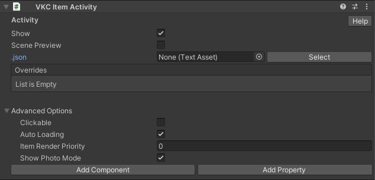

# VKC Item Activity

VKC Item Activity is a component for setting activities. 
The "Activity" in Vket Cloud is a feature for wrapping models and scripts as a single [Item](../hs/hs_overview.md#item), aimed for easy placement and implementation on worlds.

## Basic Settings

| Label | Function |
| ---- | ---- |
| Scene Preview | Creates a preview object of the designated activity in Scene. |
| .json | Designates the json file containing the activity information. |
| Overrides | Edits the settings in each activity. |

!!! caution "About Scene Preview"
    When enabling `Scene Preview`, a preview object of the activity will be created in Scene, which position / size / rotation can be altered. 
    However, the edits will be **reverted** on build, and Transform values of object with VKC Item Activity will be referred instead.

### Advanced Settings

| Label | Function |
| ---- | ---- |
| Clickable | Toggles acceptance of click input from player |
| Auto Loading | When enabled, this Item will be loaded automatically on world entrance.  As this Item must be explicitly loaded when `Auto Loading` is disabled, use [Dynamic Loading](VKCItemField.md) or use [Load()](../hs/hs_class_item.md#load) on HeliScript. |
| Item Render Priority | Designates the Item's render priority.   For details, refer to [RenderingSettings / Priority List](../VketCloudSettings/RenderingSettings.md) |
| Show Photo Mode | Toggles display/hide activity when in photo mode |

!!! info "Creating your own Activity"
    On SDK Ver12.x and later versions, a tool has been added to create/export your own Activity. 
    For details, please see [VKC Activity Exporter](../SDKTools/VKCActivityExporter.md).

### About Edit Mode

The Edit Mode allows re-editing of exported Activity files on the Unity Editor. 
When Edit Mode is set to On, a list of HeliScripts and Motions related to the activity will be shown, allowing to edit and configure.

Note that Scene Preview will be set to On when Edit Mode is enabled, which will disallow preview to be hidden.

#### How to Edit Activity

For example, the AnalogClockActivity is edited by the instructions below.

- The "Activity" object in the image above is the object with VKC Item Activity component attached.
- To add, delete, or edit an Activity, the objects under the root object with VKC Item Activity attached must be edited. Other objects outside the root object will not be saved to the Activity.  
For this case, the `AnalogClockObject` and its child objects located under Activity will be edited.

The objects under Activity can be edited in the scene view, by editing components such as Transform, etc.

By selecting Off in VKC Item Activity's Edit Mode, the edited contents will be automatically saved.

When save is successfully completed, a dialog as the image below will be shown.

---

## How to Download Activity

The Vket Cloud Activity can be downloaded from the asset store. 

The asset store can be accessed by selecting "Asset Store" in the [Vket Cloud MyPage](https://cloud.vket.com/){target=_blank} after login.

For details on how to use the asset store, refer to the manual page below. (English Version WIP)
[Gimmicks and Features ready to use! How to use the Vket Cloud Asset Store and Activities](https://magazine.vket.com/n/n7d554dbeb552){target=_blank}

## How to Use

For example, the analog clock activity from the asset store is used here. 
For details on how to get the activity data, refer to the manual which is referred later.

1\. Unzip the downloaded Activity file. As unzipping instructions varies among OS, please use the method on your preference.

2\. Check the file contents, and make sure to read the README before use.

3\. Read the README's articles, especially the "Activity Settings" which contains the parameters for customizing the activity.

4\. Move the unzipped analogclock folder to the Unity project with the VketCloudSDK installed. Folder position within the Assets is at your choice.

5\. In an empty scene, place the essential components by right clicking and selecting "Add Essential Objects for Vket Cloud", and create an empty object for setting the activity.

6\. Change the object name to AnalogClock or other names. (Avoid name conflicting with other objects.)

7\. Attach the VKC Item Activity component to the AnalogClock object.

8\. Set the `activity\analogclock\AnalogClockActivity.json` to the VKC Item Activity's json setting.

9\. Set a value for "useSecondHand" in VKC Item Activity's overrides. For details on the settings, refer to the "Activity Settings".

10\. As the analog clock will appear on the object origin, adjust the placement position via Transform.

11\. Build and see if the analog clock appears.

