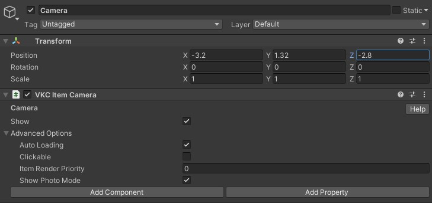
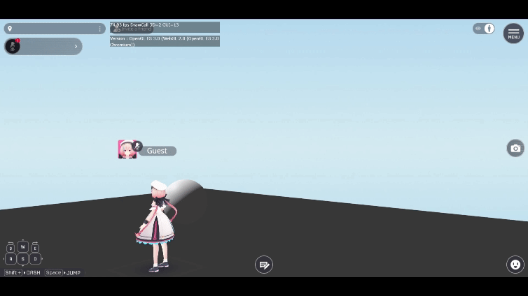

# VKC Item Camera


VKC Item Camera is used to switch camera controls for visual purposes.<br>
Using this component, camera can be switched in occasions such as event cut scenes, special camera works, and more purposes.<br>
Switching camera will be done by HeliScript as explained later.

## Settings

| Label | Initial Value | Function |
| ---- | ---- | ----|
| Show | true | Enable this if you want the item to display by default |

### Advanced

| Label | Initial Value | Function |
| ----   | ---- | ---- |
| Auto Loading | true | When enabled, this Item will be loaded automatically on world entrance.<br> As this Item must be explicitly loaded when `Auto Loading` is disabled, use [Dynamic Loading](VKCItemField.md) or use [Load()](../hs/hs_class_item.md#load) on HeliScript. |
| Clickable | false | Toggles acceptance of click input from player |
| Item Render Priority | 0 | Designates the Item's render priority. <br> For details, refer to [RenderingSettings / Priority List](../VketCloudSettings/RenderingSettings.md) |
| Show Photo Mode | true | Toggles display/hide item when in photo mode |

## Usage

1\. Create an empty GameObject and attach the VKC Item Camera component to place in scene.



As this object will be treated as a different [Item](../hs/hs_class_item.md) than VKC Item Field, this can be placed outside the World object.


2\. Implement the HeliScript for controlling camera

The object with VKC Item Camera attached will be output as an Item.<br>
Therefore, Item class functions such as [SetPos](../hs/hs_class_item.md#setpos) and [SetQuaternion](../hs/hs_class_item.md#setquaternion) can be applied, added to [Camera Functions](../hs/hs_class_item.md#setcamera).


!!! note "Camera Functions"
    1. bool SetCamera()<br>
    Sets camera to the designated camera item.<br>
    Return value is true if switching has succeeded, false if failed.

    2. void ResetCamera()<br>
    Resets camera to the default camera following the player.

For example, the HeliScript using functions above is written as follows:

```cs
component EventCameraTest
{
    Item m_Camera;
    bool is_evented;
    float Timer;

    public EventCameraTest()
    {
        m_Camera = hsItemGet("CameraObj");
        is_evented = false;
    }

    public void Update()
    {
        Timer += 10*hsSystemGetDeltaTime();
        m_Camera.SetPos(makeVector3(7*hsMathSin(DEGtoRAD(Timer)),2,7*hsMathCos(DEGtoRAD(Timer))));
        m_Camera.SetQuaternion(makeQuaternionYRotation(DEGtoRAD(Timer + 180)));
    }

    public void ChangeCamera(string dummy){
        is_evented = !is_evented;
        if(is_evented){
            m_Camera.SetCamera();
        }else{
            m_Camera.ResetCamera();
        }
    }
}
```

The scene implementing this script is as the image below.<br>
When the defined event camera is enabled, camera will pivot around the world center.<br>
On the image below, the Sphere object has a [CallScript](../Actions/HeliScript/CallScript.md) attached to switch camera when clicked.




## Other Tips

The event camera has characteristics as following:

- Player control will be affected by camera
- When POV is switched to 1st person view, player will warp to the camera position

Therefore, it is advised to constraint UI / player controls while event camera is enabled to prevent unexpected movements.
