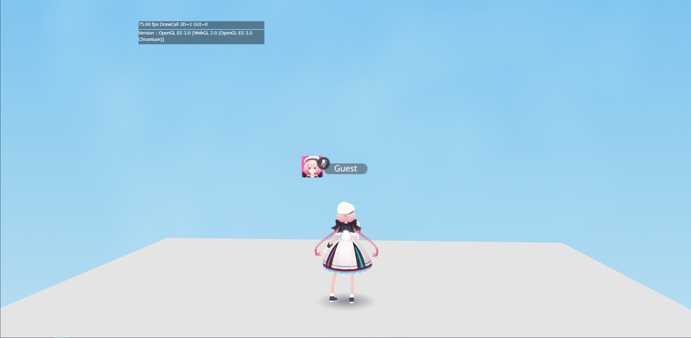
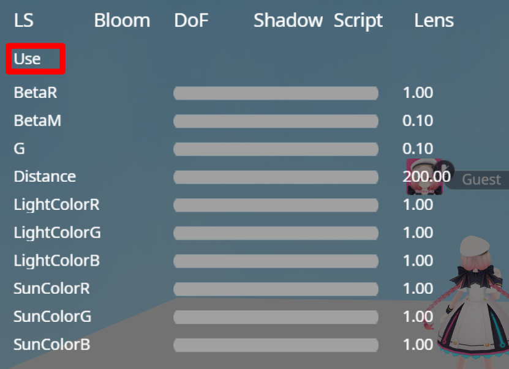

# Debug Mode

By enabling the debug mode on [HEOWorldSetting](../HEOComponents/HEOWorldSetting.md), various debug features will be available for use on world build.  
When debug mode is enabled, each feature can be toggled using F2~F9 keys.

## F9: Toggle UI Display

Toggle display of all UI objects on window. By reentering F9, the UI will be displayed. 
This can be used for taking in-world screenshots.

This feature can be used when debug mode is not enabled. 
Note that camera UI cannot be disappeared.

In previous SDK versions than Ver9.0, the **F1** key was allocated for this feature. Current versions use the **F9** key.

## F2: Light Scattering Settings

Display the UI for adjusting light scattering settings. 
After clicking the "Use" button on the LS tab, each settings will be applied by twitching the parameter bar. 
By clicking "Use" again, the light scattering settings will be unapplied.

For each settings details of light scattering, please refer to the [settings page](../HEOComponents/HEOWorldSetting.md).

On SDK9.0, the "Lens" settings has been added with the camera filters below:

## F3: Display Collision

Displays colliders placed in world. 
The clickable colliders will be displayed in red, origin(0,0,0) in purple, and BoxCollider by frames.

*If Mesh Renderer is disabled, clickable colliders in HEOObjects will not be shown.

In addition, the displays below have been added on SDK9.0 as below:

- Orange: Player Click Collision
- Yellow: Area Collider
- Green: Range of ReflectionProbe

## F4: Occlusion Culling

The "OC" indicator will appear on side of draw call information. 
The indicator will disappear when entering F4 again. 

When "OC" is indicated, the occlusion culling will be enabled.

To implement occlusion culling, preparation is needed. 
For details, please refer to the [Occlusion Culling](../WorldOptimization/OcclusionCulling.md) page.

## F5: Display Script Information

Displays Script information. 
This feature displays page count, local frame count, and operand stack count.

Content is same as the Script tab in the debug window which toggled by entering F2.

!!! Details of Script Information
    - Page Count: Count of currently active objects (Should be more than 0)
    - Local Frame Count: Stack count of function frames (Should be 0. If it's not, there's a bug somewhere!)
    - Operand Stack Count: Count of stacks in operand stack (Should be 0. If it's not, there's a bug somewhere!)

## F6: Ignore Collision

Enables moving space by ignoring collision. 
Jumping will be disabled, and instead the player can move upwards by R key and downwards by F key.

Please note that area collider events will fire even when collision is ignored.

The upward/downward velocity before enabling this will be saved. 
If the player was jumping before pressing F6, the jump will resume when feature is disabled.

## F7: Toggle GUI Information Display

Displays status / information such as positions of GUI elements like Image, Text, and Button.

| Label | Content |
| ---- | ---- |
| Name | The name of GUI element. |
| Show | Shows display status as Show/hide. |
| Pos | Position of element. |
| Z | Depth order. |
| Size | Element size. |
| Pivot | Pivot position of element. |
| Anchor | Information of element anchor.|

## F8: Toggle Status Display

Toggles the status display on top of the window.
