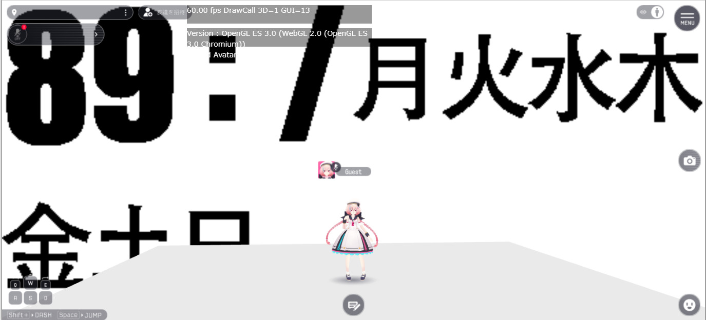
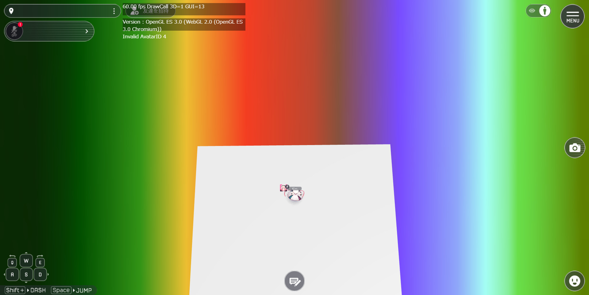
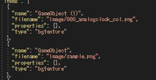

# How to Use VKC Item Background Texture/HEOBackgroundTexture

## Overview
By using VKC Item Background Texture/HEOBackgroundTexture, you can easily implement a world background.
However, there are some restrictions to be aware of.



!!! info "Test Environment"
    SDK Version: 9.3.0
    OS: Windows 10
    Unity: 2019.4.31.f1
    Browser: Google Chrome

!!! warning "The names have changed since VketCloudSDK13."
    HEOBackgroundTexture → VKCItemBackgroundTexture <br>
    HEOScript → VKCAttributeScript <br>
    *The functionality remains the same, so please read accordingly.*

## Implementation Steps

### ① Add VKC Item Background Texture/HEOBackgroundTexture
Create an empty object and add VKC Item Background Texture/HEOBackgroundTexture to it.


Although it will work correctly if added to an existing object, it is recommended to add it to an empty object for clarity.

Since it will be exported as a standalone item, it will work correctly even if it is not under HEOField.

### ② Add an Image
As stated in the component, an image with an aspect ratio of 1:1 is recommended,
but images with other aspect ratios can also be used.
*The aspect ratio will be adjusted appropriately.*


Original Image


With this, the world background is implemented.



However, since the appearance does not change even if the angle is changed, it is difficult to use it as a substitute for Skybox.

## Additional Insights

### ① Description in Scene.json


It is added as type: bgtexture.
The image will be placed in the Image folder.

### ② When Adding More Than One VKC Item Background Texture/VKC Item Background Texture/HEOBackgroundTexture



The one at the bottom will take precedence.

Regardless of the position in Unity's Hierarchy view, the object with the name that comes earlier in alphabetical order will be output at the bottom and take precedence.

Priority
GameObjec > GameObject > GameObject (1)

### ③ Interaction with Actions
1. ShowItem: HideItem
They interact. Therefore, it is possible to switch between multiple backgrounds.
However, the display priority mentioned above applies.

2. HEOScript (Direct Attachment)


Since there is no component item, attaching HEOScript to an object with VKC Item Background Texture/HEOBackgroundTexture will not increase the components, but it will be listed in the Script list.

3. HEOScript (Specified with hsItemGet)

```csharp
component BackgroundTest
{
    Item m_Item;
    float timer;
    bool back_show;
    public BackgroundTest()
    {
        m_Item = hsItemGet("GameObjec");
    }
    public void Update()
    {
        timer += hsSystemGetDeltaTime();
        if(timer>3){
            timer = 0;
            back_show = !back_show;
            m_Item.SetShow(back_show);
        }
    }
}