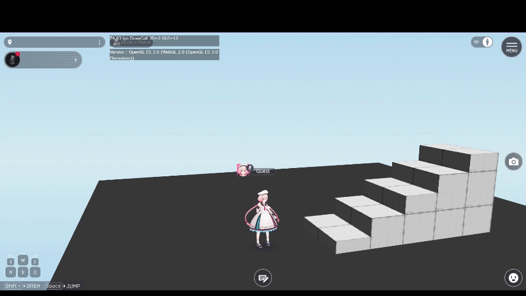

# How to use Colliders / Tips

Vket Cloudでは、UnityのコライダーにHEOComponentを付与することで壁や床などの役割だけではなく、[オクルージョン](./OcclusionCulling.md)、[動的ローディング](../HEOComponents/HEOField.md)、[クリック / 入退場 / 視野判定](../HEOComponents/HEOCollider.md#_1)、[物理演算](./PhysicsEngine.md)など様々な振る舞いをワールド上で行うことができます。 

## コライダーの付け方

VketCloudSDKでは、Unityコライダーに対応するHEOComponentをそれぞれアタッチすることでワールド上で扱えるようになります。 
コライダーの設定方法・各設定項目の詳細は各ページをご確認ください。

[HEOCollider](../HEOComponents/HEOCollider.md) : コライダーにおける基本的なコンポーネントです。

以下のコンポーネントは単体では使用せず、[HEOCollider](../HEOComponents/HEOCollider.md)と組み合わせて使用します。

[HEOAreaCollider](../HEOComponents/HEOAreacollider.md) : プレイヤーの入退場など、特定の範囲の内外でアクションを起こしたい場合に使用します。

[HEOMeshCollider](../HEOComponents/HEOMeshCollider.md) : UnityのMesh ColliderをVket Cloudにて使用したい場合に付与します。

HEOCylinderCollider : [物理演算](./PhysicsEngine.md)にてUnityのCylinder Colliderを物理演算させたい場合に使用します。 
なお、Cylinderは物理演算以外には使えないためご注意ください。

## Action Trigger / HeliScriptでの物理演算・コライダーについて

VketCloudSDKにおいて、コライダーはクリックや[HEOAreaCollider](../HEOComponents/HEOAreacollider.md)を使用した入退場判定によってアクションを起こすことができます。
詳しくは[Actionについて](../Actions/ActionsOverview.md)をご確認ください。

また、コライダーはその範囲内外にてHeliScriptのコールバック関数を呼び、様々なギミックの作成に役立てられます。 
各関数の挙動は以下のページにて記述しております。

- [コールバック - AreaCollider](../hs/hs_component.md#-areacollider)
- [コールバック - 物理衝突判定](../hs/hs_component.md#-_2)
- [コールバック - 視野内コライダー](../hs/hs_component.md#-_3)

## Tips: 階段にコライダーを設置する際の注意点

ワールドに階段を設定する際、[Mesh Collider](../HEOComponents/HEOMeshCollider.md)あるいはBox Colliderを使用してコライダーを設定すると移動時にガタつきやすく、一段一段の高さによってはジャンプを要するため、プレイヤーにとってストレスとなりうる可能性があります。

そこで、Box Colliderを斜めに設置して坂状にすることで、滑らかにのぼりやすい階段が設置できます。

