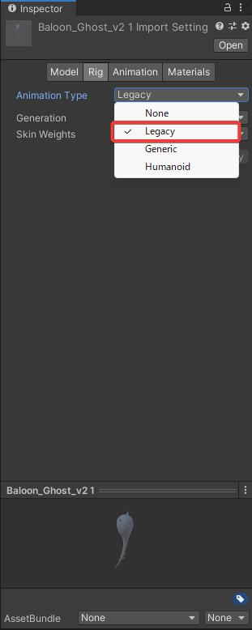
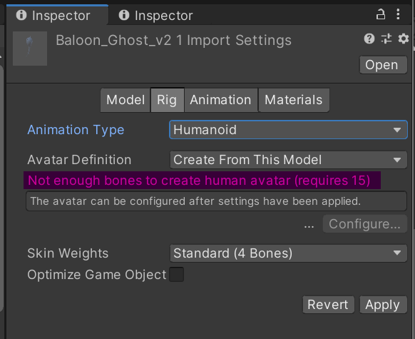

# Unityアセットのアニメーションを変換する

このページではUnity Asset Storeから、HumanoidタイプもしくはPropタイプのアニメーション付きFBXをダウンロードし、VketCloudで使える.hem形式に変換するまでの手順を解説します。

## 2種類の変換方法について

VketCloud SDKにはMotionExport、HEMAnimationConverterの2種類のツールが用意されており、それぞれで処理が異なるため、変換する対象のモデルによって使い分けを行う必要があります。

### MotionExport

- 可能なこと
    - アニメーションのHEM変換
- 不可能なこと
    - 複数のアニメーション出力
    - IKアニメーションの出力

### HEMAnimationConverter

- 可能なこと
    - Humanoid型のアニメーションのHEM変換
    - 複数アニメーションの一括出力
    - IKアニメーションの出力
- 不可能なこと
    - Legacy、Generic型のアニメーションのHEM変換

### 比較表

| ツール名 | Legacy | Generic| Humanoid | 複数出力 | IK対応 | 
| -- | -- | -- | -- | -- | -- |
| MotionExport | 〇 | × | × | × | × |
| HEMAnimationConverter | × | × | 〇 | 〇 | 〇 |

---

## 作業前提

今回は例として以下のアセットを使用します。

- [Balloon Ghost(with Breakable parts)](https://assetstore.unity.com/packages/3d/animations/balloon-ghost-with-breakable-parts-209499)

- [Basic Motions FREE](https://assetstore.unity.com/packages/3d/animations/basic-motions-free-154271)

あらかじめプロジェクトのAssetsに追加しておいてください。

また、Assets/Balloon_Ghost/Animations/Attack.fbxのインスペクターを開き、  
「Animation Type」を`Legacy`に変更します。

---

## HEMファイルの書き出し手順

### HEMExporter編

Project内のモデル（画像では`Baloon_Ghost_v2 1）を選択し、Hierarchyへドラッグ＆ドロップします。

モデルのObjectを選択して、Animationコンポーネントが追加されている事を確認します。  
追加されていない場合、InspectorビューのAdd ComponentからAnimationを追加し、出力したいアニメーションを設定します。

Unity画面上部のVketCloudSDKタブから`Export Motion`を選択してください。

.hemの保存場所選択ウィンドウが起動するので、任意の場所に任意の名前で保存してください。  

以下のメッセージが表示されたら、書き出し完了です。

### HEMAnimationConverter

変換したいモデルのインスペクター上で、`Animation Type`が`Humanoid`になっている事を確認します。  
（Humanoid型のみ変換可能となっています）

HEMAnimationConverterをVketCloudSDKタブ > Tools > HEMAnimationConverterをクリックし、  HEMAnimationConverterを立ち上げます。

HEMAnimationConverterの画面の左側に変換したいアニメーションファイルをドラッグアンドドロップします。

画面右側のModelエリアの右上にある`+`ボタンをクリックすると、デフォルトでVketちゃんのVRMが指定されます。

`Convert Animation`を押して、hemファイルを保存します。  

`正常にエクスポートされました`と表示されれば、成功です。

## HEOファイル書き出し手順

先ほどの例で使用した`Baloon_Ghost_v2 1`をシーン内に配置します。  

モデルを配置した図

Animationコンポーネントがアタッチされたオブジェクト（モデルを配置した図では**Baloon\_Ghost\_v2 1**）を選択した状態でVketCloudSDKの`Export Field`を選択してください。  
.heoの保存の際、アセットが**複数作成されるため、新しいフォルダを作り、その中に保存すること**を推奨します。

保存が成功すると、以下のポップアップウインドウが表示されます。

## HEMで動くHEOをブラウザに表示する手順

Hierarchyビュー上で右クリックし、`3D Item`＞`Create VKC Avatar`を選択する。

VKC Item Objectのコンポーネント内で.heoタブを開き`select`ボタンを押下すると、Selectウィンドウが開くので、さきほど作成した.heoファイルを選択します。  
このとき、`Enable Bone`の項目にチェックを入れます。

Object Modeを`Motion`に変更し、プラスボタン(＋)をクリックしモーション用アクションを追加します。

モーション用アクションリストのHemのSelectボタンをクリックし、Selectウィンドウで作成したHemファイルをSelectボタンをクリックして適用します。

!!! note "Loop再生について"
    再生するモーションをLoopさせたい場合は`Loop`にチェックを入れてください。   
    ※なお、**モーションチェック時はLoopにチェックを入れる事を推奨**します。

!!! warning "ご注意"
    Humanoidとして認識できないアニメーションは 
    **Scene Previewにチェックを入れてもEditor上で再生できません。**

この状態でビルドすることで、アニメーション付きのオブジェクトをシーン上に出すことができます。

## 小技・Tips等

!!! note "Humanoid型アニメーションの確認方法"
    

    Inspectorビュー上で再生した際、Unity Modelが動けばHumanoid型

    

!!! note "FBXからアニメーションを抽出・編集する方法"
    プロジェクトタブで対象のfbxを選択したのち、インスペクターのRig > Animation Type > Humanoidを選択しApplyします(下図参照)  

    

    HumanoidタイプになったAnimationファイルを選択しctrl + Dを押します（下図だと`BasicMotion@Idle01`）  
    アニメーションファイルが複製され、複製したファイルについては編集が可能

    

!!! warning "HEMをシーンプレビューできない"
    Humanoidとして認識できないアニメーションは    
    **Scene Previewにチェックを入れてもEditor上で再生できません。**

    