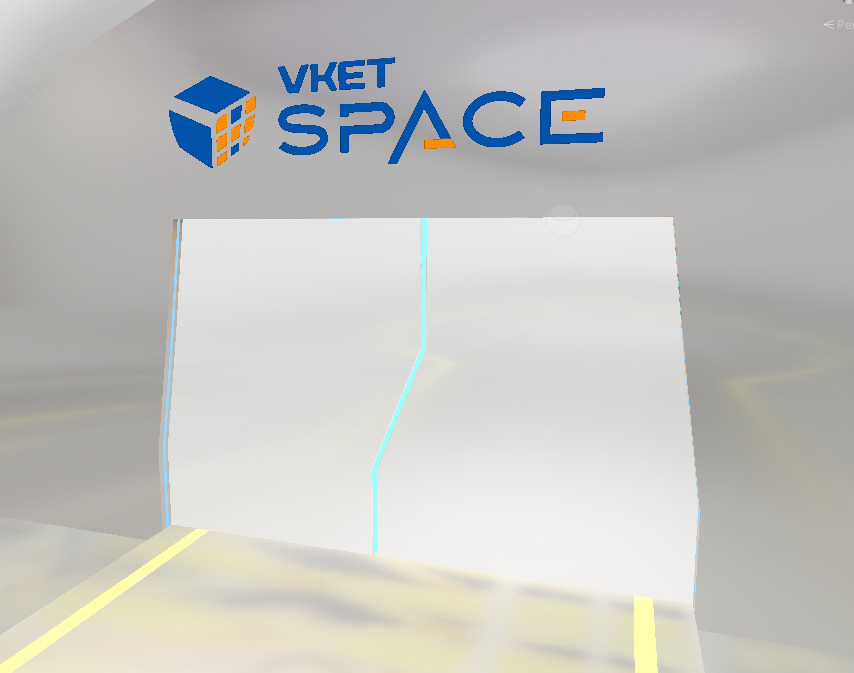

動的ローディングを実装したワールドで、ローディングが完了したらスポーン地点から移動できるようにするギミックの作り方です。

本ページでは、VketSpaceでの実装事例を紹介します。

## 実装方法

1. スポーン地点に動的ローディング読み込みエリアに入れないようにするための当たり判定を設置する

動的ローディングで読み込まれる部分への入り口を塞ぐように、当たり判定を設置します。 この当たり判定は、初めから読み込まれる(= autoloading : true)VKCItemField内に入れます。 基本的にはスポーン地点周辺のVKCItemFieldに含みます。

2. 動的ローディング読み込みHEOFieldの中に通行止め当たり判定を無効 & 扉を開けるアニメーションを行うエリアコライダーを入れる

動的ローディングで読み込まれるVKCItemField (= autoloading : false)にVKCItemAreaColliderを入れ、エリアコライダー侵入時のアクションに1で設定した読み込みエリアに入れないようにするコライダーを無効にし、ドアが開くアニメーションを再生するようにします。

## 原理

VKCItemAreaColliderは単体でアイテムとなりますが、母体となる当たり判定はそれぞれが所属するVKCItemFieldが管理しています。

シーン開始時点ではVKCItemAreaColliderの母体となる当たり判定が存在しないため、ドアは閉じたまま、行き止まりコライダーが機能した状態となりますが、動的ローディング資材の読み込みが完了した後はドアが開き、行き止まりコライダーが無効になります。

この仕組みを使用することにより、コーディング無しで動的ローディング後の処理を作成することができます。

## 動画

