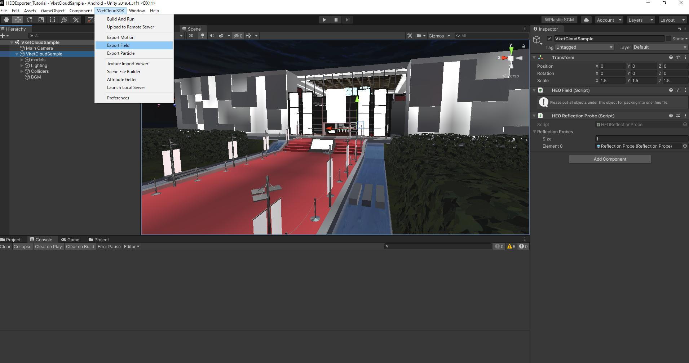
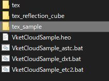

# HEOExporter Tutorial

HEOExporter is one of the tools included in VketCloudSDK, and can export ".heo", a 3D object file format dedicated to VketCloud. It is mainly used to export model data as .heo.

## Preparing the scene

Place an empty object and give it any name. Let's call it "VketCloudSample" here. This name will be used for the .heo file name when exported.

And place the world model etc. that you want to export as the child of VketCloudSample. HEOExporter exports all objects under the parent element (VketCloudSample in this case).

## Export as .heo

With the VketCloudSample object selected in the Hierarchy, click VketCloudSDK > Export Field in the topmenu. A save dialog will show up. Create a folder in an appropriate location and save the file.

If successful, the console will output "Exported" and the number of polygons as shown below.

Open the "tex_sample" folder in the output folder.

Here you will find the original texture files for confirmation purpose. If it contains files other than png files (JPEG, TGA, etc.), VketCloud won't be able to read them. Replace the textures, modify the materials, and export again.

In the example below, "009_VketCloudComu.jpg" is the problematic one. The numbers added to the beginning such as "000_" were added at the time of export, and the original file name was "VketCloudComu.jpg".

**Please delete the "tex" and "tex_sample" folders manually before re-exporting**. Since numbers are automatically added to the top of the texture file name, if the situation is different from the previous time, the old file with the same number may remain.

If there is no problem with the texture file, the export is successful for the time being. Copy the exported file / folder to load it in Vket Cloud.

!!!note tip
     Objects exported as .heo can be included in the BuildAndRun output by setting it in HEOObject. See [here](../HEOComponents/HEOObject.md) for how to use HEOObject.

A sample of this HEO file read and displayed by VketCloud is as follows.

