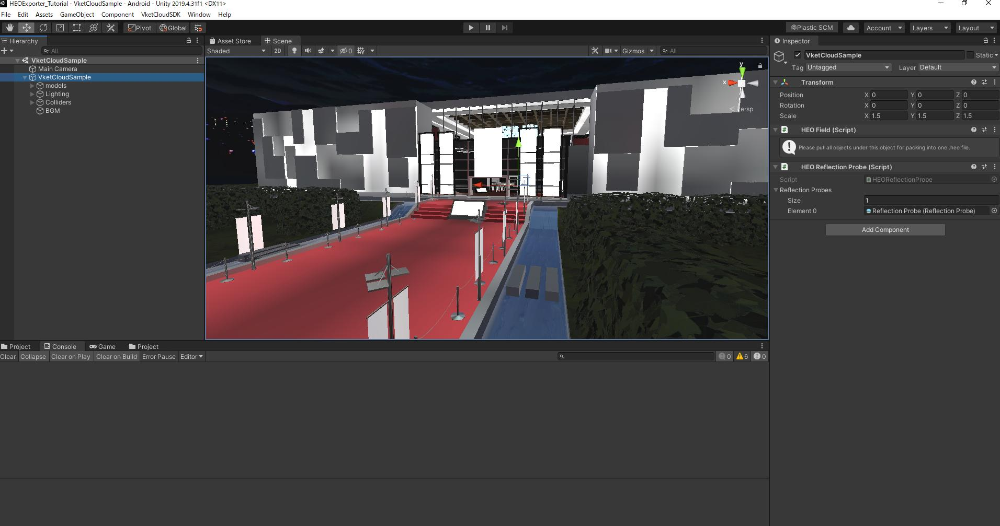
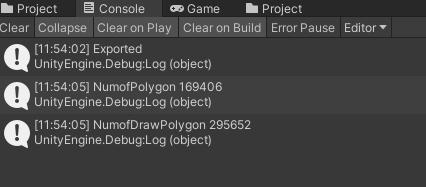
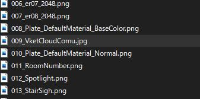

## Export Fieldの使い方
Export Fieldとは、VketCloudSDKに含まれているツールの一つで、VketCloud専用の3Dオブジェクトファイルフォーマットである『.heo』を出力することができます。主にモデルデータを.heoとして書き出します。

## シーンの準備
空のオブジェクトを配置して任意の名前を付けてください。ここでは『VketCloudSample』とします。このオブジェクト名は、出力時の.heoファイル名となります。

そしてVketCloudSampleの子にエクスポートしたいワールドモデルなどを配置してください。HEOExporterでは一番親の要素(ここではVketCloudSample)を基準にエクスポートを行います。

## .heoとしてエクスポートする
HierarchyでVketCloudSampleオブジェクトを選択した状態で、ウィンドウメニューのVketCloudSDK > Export Fieldをクリックします。保存ダイアログが表示されますので、適当な場所にフォルダを作成して保存します。

成功すると、Consoleに以下のように「Exported」とポリゴン数が出力されます。

出力したフォルダにある「tex_sample」フォルダを開いてみます。

ここには確認用のテクスチャファイルが出力されます。もしこの中にjpgファイル以外（JPEGやTGAなど）が含まれているとVketCloudでは読み込めませんので、テクスチャを差し替えてマテリアルを修正し再度エクスポートします。

上記の例では「009_VketCloudComu.jpg」がそれに該当します。なお、「000_」など先頭に追加されている数字はエクスポート時に付けられたもので、元のファイル名は「VketCloudComu.jpg」になります。

なお、**再エクスポートする際は「tex」「tex_sample」フォルダは手動で削除してからおこなって下さい**。テクスチャファイルの先頭に番号が自動で付与されるため、前回と状況が異なると同番号で古いファイルが残ったままになります。

テクスチャファイルに問題なければエクスポートはひとまず成功です。この後、VketCloudで読み込ませる場合は、出力されたファイル・フォルダを一式コピーします。

!!! note tip
    .heoとして吐き出したオブジェクトは、HEOObjectからセットすることでBuildAndRunの出力に含めることができます。HEOObjectの使い方は[こちら](../VKCComponents/VKCItemObject.md)をご覧ください。

このHEOファイルをVketCloudで読み込んで表示したサンプルは以下のものになります。

