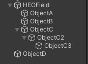

# Tips on using VKC Item Field

By using [VKC Item Field](../VKCComponents/VKCItemField.md), objects in the Unity scene will appear on the world after build, while unexpected errors and object misplacement may occur by misuse.

This article will explain the usage of [VKC Item Field](../VKCComponents/VKCItemField.md).

## Basic Use

When attaching child objects ObjectA, ObjectB, ObjectC, ObjectC2, ObjectC3 to an object with [VKC Item Field](../VKCComponents/VKCItemField.md) attached, these objects will be included within the "Item" generated by [VKC Item Field](../VKCComponents/VKCItemField.md), and displayed in the scene. (See [Item](../hs/hs_class.md) for definition)

On the other hand, ObjectD will not be displayed in the scene, as it is not a child object of [VKC Item Field](../VKCComponents/VKCItemField.md).

Also, ObjectA, ObjectB, ObjectC, ObjectC2, ObjectC3 are considered as "[Nodes](../hs/hs_overview.md#player-item-node)", which are subject to actions such as [Show/HideNode](../Actions/Node/ShowHideNode.md), [Enable/DisableCollider](../Actions/Node/EnableDisableCollider.md), and [Enable/DisableClickableNode](../Actions/Node/EnableDisableClickableNode.md).

As above, when putting ObjectD, ObjectE, ObjectF, and ObjectF2 as a child object of object VKCItemField2 with [VKC Item Field](../VKCComponents/VKCItemField.md) attached, these objects will be included within the Item "VKCItemField2", and shown in the scene.

VKCItemField2 has ObjectD, ObjectE, ObjectF, and ObjectF2 as a node. 
Therefore, the action implementation for showing/hiding these nodes will be as below:

The first Target requires the Item including the target node, which parent object VKCItemField2 is in this case, while the second Target requires the target object subject to the action.

If the Item-Object combination is wrong, such as setting the first target object to VKCItemField and the second to ObjectE, the action will not function.

## Misuses and Errors

Below are misuses and errors, therefore avoid the following usages.

1\. Parent-child relations of VKCItemField

As above, placing an object with [VKC Item Field](../VKCComponents/VKCItemField.md) within another object with [VKC Item Field](../VKCComponents/VKCItemField.md) is an error.

Keep in mind as [VKC Item Field](../VKCComponents/VKCItemField.md) objects should only be in the top-most objects.

2\. Attaching VKCItemField to every objects

As "attaching [VKC Item Field](../VKCComponents/VKCItemField.md) will show the objects in the scene", this may seem correct, however [VKC Item Field](../VKCComponents/VKCItemField.md) is required only once unless intended to implement [Dynamic Loading](../VKCComponents/VKCItemField.md#configure-dynamic-loading).

On build, .heo files will be generated based on the objects with [VKC Item Field](../VKCComponents/VKCItemField.md) attached.
Therefore, implementations as above will cause multiple .heo files to be generated, resulting to unexpected resource bloating.

As much as possible, aim to reduce the count of [VKC Item Field](../VKCComponents/VKCItemField.md).

3\. Attaching other Item-generating HEO components to the object with VKCItemField

As above, if [VKC Item Field](../VKCComponents/VKCItemField.md) and [VKC Item Audio](../VKCComponents/VKCItemAudio.md) is attached to the same object on build, the same object will be counted redundantly as a separate object.

As objects with same names cause unexpected behavior, this implementation is discouraged.

### Allowed Combinations

1\. +[VKC Attribute Script](../VKCComponents/VKCAttributeScript.md)

[VKC Item Field](../VKCComponents/VKCItemField.md) and [VKC Attribute Script](../VKCComponents/VKCAttributeScript.md) is allowed to be combined.

For instance, the Item defined by [VKC Item Field](../VKCComponents/VKCItemField.md) can be used in [VKC Attribute Script](../VKCComponents/VKCAttributeScript.md).

## Wrap-up

!!! info "Usage of VKCItemField"
    - Generally 1 VKCItemField per scene
    - Attach to the top-most object (empty object if possible)
    - When using Dynamic Loading, use more than 2 VKCItemField components
