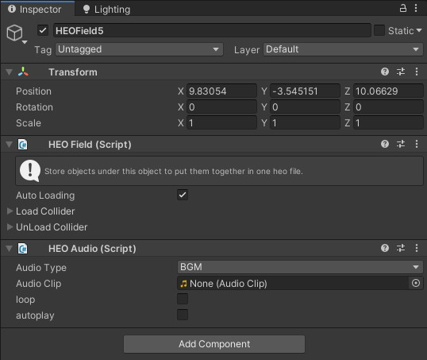

# HEOFieldの使い方

[HEOField](../HEOComponents/HEOField.md)を使うことで、ビルド後のシーンにUnity上のオブジェクトを反映することができますが、使い方を誤るとエラーが発生したり、オブジェクトが思わぬ位置に現れたりします。

本記事では[HEOField](../HEOComponents/HEOField.md)の使い方を解説していきます。

## 基本的な使い方

上記のような[HEOField](../HEOComponents/HEOField.md)をアタッチしたオブジェクトにObjectA、ObjectB、ObjectC、ObjectC2、ObjectC3を子オブジェクトに入れた場合、これらのオブジェクトは[HEOField](../HEOComponents/HEOField.md)によって生成されるアイテムに含まれ、シーン上に表示されます。(ここでの「アイテム」については [Itemクラス](../hs/hs_class_item.md) を参照)

一方、[HEOField](../HEOComponents/HEOField.md)の子オブジェクトではないObjectDはアイテムに含まれず、シーン上に表示されません。

また、この状態でのObjectA、ObjectB、ObjectC、ObjectC2、ObjectC3は「[ノード](../hs/hs_overview.md#player-item-node)」と呼ばれる状態になっており、[Show/HideNode](../Actions/Node/ShowHideNode.md)、 [Enable/DisableCollider](../Actions/Node/EnableDisableCollider.md)、 [Enable/DisableClickableNode](../Actions/Node/EnableDisableClickableNode.md)アクションの対象とすることができます。

上記のように、[HEOField](../HEOComponents/HEOField.md)をアタッチしたHEOField2にObjectD、ObjectE、ObjectF、ObjectF2を子オブジェクトに入れた場合、これらのオブジェクトは[HEOField](../HEOComponents/HEOField.md)によって生成されるアイテム「HEOField2」に含まれ、シーン上に表示されます。

HEOField2はObjectD、ObjectE、ObjectF、ObjectF2をノードに持ちます。 
したがって、これらのノードに対し表示/非表示を行う時のアクション設定は下記画像のようになります：

1つ目のTargetにノードが所属するアイテムが入るため、親オブジェクトとなるHEOField2が入り、2つ目のTargetにアクションの対象となるオブジェクトが入ります。

この時、1つ目のTargetがHEOFieldなのに2つ目のTargetがObjectEといった、アイテムとノードの組み合わせが正しくない状態だと動作しません。

## 間違った使い方

以下の使い方は正しくないので注意してください。

1\. HEOFieldの親子構造

上記画像のように[HEOField](../HEOComponents/HEOField.md)を持ったオブジェクトの子オブジェクトの中に[HEOField](../HEOComponents/HEOField.md)を持ったオブジェクトを入れるのは誤りです。

[HEOField](../HEOComponents/HEOField.md)を入れるのは最上位オブジェクトのみ、と覚えておきましょう。

2\. オブジェクトごとにHEOFieldをアタッチする

「[HEOField](../HEOComponents/HEOField.md)をアタッチすることでシーン上にオブジェクトが表示される」ことから、このような実装をやってしまいがちですが、[HEOField](../HEOComponents/HEOField.md)は[動的ローディング](../HEOComponents/HEOField.md#_1)を実装しない場合、基本的に1つだけで大丈夫です。

ビルド時に[HEOField](../HEOComponents/HEOField.md)をアタッチしたオブジェクトを元に.heoファイルが生成されます。
上記のような実装を行うと大量に.heoファイルが生成され、容量を大幅に取ってしまいます。

可能な限り、[HEOField](../HEOComponents/HEOField.md)を使う数は最小に抑えましょう。

3\. HEOFieldをアタッチしたオブジェクトに他のアイテム生成系HEOコンポーネントをアタッチする

上記画像のように、[HEOField](../HEOComponents/HEOField.md)と[HEOAudio](../HEOComponents/HEOAudio.md)を同じオブジェクトにアタッチした状態でビルドすると、同一のオブジェクトが別アイテムとして二重計上されてしまいます。

同名のアイテムが存在する場合、誤作動が起きてしまうので、このような実装はNGです。

### OKな組み合わせ

1\. +[HEOScript](../HEOComponents/HEOScript.md)

[HEOField](../HEOComponents/HEOField.md)と[HEOScript](../HEOComponents/HEOScript.md)は併用可能です。

[HEOField](../HEOComponents/HEOField.md)で定義したアイテムに[HEOScript](../HEOComponents/HEOScript.md)で定義したComponentを入れることができます。

2\. +[HEOReflectionProbe](../HEOComponents/HEOReflectionProbe.md)

[HEOField](../HEOComponents/HEOField.md)と[HEOReflectionProbe](../HEOComponents/HEOReflectionProbe.md)も併用可能です。

ReflectionProbe本体に[HEOField](../HEOComponents/HEOField.md)は付けないでください。

## まとめ

!!! info "HEOFieldの使い方"
    - 基本1シーンにつき1つ
    - 最上位オブジェクトにアタッチする(空のオブジェクトが好ましい)
    - 動的ローディングを使う時は2つ以上HEOFieldを使う