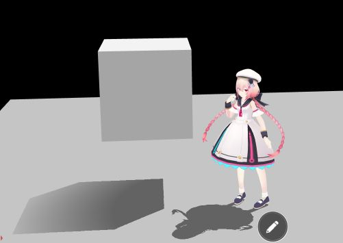
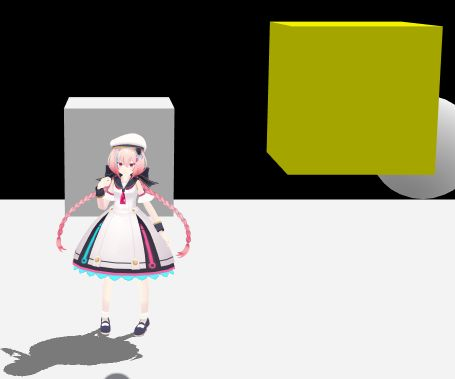
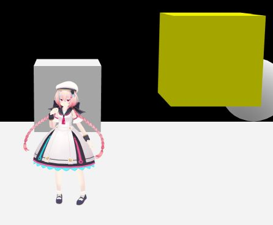
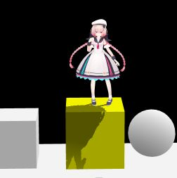

# HEOShadowの使い方

## 概要

HEOShadowを使うことで、動的影（シャドウマップ）を設定することができます。

!!! info "検証環境"
    SDKバージョン : 4.1.4
    OS : Windows 10
    Unity : 2019.4.31.f1
    ブラウザ : Google Chrome

VketCloudSDK13以降で名称が変化しています。

HEOShadow → VKCNodeShadow

※出来ることは変わっていないので、読み替えてください。

## 手順

`HEOShadow`をGameObjectにアタッチしている`Renderer`(`MeshRenderer`もしくは`SkinnedMeshRenderer`)を制御できます

この機能を追加すると、Unity Editorで影の状況を簡単に確認することができます。

-   `HEOShadow`の**Shadow Caster**は`Renderer`の**Cast Shadow**フィールドを制御します。
    
    -   `HEOShadow`の**Shadow Caster**がON：`Renderer`の**Cast Shadow**フィールドをONに設定します。
        
    -   `HEOShadow`の**Shadow Caster**がOFF：`Renderer`の**Cast Shadow**フィールドをOFFに設定します。
        
-   `HEOShadow`の**Shadow** **Receiver**は`Renderer`の**Receive Shadow**枠を制御します。
    
    -   `HEOShadow`の**Shadow** **Receiver**がON：`Renderer`の**Receive Shadow**チェックボックスをONに設定します。
        
    -   `HEOShadow`の**Shadow** **Receiver**がOFF：`Renderer`の**Receive Shadow**チェックボックスをOFFに設定します。
        
### ①HEOShadowのアタッチ

・影を映し出すオブジェクト
　→ Is Shadow Caster にチェックを入れます。

・影を投影するオブジェクト
　→ Is Shadow Receiver にチェックを入れます。

ひとつのオブジェクトをCasterとReceiverの両方に設定することも可能です。

### ②シーンJsonのrendering項目にshadowtypeを追加

上記画像のように、"shadowtype":"normalshadowmap" の記載を追加します。

### ③確認
ブラウザを更新することで、HEOShadow設定が読み込まれます。

HEOShadowが設定されたオブジェクトの影がリアルに表現されます。

影には表示距離があり、一定距離離れたオブジェクトは影が徐々に薄くなり、離れると表示されなくなります。

HEOShadowで動的影が出力されるのは、HEOShadowをアタッチしたオブジェクトのみになります。
HEOShadowがアタッチされていないオブジェクトは影を表示しない + 影が投影されない状態となります。

上記画像では、黄色のオブジェクトにのみHEOShadowを入れ、空中にあるCubeにはCaster設定、床にはReceiver設定を行っています。

見てわかる通り、HEOShadowをアタッチしていないオブジェクトは影が出力・表示されません。

## HEOShadowによる影の生成の比較

床とVketちゃんの右上の黄色CubeにHEOShadowを入れ、
それぞれのHEOShadowのCasterとReceiverの設定を変更した時の影のでき方の違いを画像にしています。
true : チェックを入れた状態　false : チェックを外した状態　です。

画面内に映っている他のオブジェクトにはHEOShadowをアタッチしていません。
Cubeに影が投影される場合、Cubeの上に乗って撮影しています。

| 床 Caster | 床 Receiver | Cube Caster | Cube Receiver | 画像 |
| ---- | ---- | ---- | ---- | ---- |
| false | false | false | false |  |
| true | false | false | false |  |
| false | true | false | false |  |
| true | true | false | false |  |
| false | false | true | false |  |
| true | false | true | false |  |
| false | true | true | false |  |
| true | true | true | false |  |
| false | false | false | true |  |
| true | false | false | true |  |
| false | true | false | true |  |
| true | true | false | true |  |
| false | false | true | true |  |
| true | false | true | true |  |
| false | true | true | true |  |
| true | true | true | true |  |

## 結論

シーン上にCasterとReceiverに設定されたオブジェクトがどちらも1つずつ以上ある時のみ、プレイヤーからリアルな影が出力されます。

プレイヤーから出力された影は、Receiverに設定されたオブジェクトにのみ投影されます。

Receiverに設定されたオブジェクトに影が投影される範囲にHEOShadowがアタッチされたオブジェクトがある場合、想定とは異なる形状の影が発生することがあります。(false,true,false,false、false,true,false,trueの時参照)

## その他知見

### ①一人称視点時の仕様

一人称視点のとき、真下を向いても自分自身の影は表示されません。

### ②カメラ撮影時の仕様

カメラで視点を変更しても、影は変わりません。  
そのため、カメラを起動した地点より遠くにあるオブジェクトは影がない、  
同じ場所からの写真なのにカメラを起動した位置によって影が異なるといった現象が発生します(不具合？)。

### ③HEOMirrorの中の動的影

HEOMirrorの鏡像の影はプレイヤー位置によって発生している影と同じものになります。

### ④その他動的影にまつわるパラメータ

[シーンファイル仕様 | rendering](https://hikky.atlassian.net/wiki/spaces/VKETCLOUD/pages/222136775#rendering) に記載がありますが、動的影を調整するパラメータがあります。

**shadowbias**  
影描画のバイアスを設定します。

**shadowareasize**  
影を描画する距離（単位メートル）を指定します。

**shadowfadesize**  
シャドウ外周に向かってフェードアウトする距離（単位メートル）を指定します。

### ⑤Directional Lightの影響

Directional Lightの角度を変更することで、動的影の角度を変更できます。

角度を付けることで、上記のように夕日の表現が出来たりします。