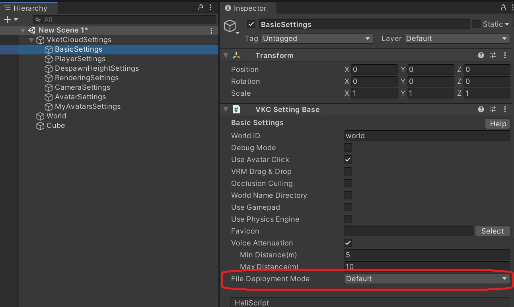

# Enabling JS Upload Feature in SDK 13.7 (Paid Plans Only, SDK 13.7 and Later)

## Purpose

By uploading JavaScript, you can execute JavaScript within your world. For example, using JS, you can integrate with external APIs (such as weather information, news, SNS feeds) and display real-time information in VR.

Other use cases include:

- **Data Collection and Analysis**: Embed a feature within the VR space that analyzes user data in real-time and displays the results using JS. Provide immediate feedback based on user behavior data to optimize the experience.

- **Integration with External APIs**: Use JS to integrate with external APIs (such as weather information, news, SNS feeds) and display real-time information in VR. This allows for dynamic content updates and the importation of external information, providing a more interactive experience.

- **Implementation of Interactive Content**: Add interactive effects and events using JS that respond in real-time to user actions such as clicks or gestures. Enhance user immersion in the content and provide a deeper experience.

- **Customization of Game Logic**: Use JS to customize game logic within VR (such as scoring systems, enemy behavior, item actions), creating unique gaming experiences. Game developers can easily implement custom rules and systems, enabling creative game design.

## Supported SDK Versions

- **SDK 13.7 and Later**

## Eligible Users

Users subscribed to the following paid plans can enable the JS upload feature in SDK 13.7 and later, allowing them to upload JavaScript. For users on free plans, JavaScript will be automatically excluded from the uploadable files.

- Basic Plan
- Business Plan
- Business Plus Plan
- Enterprise Plan

For more information on pricing plans, please check [here](https://cloud.vket.com/plan).

## JS Submission Procedure

1. **Right-click in the Project Window** and create the `File Deployment Config` item.

   

2. **Access Base Setting** and change `File Deployment Mode` to `Custom`. Then, create the file in your Asset by clicking the `Create File Deployment Config` button.

   

3. Set the JavaScript you want to include in the target `File Deployment Config`.

   **Sample JS**: `vkc_sample.js`

   

4. Set the target `Scriptable Object` in the **Base Setting's File Deployment Config**.

   
   

5. Finally, perform **Build And Run** or **Upload**.

This completes the procedure for setting up the JS upload feature in SDK 13.1.

--- 

This should accurately convey the information from the original Japanese text in English while maintaining the Markdown format.