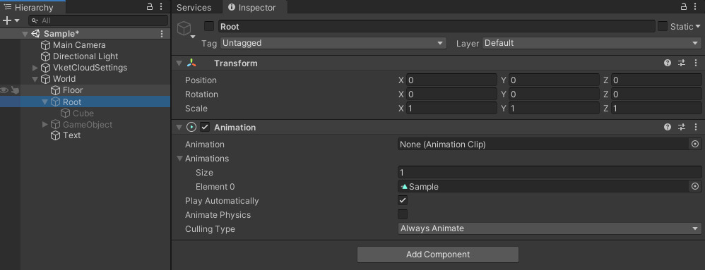
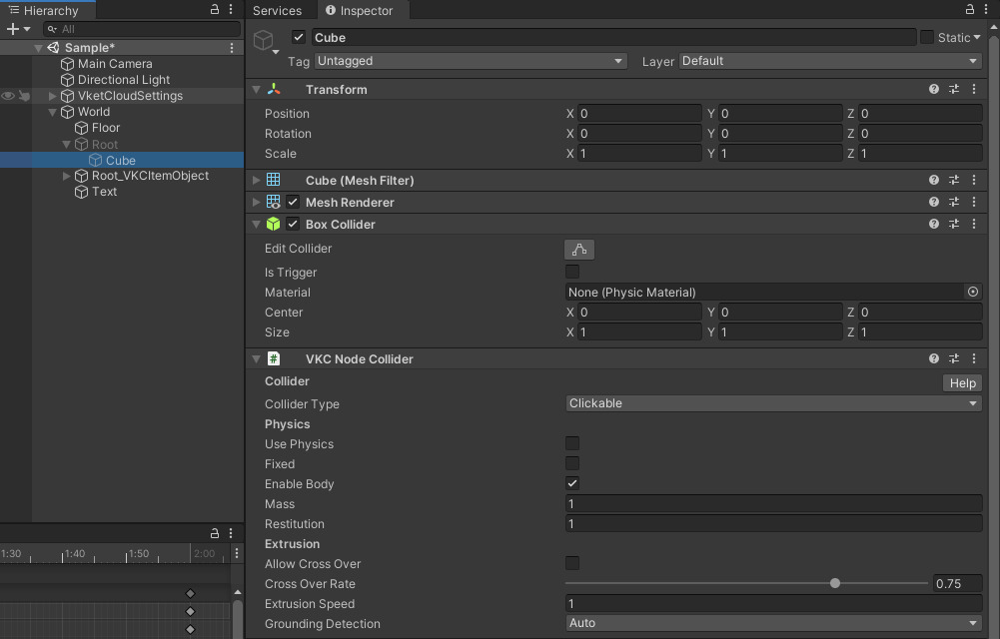

# Movable Clickable Object

VKCItemObject is an Item, not a Node, so the click detection method GetNodeIndexByName described in [this manual](../hs/hs_overview.md){target=_blank} cannot be used. However, it is possible to achieve a movable object with click detection in VketCloud using a different approach. Follow the steps below:

## Setting Up the Floor


1. Create a Cube and name it "Floor".
2. Set the Scale to `100, 1, 100`.
3. Set the Position to `0, -1, 0`.

## Outputting HEO and HEM





1. Create an empty GameObject named "Root".
2. Create a Cube as a child of Root.
3. Add an `Animation` component to Root.
4. Create an AnimationClip that makes the Cube move left and right.
5. Right-click on Root and select `VKCHelper > Export Motion`.
6. Save the created HEM file under the Assets folder.
7. Add a VKCNodeCollider to the Cube and set the `ColliderType` to `Clickable`.
8. Right-click on Root and select `VKCHelper > Create VKCObject`.
9. A Root_VKCItemObject will be generated. Root is no longer needed, so delete it.
10. Turn on `ScenePreview` for the generated Root_VKCItemObject.
11. Set the object mode to `Motion`.
12. Drag and drop the created HEM file into the Hem field.
13. Turn on Loop.

## Placing a TextPlane for Click Confirmation


1. Create an empty GameObject named "Text".
2. Add a VKCItemTextPlane to it.
3. Since it is hard to see as is, set the Position to `0, 2, 0`.
4. Set the text to `count: 0`.

## Setting Up HeliScript


1. Right-click in the Project pane and create a new HeliScript.
2. Paste the following HeliScript:

```
component Sample
{
    Item target;
    int count;

    public Sample()
    {
        target = hsItemGet("Text");
    }

    public void OnClickNode(int NodeIndex)
    {
        count = count + 1;
        target.WriteTextPlane("count: " + count.ToString());
    }
}
```

3. Add a VKCAttributeScript to Root_VKCItemObject.
4. Click the + button on VKCAttributeScript and select Sample from the selection button.


## BuildAndRun


When you BuildAndRun, it will work as described above. Clicking on the moving Cube will increase the click count on the Text.
