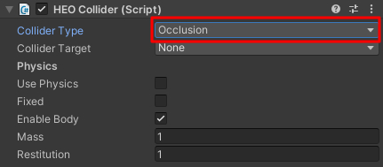

# Occlusion Culling

If there is an obstruction (e.g. a huge building, wall, etc.) within the player's field of vision, there is no need to draw it because the other side of the obstruction is not actually visible.  
By setting occlusion culling to the relevant parts, you can cut off the drawing of invisible parts and optimize and reduce the weight.

## Setup steps

As an example, here we will prepare a Cube as a shield.

At this time, if you do not need to show the Cube itself to the player, you can uncheck MeshRenderer and make it transparent.  

Next, set up a Sphere as a shielded target on the other side of the Cube.

Insert [HEOCollider](../HEOComponents/HEOCollider.md) into the Cube and set ColliderType to Occlusion.

Also, check Occlusion Culling in [HEOWorldSetting](../HEOComponents/HEOWorldSetting.md) and build.

The Sphere will be hidden by placing a Cube with Occlusion settings between the camera and the Sphere.
At this time, the Cube has neither hit detection nor camera non-penetration detection.

## How to debug occlusion culling

If DebugMode is turned on in [HEOWorldSetting](../HEOComponents/HEOWorldSetting.md), information can be displayed at the top of the screen by pressing the F1 key twice.

The number next to "DrawCall(Field)" on the top line of the displayed information is the number of draw calls for the currently displayed object, and the OC indicates that the occlusion culling setting is ON.  
In this state, you can check the increase or decrease in the number of draw calls by showing/hiding objects using occlusion culling by moving the camera, etc.  
An increase or decrease in the number of draw calls indicates that occlusion culling is working properly.  

Also, if DebugMode is on, you can toggle occlusion culling itself on and off with the F4 key.

## Tips

Even if you move the viewpoint using the camera function, occlusion culling will be displayed or hidden.  
Depending on the camera position, occlusion culling may not work and the number of draw calls may increase and become heavy, so avoid relying entirely on occlusion culling to adjust the number of draw calls.