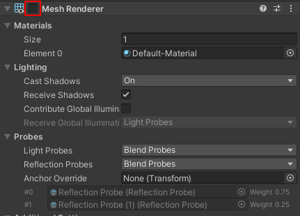

# オクルージョンカリング

プレイヤーの視界内に遮蔽物（例：巨大なビル、壁、etc...)などがある場合、その遮蔽物の向こう側は実際には表示されないため、描画する必要がありません。 
該当する部分にオクルージョンカリングを設定することで見えない部分の描画を切り、最適化と軽量化を行うことができます。

## 設定手順

例として、ここでは遮蔽物としてCubeを用意します。

このとき、Cube自体をプレイヤーに見せる必要がない場合はMeshRendererのチェックマークを外して透明にしてもかまいません。 

次に、Cubeの向こう側に遮蔽される対象としてSphereを設置します。

Cubeには[HEOCollider](../HEOComponents/HEOCollider.md)を入れ、ColliderTypeをOcclusionに設定します。

また、[HEOWorldSetting](../HEOComponents/HEOWorldSetting.md)のOcclusion Cullingにチェックを入れ、ビルドします。

カメラとSphereの間にOcclusion設定を行ったCubeが入ることで、Sphereが非表示になります。
この時、Cubeには当たり判定もカメラ非貫通判定もありません。

## オクルージョンカリングのデバッグ方法

[HEOWorldSetting](../HEOComponents/HEOWorldSetting.md)でDebugModeをオンにしている場合、F1キーを2回押すことで画面上部に情報表示することができます。

表示された情報の1番上の行の「DrawCall(Field)」の隣の数字が現在表示されているオブジェクトのドローコール数で、OCがオクルージョンカリング設定がONになっている表示です。 
この状態でオクルージョンカリングによるオブジェクトの表示/非表示をカメラ移動等で行うことで、ドローコール数の増減が確認できると思います。 
ドローコール数に増減がある場合、オクルージョンカリングが正常に動作していることを表します。 

また、DebugModeをオンにしている場合、F4キーでオクルージョンカリングそのものの機能オンオフを切り替えることができます。

## Tips

カメラ機能で視点を動かした場合でも、オクルージョンカリングの表示非表示が発生します。 
カメラ位置によってオクルージョンカリングが動作せず、ドローコール数が増え重たくなってしまうといったことも起こりえるので、ドローコール数調整はオクルージョンカリングに頼りきらないようにしましょう。