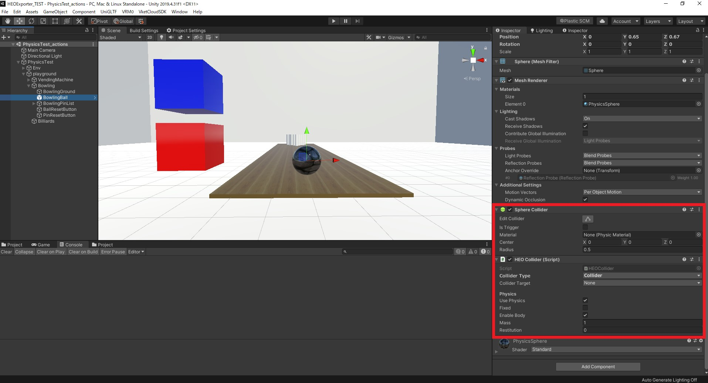
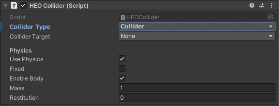
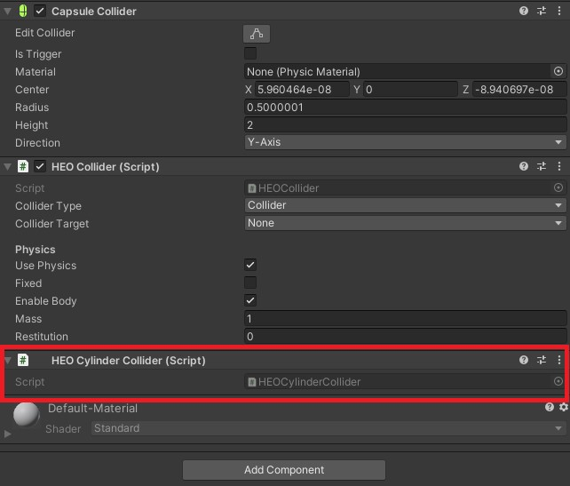

# 物理エンジン

## 物理エンジンの使用方法
1. 物理演算を適応したいゲームオブジェクトに『Unityコライダー』と『HEOCollider』をアタッチしてください。物理演算に使用できるUnityコライダーは『Box Collider』『Sphere Collider』『Capsule Collider』です。また後述されているように『Capsule Collider』がアタッチされているゲームオブジェクトに追加で『HEOCylinderCollider』をアタッチすることでVketCloudの物理エンジン限定でシリンダーコライダーとして使用することができます。

2. HEOCollider/Physicsの項目のプロパティを設定します。各項目は下記で説明いたしますが、『UsePhysics』にチェックを入れることでそのゲームオブジェクトに物理演算が適応されるようになります。
  - HEOCollider/Physicsのプロパティについて
  
    - UsePhysics : チェックを入れると物理演算が適応されます
    - Fixed : 物理演算においてこのゲームオブジェクトを固定するかどうか。
      - 例.
        - 床や壁などの動かないもの → Fixedオン
        - ボールなどの動くもの  → Fixedオフ
  - EnableBody : 物理演算の有無の初期値
    - 後述しますが、Action Triggerで物理演算を有無を切り替えることができます。EnableBody はその初期値です。例えば自動販売機の中にジュースの缶を物理演算を無効にして仕込んでおいて、自動販売機の購入ボタンを押したときに缶の物理演算を有効にして自動販売機の中から缶を転がすといったギミックを作成することができます。
  - Mass : 重さ
  - Restitution : 反発係数

3. 後は通常通りエクスポートすれば物理演算を使用することができます。

## Action Triggerについて
ActionTriggerの使い方に関しては、以下ページに記述しております。

- [PhysicsAddVelocity](../Unity/PhysicsAddVelocity.md)
- [PhysicsClearAddForce](../Unity/PhysicsClearAddForce.md)
- [PhysicsSetEnable](../Unity/PhysicsSetEnable.md)
- [PhyscsSetPosRot](../Unity/PhysicsSetPosRot.md)

## シリンダーコライダーについて
通常Unityではシリンダーコライダーは無く、それはカプセルコライダーで代用されますが、VketCloudでは下記の画像のように『Capsule Collider』を持っているオブジェクトに追加で『HEOCylinderCollider』をアタッチすることで、VketCloudの物理エンジン限定でシリンダーコライダーとして使用することができます。

!!! 注意点 Info
    - 物理エンジンの衝突判定の実装の都合上、カプセルコライダーとシリンダーコライダー・シリンダーコライダーとシリンダーコライダーは衝突しません。
    - シリンダーコライダーを使用する場合、Planeの様な薄いコライダーだと貫通してしまうことがあるので地面にボックスを使用する必要があります。