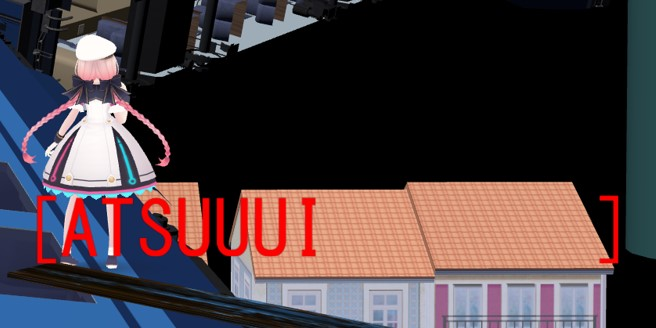

# プレイヤーに追従するテキストの実装

## 概要

プレイヤーに追従するテキストの実装方法です。



!!! info "検証環境"
    SDKバージョン : SDK5.4.0<br>
    OS : Windows 10<br>
    Unity : 2019.4.31.f1<br>
    ブラウザ :Google Chrome  

!!! warning "VketCloudSDK13以降で名称が変化しています。"
    HEOTextPlane → VKCItemTextPlane<br>
    ※出来ることは変わっていないので、読み替えてください。

## 手順
        
### ①HEO Text Planeを用意する


プレイヤーに追従させたいシーン内のGameObjectにHEO Text Planeコンポーネントをアタッチします。

のちにHeliScriptで名前を使ってGameObjectを取得するので、”textPlane_1”のようにGameObjectを出来るだけ整った名前にすると良いです。

常にテキスト面をこちらに向かせたい場合はBillboardを有効にします。

Showが有効になっていることを確認してください。

Z-Biasを負の値にして、テキストが物陰に隠れないようにします。おすすめは-0.05以下です。

### ②HeliScriptを用意する

```
component FollowPlayer
{
    Item m_textPlane_1;
    public FollowPlayer
    {
        m_textPlane_1 = hsItemGet("textPlane_1");
    }
    public void Update()
    {
        m_textPlane_1.SetPos(m_player.GetPos());
    }
}
```

hsItemGet()で①のGameObjectの名前でHEO Text Planeを取得し、Update()で毎フレームHEO Text Planeの位置をプレイヤーの位置に移動させます。

## その他知見

本ページ記載のとおりの実装だとテキストはプレイヤーの原点に追従します。プレイヤーアバターの頭の上などにオフセットして表示したい場合は、`m_textPlane_1.SetPos(m_player.GetPos() + offSet);`のようにプレイヤーの原点位置にオフセットのベクトルを加算します。