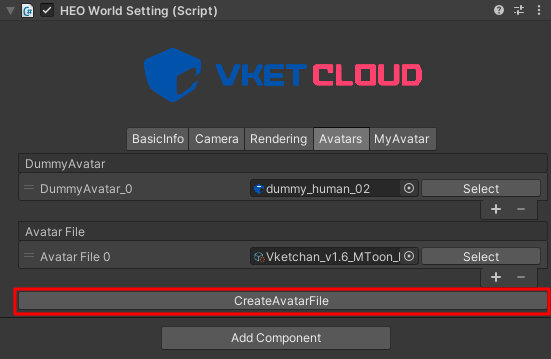
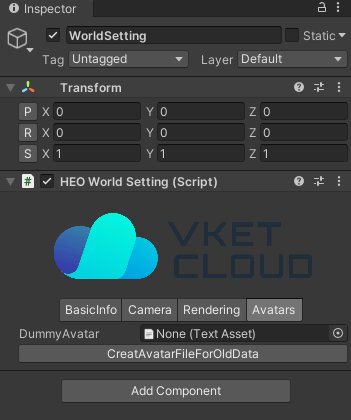
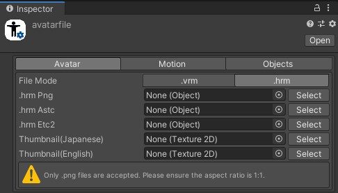
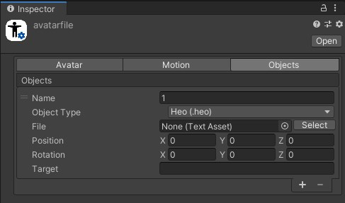
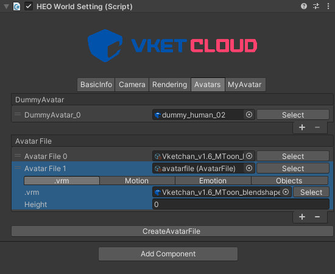

# プリセットアバターを追加する

VketCloudSDKでは、ワールドに入ったユーザーが手持ちのアバター以外に使えるプリセットアバターを設定できます。 
設定されたアバターは「設定画面」-->「マイページ」-->「アバター」-->「プリセットアバター」にて一覧表示され、ワールドの中でユーザーが自由に着脱することができます。

なお、プリセットアバターを追加するにあたって、追加したいアバターをあらかじめ[vrm形式に変換](https://vrm.dev/vrm/how_to_make_vrm/index.html){target=_blank}する必要があります。 

## 1. テクスチャが圧縮されたアバターを作成する

スマートフォン上でもアバターが表示できるようにテクスチャの圧縮を行います。 

テクスチャの圧縮方法は[ワールドテクスチャの圧縮](../heoexporter/he_TextureCompression.md)と同じツールを使用して行えます。

## 2. AvatarFileを作成する
### 2.1 HEOWorldSettingからAvatarFileを新規作成する

VketCloudSDKではAvatarFileというファイルにアバター情報を設定し、ワールドのビルド時にプリセットアバターとして反映します。

[HEOWorldSetting](../HEOComponents/HEOWorldSetting.md)内のAvatarsタブ下の`CreateAvatarFile`を押すことで、新しいAvatarFileを作成します。

AvatarFileリスト右下の +/- を押すことで、プリセットアバターのリストに項目を追加/削除することができます。 
リストから削除した場合でも、元のAvatarFileのデータが残ります。

!!! note
        以下の画像のようにAvatarFileリストが表示されず、「CreatAvatarFileForOldData」ボタンが表示されている場合があります。 
        これは、古いSDKのアバターデータ情報が残っている時に見られます。 
        ボタンを押すことで、元々あったアバター情報がAvatarFileリスト形式に書き出されます。

### 2.2 AvatarFileの中身を設定する

ProjectビューでAvatarFileを選択することで、Inspectorビュー上に中身が表示されます。 
設定できる項目はタブ別に分類されています。

各項目の仕様詳細は[AvatarFile](AvatarFile.md)に記載されています。

#### 2.2.1 .vrmタブ

アバターの.vrmを登録することができます。 
また、圧縮アバターの.hrmファイルについても登録可能です。

#### 2.2.2 Motionタブ

モーションの登録が可能です。

#### 2.2.3 Emotionタブ

エモートが登録できます。

#### 2.2.4 Objectsタブ

アバターの持つオブジェクトが登録できます。

## 3. WorldSettingsに入れる

WorldSettingsのAvatarFileリストにAvatarFileを入れます。 
これによってプリセットアバターの一覧にアバターが追加されます。

また、AvatarFileリスト上でも枠を選択することで簡易編集画面を出すことができます。 
全項目が表示されるわけではないので、AvatarFileをProjectビューで選んでからInspectorビューを編集する方法を使うことをおすすめします。