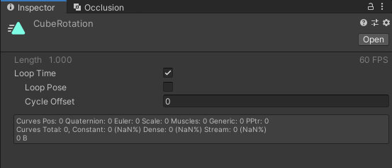
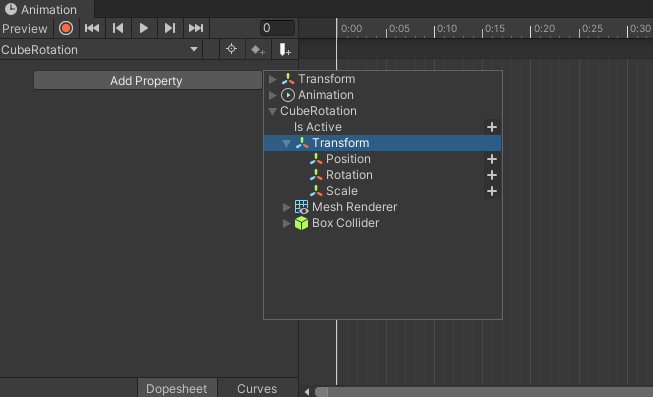
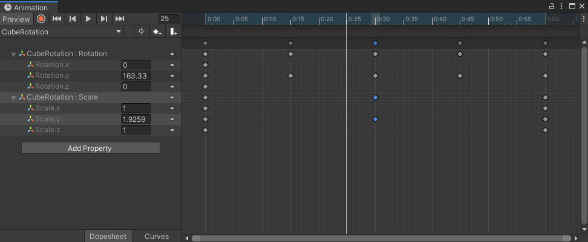
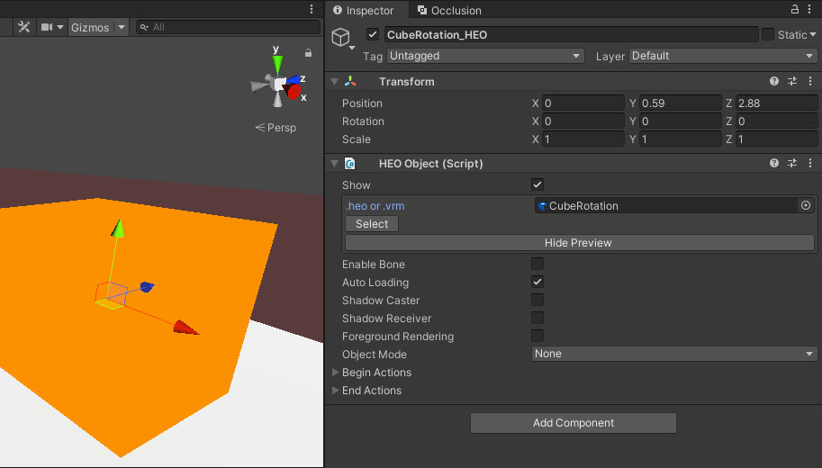
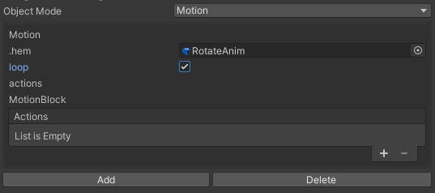

# オブジェクトをアニメーションさせる

VketCloudSDKでは、[HEOAnimation](../HEOComponents/HEOAnimation.md)コンポーネントあるいは.heoファイルと.hemを使用してワールド上にアニメーション付きのオブジェクトを置くことができます。
動くオブジェクトがワールド上に設置されることで、見栄えが大きく向上します。

各ステップで躓いた際はオブジェクトをアニメーションさせる[オブジェクトをアニメーションさせる - できないときは]()を参照してください。

## HEOAnimationのアタッチ

[HEOAnimation](../HEOComponents/HEOAnimation.md)コンポーネントの`使い方`項目をご参照ください。

## HEOObjectにアニメーションを付与する方法
オブジェクトを.heoに書き出し、アニメーションを.hemに書き出し、シーン上に配置することで、[HEOAnimation](../HEOComponents/HEOAnimation.md)より自由に動くオブジェクトを作成することができます。

なお、ここで使用できるアニメーションのパラメータは**Transformの値変更のみ**です。

### .hemファイル(Heliodor Export Motionファイル)を書き出す

1\. アニメーション作成用に空の親オブジェクト(下記画像におけるAnimationBase)と動かすためのCubeオブジェクト（下記画像におけるCubeRotation）を新規作成し、親子関係をヒエラルキーにて構成した上でともにPosition(0,0,0)地点に設置します。 
    

2\. 空オブジェクトを選択し、InspectorビューのAdd ComponentからAnimationを追加します。 
    誤ってCubeオブジェクトに対してAnimationを追記しないよう注意してください。

!!! note
        類似コンポーネントにAnimatorがありますが、こちらは使用しないので注意してください。

3\. Window > Animation > AnimationまたはCtrl+6でアニメーションタブを出します。

4\. Animation Clipを作ります。  **空の親オブジェクト**を選択している状態でAnimationタブを表示し、画像の表示のCreateをクリックし、.anim形式のファイルを作成します。

空の親オブジェクトのInspectorのAnimationsのプロパティに作成したアニメーションが設定されていることを確認します。

5\. Projectビューで作成したアニメーションファイルを確認します。 
Inspectorビューが下記画像のようになっていたらOKです。

もし、下記画像のように上記とInspectorビューの中身が異なる場合、追加作業が必要です。

右上の縦に並んだ「…」を選択し、Debugを選択します。

Legacyにチェックを入れます。

再度「…」を選び、Normalを選択して作業完了です。

6\. AnimationウィンドウにてAdd Propertyで動かしたい項目を選びます。 
空オブジェクトを選択していることを確認し、Animationウインドウを開きます。Add Propertyを選択すると、子オブジェクトであるCubeオブジェクトが確認できます。 

ここでは、CubeRotation - Transformから、RotationとScaleを選択します。＋ボタンを押すことで、項目を追加することができます。それぞれ追加してください。

!!! note
        手順②でAdd ComponentでAnimationを追加する際、誤って子オブジェクトのCubeオブジェクトに対してAnimationを追加してしまっていないか確認してください。 
        そのまま作業を進めてしまうと`KeyNotFoundException: The given key was not present in the dictionary.`が発生する原因となります。

詳しいアニメーションの作り方はここでは説明しませんが、
- 始点と終点はすべての項目でキーフレームが入力されている必要がある
- Animationコンポーネントをアタッチしたオブジェクト（空オブジェクト）を動かしていない
の2点は守ってください。

キーフレームをいくつか追加し、任意のアニメーションを作成してください。

入力が完了したら、Inspectorビュー上でAnimationを持つオブジェクト（空オブジェクト）を選んだ状態で、画面上部VketCloudSDKタブの「Export Motion」を選択してください。 
選択後、.hemの保存場所選択ウィンドウが起動するので、任意の場所に任意の名前で保存してください。

保存後、Unityのコンソール(標準だと左下)に「Exported」が出たら書き出し完了です。

!!! note
        エラーが出てしまった場合は [オブジェクトを動かす - できないときは]() を参照するようにしてください。

### .heoファイル(Heliodor Export Objectファイル)を書き出す

上記でAnimationコンポーネントを入れたオブジェクト（空オブジェクト）を選択した状態でVketCloudSDKの`「Export Field」`を選択してください。

.hemと同じく保存画面が出ますが、.heoの保存の際は複数オブジェクトが作成されるため、**新しいフォルダを作り、その中に保存すること**を推奨します。 
（上記画像ではAssetsフォルダ内に新規のCubeRotationフォルダを作成しています） 
保存が成功すると、以下のポップアップウインドウが表示されます。

正しく保存されたことを確認するため、コンソールタブを開き、下記のような画面が出たら保存完了です。 

新しく空のオブジェクトを作成してInspectorタブを選択し、Add Componentを押下し、HEOObjectを追加します。

.heo or .vrmの”select”の左にある丸ボタンを押下し、先程作成した.heoファイルを選択します。

.heoファイルを入れ、"Show Preview"を選択すると空オブジェクトの位置に選択したheoファイルのプレビューが出現します。 
空オブジェクトのTransformはオブジェクトを生成したい位置に設定します。

Object ModeをMotionに変更し、Add(丸ボタン)を選択し、表示された欄の.hemに作成した.hemファイルを入れます。

ループアニメーションの場合は、loopにチェックを入れます。 
この状態でビルドすることで、アニメーション付きのオブジェクトをシーン上に出すことができます。

!!! note caution
        .heo書き出しの注意点： 
        - 元オブジェクトのPositionを(0,0,0)にせずに書き出しした場合、HEOObjectにてシーン上に配置した際に、HEOObjectのPosition + 書き出し時のPositionになります。 
        - 元のオブジェクトが当たり判定を持っていた場合、書き出し後のオブジェクトも当たり判定を持ちます。 
        - .hemにてオブジェクトを移動させた場合であってもオブジェクトの持つ当たり判定情報が移動することはありません。 
        - Motion欄の1番目に入れたアニメーションはワールド起動時に自動再生されます。 
          自動再生したくない場合は、Motionは空欄にしてください 

## HEOObjectに付与したアニメーションの制御

### Actionを使用した制御

PlayItemでHEOObjectに付与したアニメーションの再生が可能です。 
IndexはPlayItemにObject TypeがMotionのオブジェクトを入れた際に出現します。

!!! note 
        PlayItem：再生する。Indexは再生対象となるMotion番号 
        PlayItemはMotionの入ったHEOオブジェクトのほか、AudioやParticleに対しても有効です。

アニメーションするCubeのアニメーションを2番目に設定し、Loopしないようにし、BeginActions上部の”Add”をクリックしてMotion欄を追加します。 
1つ目のMotionでは.hemに指定されているモーションを削除し、2つ目のMotionに.hemファイルを指定します。

Sphereオブジェクトを新規作成して右隣に配置し、InspectorタブからAdd ComponentしてHEO Action Triggerを追加します。 

Actionsの下のList is Emptyと書かれている右下の＋ボタンを押下し、PlayItemを選択します。 

Targetの欄で.heoと.hemを追加したオブジェクトを選択したし、対象となるMotionのIndex番号を入力します。 
先程1つ目のMotionは空にし（Index 0）、2つ目のMotion（Index 1）に作動させたいMotionを設定したため、Indexは1と入力します。

ビルドすると、クリックした時のみCubeが回転（Motionが再生）するようになります。

!!! note
        StopItemについて 
        PlayItemの対になるアクションにStopItemがあります 。
        一見、再生中のアニメーションを停止しそうなアクションですが、 
        StopItemの効果はbeginactionの停止であり、再生中のアニメーションはBeginActionsに該当しないので止まりません。 
        StopItemはパーティクルやサウンドを止めるのに使うことができます。

### HeliScriptを使用した制御