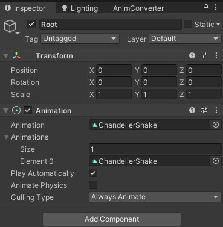
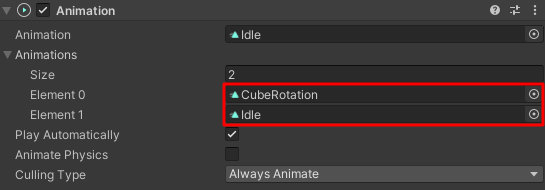

# How to Animate Objects - Troubleshooting

This is the page to see when you cannot perform each step in [How to Animate Objects](PropAnimation.md).

## About attaching HEOAnimation

### Behavior is different from what I expected

Deformation occurs when changing the Rotation of a child object of an object whose Scale has been changed. 
If you just want to rotate horizontally, but the object somehow stretches, the object you want to rotate may not have a Rotation of (0,0,0), or is a child object of which the parent object does not have the  Scale fixed to (1,1,1).

If behavior is strange, it is better to make the object containing HEOAnimation a child object of Position(0,0,0), Rotation(0,0,0), and Scale(1,1,1).

Also, the result of adding HEOAnimation is the same as changing the Rotation of the object in Unity.  
It is a good idea to check how it works on Unity before entering the values.

---

## About .hem file export

### Error occurs when exporting

There are several possible reasons why an error may occur when exporting a .hem file.

`KeyNotFoundException: The given key was not present in the dictionary.`

### 1. There is an animation that moves the object that is the export source

By selecting `Export Motion` targeting an object having an Animation component, the animation of said object will be exported. 
However, an error may occur if the animation is targeting the object itself is included.

In the case of the above image, an error is occurring because the `"Root"` object is trying to be animated.

×: Animation cannot be added, ○: Animation can be added 
The animation must only be targeting child objects.

### 2. Exporting too many different animations in a row

If you export animation continuously, an error may occur due to full cache or other unexpected reasons.

The error can be resolved by saving the current animation and reopening the edit window.

### Error occurs on loading screen

Even if the hem is successfully exported, an error may occur on the world loading screen after implementing the animation.

This may occur around 41% or 42%.

### Not set to Legacy animation

Animation that can be created by inserting the Animator component does not have Legacy settings.  
Please refer to step 4 of [How to Animate objects - Export .hem file (Heliodor Export Motion file)](PropAnimation.md#export-hem-file-heliodor-export-motion-file).

---

## About .heo file export

### Export fails

Exporting objects using Export Field may fail due to the following reasons:

### 1. You are using a shader that cannot be used with Vket Cloud

The shaders that Vket Cloud supports are limited.
If the shader cannot be used, it will be displayed as "UnknownShader" as shown in the image below.

### 2. There is a problem with the component settings

In the image above, the error `Index was out of range` is displayed.  
This error occurs when you try to handle a mesh without uv2 with MeshRenderer, so you can avoid it by creating uv2 or using SkinnedMeshRenderer.

!!! caution "Notice on SkinnedMeshRenderer"
    As objects with SkinnedMeshRenderer cannot be animated on hem animations, recreate the mesh if this object is intended to be animated.

Like this example, if the component settings are incorrect, the export may fail.

### 3. Exporting too many different objects in succession

As like animation in Vket Cloud, if you export various objects continuously, an error may occur.  
Restart the Unity Editor and then try exporting if such error happens.

## The export is successful, but it is not displayed on the scene

### 4. The object position is incorrect

Unless there is a special reason, set the position of the export source object to (0,0,0).  
When placed in the scene as a HEOObject, the position will be where the object position of HEOObject, added with the position of the export source object.

Example: If the position of the export source object is (5, 2, 10) and the position of the HEOObject attached object is (-3, 2, -6), the displaying position will be (2, 4, 4)

### 5. The shader of the export source object is not compatible with Vket Cloud

Objects may not be displayed because the shader is unsupported.  
Please try changing it to something like Standard and see if it appears.

!!! note
        After build, select VketCloudSDK > Tools > Open Release Folder, go to data > Scene, and search for the exported object name in the json file (scene json) to check the exported object information on the scene.  
        If there are no hits after searching, it is not displayed on the scene.

## After restarting Unity after exporting, the project no longer starts

Rare error to happen.
The cause is a false positive by the batch file used for texture compression.

To solve it you need to remove the batch file causing the error.  
After compressing the texture, the batch file is no longer needed, so it is a good idea to compress the texture beforehand and then delete it.

---

## About HEOObject animation

### Animation not playing

### 1. Animation and object hierarchy/name do not match

VketCloud animations are performed on hierarchies and names.  
For example, if you create an animation that changes the position of the child object "Object_1", the child object named "Object_1" will be moved using the object hierarchy exported as HEOObject as the origin.

At this case, the object type of Object_1 is allowed to be set different when exporting the animation and when implementing the object.

Also, the name of the parent object that serves as the origin is allowed to be set different.

### 2. Animation is not applied

Even if the animation is applied, it does not play for some reason, such as switching the HEOObject's Object Type to Motion and forgetting to insert the animation, or trying to play the animation with a PlayItem but not being able to execute the playback trigger.

In this case, the quickest way is to "check the loop, bring it to Index 0, and check whether it is working."

If it moves, there is a problem with the animation playback trigger.

If it still doesn't work, there is a problem with creating the animation, so you may want to review the process of creating the HEM.

### 3. Multiple animations are allocated on exporting hem file

As the image below, if multiple animations are allocated in Animation component / Animations on exporting a hem file, it may lead to unintended animation behavior.

When exporting an animation, be sure that the component only has **one** animation allocated at a time.

