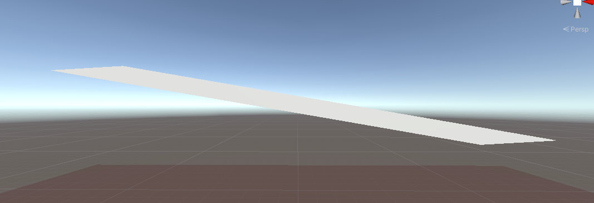
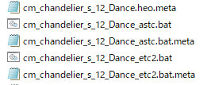

# オブジェクトをアニメーションさせる - できないときは

[オブジェクトをアニメーションさせる](PropAnimation.md) にて、各手順が出来ないときに見るページです。

## HEOAnimationのアタッチについて

### 思っていた挙動と異なる

Scaleを変更したオブジェクトの子オブジェクトのRotationを変更すると変形が発生する 
横方向に回転させたかっただけなのになぜか物体が伸びてしまうといった現象は、回転させたいオブジェクトがRotationが(0,0,0)ではない、または、Scaleが(1,1,1)ではないオブジェクトの子オブジェクトだからであることが考えられます。

動作が変な場合、HEOAnimationを入れるオブジェクトは、Position(0,0,0)、Rotation(0,0,0)、Scale(1,1,1)の子オブジェクトにした方が良いでしょう。

また、HEOAnimationを入れた動作結果は、Unity上で該当オブジェクトのRotationを変更したものと同じになります。 
予めUnity上でどのように動作するか確認してから値を入力すると良いでしょう。

---

## .hemファイル書き出しについて

### 書き出し時にエラーが出る

.hemファイルの書き出しでエラーが出る要因はいくつか考えられます。

`KeyNotFoundException: The given key was not present in the dictionary.`

### ①書き出し元となるオブジェクトを動かすアニメーションがある

Animationコンポーネントを持つオブジェクトを選択した状態でExport Motionを選択することでそのオブジェクトのアニメーションが書き出されますが、書き出し元となるオブジェクト自体に対するアニメーションが入っていたらエラーとなります。

上記画像の場合、Animationコンポーネントを持つオブジェクト「Root」を直接アニメーションで動かそうとしているため、エラーとなります。

× : アニメーションを付けられない、○ : 付けられる 
子オブジェクトを対象としたアニメーションにする必要があります。

### ②連続で色々なアニメーションを書き出しすぎている

アニメーションの書き出しを連続で行うと、キャッシュが溜まっているのか、エラーとなる要素が無くてもエラーになる場合があります。

現状のアニメーション編集シーンを一度保存し、再度開きなおすことでエラーが解消されます。

### ローディング画面でエラーが出る

hemの書き出しに成功しても、アニメーションを実装した後ローディング画面でエラーとなる場合もあります。

だいたい41%か42％あたりでこれが出る

### Legacyアニメーションにしていない

Animatorコンポーネントを入れることで作成できるAnimationではLegacy設定がされていません。 
[オブジェクトをアニメーションさせる - .hemファイル書き出し](PropAnimation.md#hemheliodor-export-motion#hemheliodor-export-motion)の④に記載があるので、参考にしてみてください。

---

## .heoファイル書き出しについて

### 書き出しに失敗する

Export Fieldでのオブジェクト書き出しが失敗することがあります。

### ①Vket Cloudで使用できないシェーダーを使っている

Vket Cloudが対応しているシェーダーは限られています。
使用できないシェーダーの場合、下記画像のように「UnknownShader」として表示されます。

### ②コンポーネント設定に不備がある

上記画像では、`Index was out of range`のエラーが表示されています。 
こちらのエラーはuv2のないメッシュをMeshRendererで扱おうとすると発生するため、uv2の作成またはSkinnedMeshRendererの使用によって回避できます。

!!! caution "SkinnedMeshRendererに関する注意"
    SkinnedMeshRendererを用いたオブジェクトはhemアニメーションで動かすことができないため、アニメーションで動かすオブジェクトを作成したいときはメッシュの作り直しで対応しましょう。

この例のように、コンポーネント設定に不備がある場合に書き出しが失敗する場合があります。

### ③連続で色々なオブジェクトを書き出しすぎている

アニメーション同様、連続で色々なオブジェクトを書き出しているとエラーとなる場合があります。 
一度Unityシーンを再起動してから書き出しを行ってみましょう。

## 書き出しは成功するが、シーン上に表示されない

### ①書き出し座標がおかしい

特例が無い限り、書き出し元オブジェクトの座標は(0,0,0)にしておきましょう。 
HEOObjectとしてシーンに配置した際の座標は、HEOObjectがアタッチされたオブジェクトの座標 + 書き出し元オブジェクトの座標となります。

例：書き出し元オブジェクトの座標 = (5, 2, 10) 、HEOObjectアタッチオブジェクトの座標 = (-3, 2, -6)の場合、シーン表示位置 = (2 , 4 , 4)となる

### ②書き出し元オブジェクトのシェーダーがVketCloudに対応していない

シェーダーが対応していないため表示されていない可能性があります。 
Standardなどに変更してみて表示されるかどうかお試しください。

!!! note 
        ビルド後にVketCloudSDK > Tools > Open Release Folderを選択し、data > Sceneと遷移舌先で確認できるjsonファイル(シーンjson)にて、書き出したオブジェクト名を検索することで、シーン上での書き出しオブジェクト情報を確認することができます。 
        検索してもヒットしない場合は、シーン上に反映されていません。

## 書き出し後Unityを再起動したら、プロジェクトが立ち上がらなくなった

稀にあります。 
原因は、テクスチャ圧縮用のbatの誤検知です。

解決するためには、batを削除する必要があります。 
テクスチャ圧縮を行った後、batは不要となるため、予めテクスチャ圧縮を行ってから削除すると良いでしょう。

---

## HEOObjectのアニメーションについて

### アニメーションが再生されない

### ①アニメーションとオブジェクト階層・名称が一致していない

VketCloudのアニメーションは、階層と名称に対して実行します。 
例えば、子オブジェクト「Object_1」のPositionを変更するアニメーションを作成した場合、HEOObjectとして書き出しを行ったオブジェクト階層を原点として、子オブジェクトとなる「Object_1」という名称のオブジェクトを動かす、ということになります。

この時、Object_1のオブジェクトの種類はアニメーション書き出し時とオブジェクト実装時で異なっていても構いません。

また、原点となる親オブジェクトの名称は異なっていても構いません。

### ②アニメーションが適用されていない

HEOObjectのObject TypeをMotionに切り替えてアニメーションを入れるのを忘れた、PlayItemでアニメーションを再生するようにはしたが再生トリガーが実行できていない、など、アニメーションを適用しても何らかの理由で再生されないことがあります。

こういった場合、「loopにチェックマークを入れ、Index 0に持ってきて動いているかどうかを調査する」のが一番手っ取り早いです。

動く場合、アニメーション再生トリガーに問題があります。

それでも動かない場合、アニメーションの作りに問題があるので、HEM作成までの過程を見直してみると良いでしょう。
