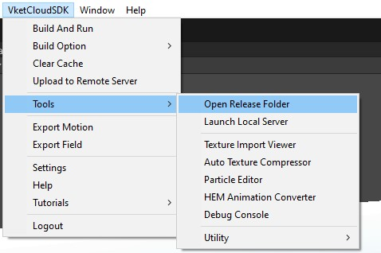
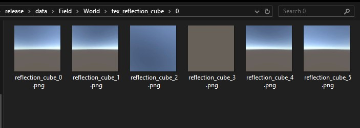
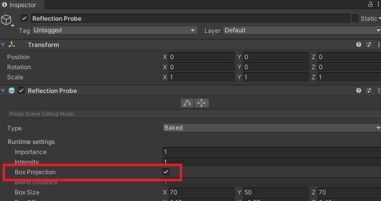
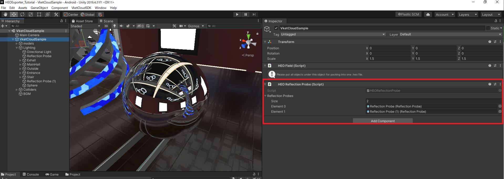

# リフレクションプローブ

(旧題：反射を映り込ませるには)

!!! note Info
    リフレクションプローブとは何か / 基本的な使い方については、Unityの公式ドキュメント等([こちら](https://docs.unity3d.com/ja/2019.4/Manual/class-ReflectionProbe.html){target=blank})をご覧ください。

Vket Cloudで使用されるリフレクションプローブは、プリミティブ単位ではなくヒエラルキー上のオブジェクト単位で決定されます。

**オブジェクトのMeshRenderer/Probesの項目に羅列されているリフレクションプローブの中で「一番Weightの数値が大きいもの」が、そのオブジェクトが使用するリフレクションプローブのインデックスとして書き出される**のでご注意ください。

このWeight値は、リフレクションプローブとオブジェクトの距離を基準に計算されます。またVket Cloudではリフレクションプローブのブレンドはサポートしていません。

---

## リフレクションプローブの設定方法

Ver12.3以降のVketCloudSDKでは、ワールドのビルド時にReflection Probeが自動検出されてVket Cloud仕様に変換されます。

1. Reflection ProbeをアタッチしたGameObjectをシーン内に配置します。

    例として、ここでは"RefProbe"という名前の空のGameObjectを作成し、Reflection Probeをアタッチします。

    

    

2. リフレクションプローブを以下のように設定し「Bake」を押します。

    - Type: Baked
    - HDR: *チェック無し*
    - Resolution:  任意 (負荷と反射させる面の大きさを考慮して指定してください)

    

3. VketCloudSDKメニューよりBuild And Runを実行し、data/Field/Worldのtex_reflection_probeフォルダにテクスチャファイルが入っていれば成功です。

    テクスチャファイルの有無はVketCloudSDK > Open Release Folderを選択し、release/data/Field/Worldに移動すると確認できます。

    

    

!!! caution "リフレクションプローブを書き出す際の注意点"

    - 大きめのオブジェクト(床・壁・面が巨大なオブジェクト)にリフレクションプローブの反射を使用する場合は、ベイクするキューブマップの解像度を高めに設定してください(2048など)。大きめのオブジェクトに反射させる場合、画質が大幅に低下してしまうためです。

    - Unity上では反射があるのにVketCloud上では真っ黒になってしまうオブジェクトがある場合、そのオブジェクトに作用するリフレクションプローブが『HEOReflectionProbe』のReflectionProbesに登録されているか・そのリフレクションプローブがUnity上で非表示になっていないかを確認してください。

    - リフレクションプローブの個数制限は特にありませんが、リフレクションプローブ1つあたり6枚テクスチャを使用します。**個数が増えるほど負荷が掛かるので、負荷と描画のバランスを見て個数を指定してください**。なお、UnityのStandard Shaderの使用を想定しています。

## Box Projection(カメラ位置により移動する反射)について

Vket Cloudでは、UnityのリフレクションプローブのBox Projectionを任意で使用することができます。

1\. Unity上でリフレクションプローブの『Box Projection』にチェックを入れます。(LightMapを使用している場合、押せないことがあります)

2\. リフレクションプローブのオブジェクトを必ずこれからエクスポートするオブジェクトの子要素にします。(Box ProjectionはTransformを使用するため)

3\. 上記の『リフレクションプローブの設定方法』に従い、Build and Runを実行します。

---

## 旧バージョンにおける設定方法

!!! caution "HEOReflectionProbeの廃止"
    Ver12.3において、HEOReflectionProbeコンポーネントは廃止されました。 
    以下の設定方法はアーカイブのために掲載されております。

1\. リフレクションプローブを以下のように設定し「Bake」を押します。

    - Type: Baked 
    - HDR: *チェック無し* 
    - Resolution:  任意 (負荷と反射させる面の大きさを考慮して指定してください) 

2\. Bakeを押した後に「リフレクションプローブ用」のキューブマップが作成されますのでそちらの設定項目にある「Advanced→Read/Write Enabled」にチェックを入れて『Apply』を押します。

3\. エクスポートしたいオブジェクトの一番親の階層のオブジェクト(VketCloudSample)に「HEOReflectionProbe.cs」をアタッチします。その後インスペクターから「HEOReflectionProbe/ReflectionProbes」にエクスポートしたいリフレクションプローブを任意の数アタッチします。

4\. リフレクションプローブ自体をこれからエクスポートするオブジェクトの子要素にします。(リフレクションプローブではTransformを使用することがあるため一緒にエクスポートする必要があります)

5\. BuildAndRunを実行します。

このHEOファイルをVket Cloudで読み込んで表示したサンプルは以下のものになります。

