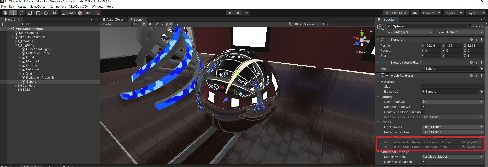
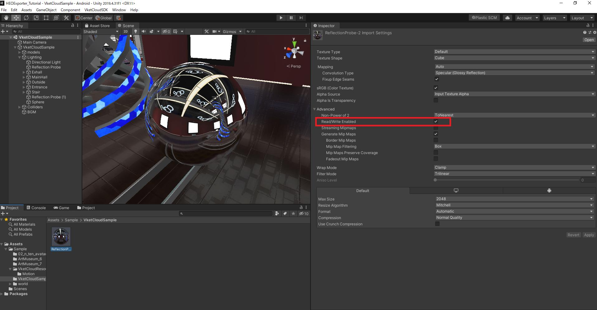

# リフレクションプローブ

(旧題：反射を映り込ませるには)

!!! note Info
    リフレクションプローブの基本的な使い方については、Unityの公式ドキュメント等([こちら](https://docs.unity3d.com/ja/2018.4/Manual/class-ReflectionProbe.html){target=blank})をご覧ください。

Vket Cloudで使用されるリフレクションプローブは、プリミティブ単位ではなくヒエラルキー上のオブジェクト単位で決定されます。

**オブジェクトのMeshRenderer/Probesの項目に羅列されているリフレクションプローブの中で「一番Weightの数値が大きいもの」が、そのオブジェクトが使用するリフレクションプローブのインデックスとして書き出される**のでご注意ください。

このWeight値は、リフレクションプローブとオブジェクトの距離を基準に計算されます。またVket Cloudではリフレクションプローブのブレンドはサポートしていません。

---

## リフレクションプローブの書き出し方法
1\. リフレクションプローブを以下のように設定し「Bake」を押します。

    - Type: Baked 
    - HDR: *チェック無し* 
    - Resolution:  任意 (負荷と反射させる面の大きさを考慮して指定してください) 

2\. Bakeを押した後に「リフレクションプローブ用」のキューブマップが作成されますのでそちらの設定項目にある「Advanced→Read/Write Enabled」にチェックを入れて『Apply』を押します。

3\. エクスポートしたいオブジェクトの一番親の階層のオブジェクト(VketCloudSample)に「HEOReflectionProbe.cs」をアタッチします。その後インスペクターから「HEOReflectionProbe/ReflectionProbes」にエクスポートしたいリフレクションプローブを任意の数アタッチします。

4\. リフレクションプローブ自体をこれからエクスポートするオブジェクトの子要素にします。(リフレクションプローブではTransformを使用することがあるため一緒にエクスポートする必要があります)

5\. BuildAndRunを実行します。

このHEOファイルをVket Cloudで読み込んで表示したサンプルは以下のものになります。

## Box Projection(カメラ位置により移動する反射)について
Vket Cloudでは、UnityのリフレクションプローブのBox Projectionを任意で使用することができます。

1\. Unity上でリフレクションプローブの『Box Projection』にチェックを入れます。(LightMapを使用している場合、押せないことがあります)

2\. リフレクションプローブのオブジェクトを必ずこれからエクスポートするオブジェクトの子要素にします。(Box ProjectionはTransformを使用するため)

3\. 上記の『リフレクションプローブの書き出し方法』に従い、BuildAndRunを実行します。

!!! caution "リフレクションプローブを書き出す際の注意点"

    - 大きめのオブジェクト(床・壁・面が巨大なオブジェクト)にリフレクションプローブの反射を使用する場合は、ベイクするキューブマップの解像度を高めに設定してください(2048など)。大きめのオブジェクトに反射させる場合、画質が大幅に低下してしまうためです。

    - Unity上では反射があるのにVketCloud上では真っ黒になってしまうオブジェクトがある場合、そのオブジェクトに作用するリフレクションプローブが『HEOReflectionProbe』のReflectionProbesに登録されているか・そのリフレクションプローブがUnity上で非表示になっていないかを確認してください。

    - リフレクションプローブの個数制限は特にありませんが、リフレクションプローブ1つあたり6枚テクスチャを使用します。**個数が増えるほど負荷が掛かるので、負荷と描画のバランスを見て個数を指定してください**。なお、UnityのStandard Shaderの使用を想定しています。