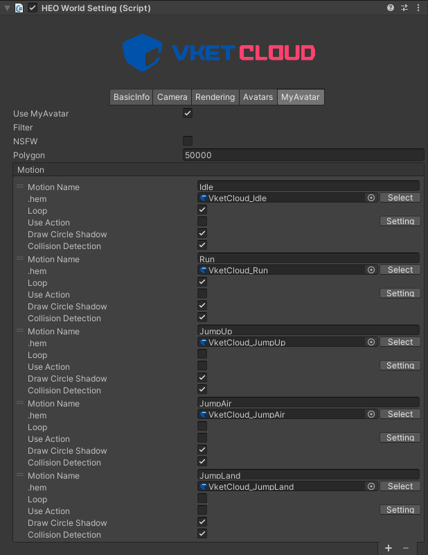

# Optimization for Smartphones

Ultimately, Vket Cloud can build a metaverse accessible for any device (PC, smartphone, tablets, etc.) as long as it meets the [Operating Environment](../AboutVketCloudSDK/OperatingEnvironment.md) requirements.

However, to reduce stress during playing and increase the overall performance, the creator must make effort for optimization as much as possible. 
For devices with weaker machine power (e.g. smartphones), optimization is vital to realize the same play experience as PC.

Few points on world optimization for smartphones will be discussed below.

## Criteria for Optimization

As an example for a criteria of smartphone optimization, world resources should be fulfilling the specs below on an average.

- Total Polygon Count: Below 600k triangles
- Texture capacity: Below 60MB
- Average draw call: Below 300
- Maximum draw call: Below 600

The total polygon count will be displayed on build at the Console as `NumofPolygon`. *If heo files are loaded using [HEOObject](../HEOComponents/HEOObject.md), the total number will be displayed on field export.

Texture capacity will can be counted by seeing the tex folder's size located under data/Field of the release folder.

As the features below causes heavier processing load, performance testing is recommended on using.

- Bloom effects
- Placing multiple particles
- Wide-range mesh colliders

## Specifications on Avatars

On Vket Cloud, the player can choose their avatar from their [My Avatar](../AboutVketCloudSDK/SetupAvatar.md) or the world's [Preset Avatar](../WorldMakingGuide/PresetAvatar.md). 
While this makes diversity in avatar selection, drawing avatars may cost heavier processing on worlds with many players gathering.

As a solution for avatar drawing, the world can set a max polygon limit or disable My Avatars via [HEOWorldSetting / MyAvatar](../HEOComponents/HEOWorldSetting.md#_5).  
For instance, on default the max polygon limit is set to 50,000, this can be revised to 20,000 on larger worlds with many players intended to gather.

The avatars exceeding the polygon limit will be replaced automatically to the world's [Dummy Avatar](../HEOComponents/HEOWorldSetting.md#_4) 
The dummy avatar can be set by exporting an [heo file](../WorldMakingGuide/HEOExporter_Tutorial.md) and allocating it on [Avatar Settings](../HEOComponents/HEOWorldSetting.md#_4).

Default dummy avatar on the SDK:

Also, users without an My Avatar / not logged in, or on My Avatar disabled worlds, the 1st avatar on the [Preset Avatar](../WorldMakingGuide/PresetAvatar.md) list will be allocated automatically on world enter. 

## Reducing load time

Generally, the player likes shorter load time, which contributes to waiting shorter on entering the world. 
On the SDK, [Dynamic Loading](../HEOComponents/HEOField.md) is available to split world resources and reducing load time before entrance.

For weaker devices such as smartphones, the world could be split for optimization by Lobby / Hallway / Main Room / etc. to organize the total resources loaded at once. 
On browser consoles, the creator can inspect resources loaded during entrance to find out which resource is causing longer load time.

For implementation details, see [Dynamic Loading](../HEOComponents/HEOField.md).

## Reformatting / Optimizing Textures

For better Vket Cloud world performance on smartphones, reducing / compressing textures are vital to solve load time and drawing bottlenecks.

On the SDK, [Export Compressed Texture](../SDKTools/ExportCompressedTexture.md) is provided as a formatting tool.  
By using this tool, the non-png / height or width not being a power of 2 texture images will be reformatted according to [Vket Cloud Specifications](../WorldMakingGuide/UnityGuidelines.md#_2), compressing as much textures as possible is recommended. 
During the reformat, the texture resolution can be reduced as well, which reduces load when loading the resources.

For instructions on texture compression, see [Texture Compression](./TextureCompression.md) or [Export Compressed Texture](../SDKTools/ExportCompressedTexture.md).

## Optimizing in-world performance and world flow

By enabling the [Debug Mode](../WorldEditingTips/DebugMode.md), the creator can view information such as FPS, draw call, etc.

As optimization features in Unity such as Static Baching is not supported on Vket Cloud, draw call will increase when the same mesh / same material object is duplicated.

Therefore, the world creator must explicitly implement optimizations. The process below are considered effective:

- Deleting objects outside the accessible range
- Merge mesh and texture using modeling tools or MeshBaker
- Reduce polygons and merging materials on modeling tools
- Use billboards for backgrounds

ALso, [Dynamic Loading](../HEOComponents/HEOField.md) and [Occlusion Culling](./OcclusionCulling.md) are also effective to reduce loads.

