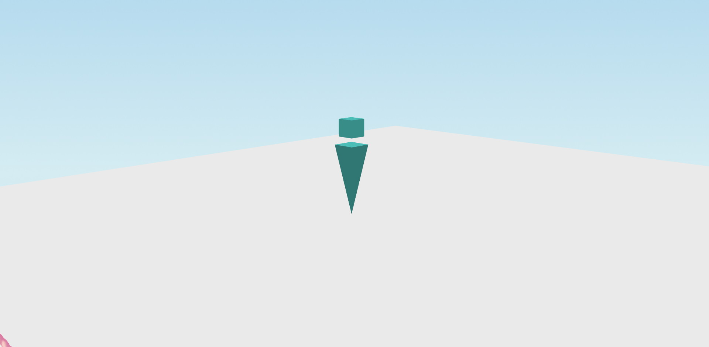

# スマートフォンのためのワールド軽量化

Vket Cloudは究極にはウェブブラウザが開けて、[端末スペック](../AboutVketCloudSDK/OperatingEnvironment.md)を満たすデバイスであればPC / スマートフォン / タブレット等端末の大小を問わずにアクセスできるメタバースを構築することができます。

しかし一方で、各ワールドにおける動作の快適さやストレスの少なさを実現するためにワールドの軽量化は必須であり、ワールド制作者は可能な限り動作の快適性に気を配る必要があります。 
特に、スマートフォンなどPCと比べてスペックが弱めの端末にて遜色のない動作体験を作るには、PC以上に軽量化を意識した制作が重要といえます。

以下にスマートフォン向けの対応を考える際にワールドとして気を付けるべきポイントを述べます。

## スマートフォン向けビルド時の一括変換機能について

VketCloud SDKではビルド時のオプションにてテクスチャやアバターファイル、パーティクルを一括でスマートフォン向けに軽量化変換する機能を備えております。

詳しくは[ビルド時のオプション](../WorldEditingTips/BuildOptions.md)のページをご参照ください。

## 軽量化の目安

スマートフォン用の軽量化の目安として、一度に読みこまれているワールドのリソースが下記のような要件を満たしていることが一つの基準と考えられます：

- ポリゴン数：60万トライアングル以下
- テクスチャ容量：60MB以下
- ワールドの平均ドローコール数：300以下
- ワールドの最大ドローコール数：600以下

ポリゴン数は、ビルド時にConsoleに表示されるNumofPolygonの総計 ([HEOObject](../HEOComponents/HEOObject.md)でheoファイルを読みこんでいる場合はフィールドのエクスポートを行ったとき)に表示されています。

また、テクスチャ容量は、releaseフォルダ内のdata/Field配下に存在するフォルダ内にあるtexフォルダの容量の総計で算出することができます。

以下の項目は処理負荷が高いため、使用する際は制作中のワールドで問題なく動作するかについて十分なテストを行う必要があります。

- ブルーム
- 大量のパーティクル設置
- 範囲の広いメッシュコライダー

## アバターの制限について

Vket Cloudにて、プレイヤーは自分の[マイアバター](../AboutVketCloudSDK/SetupAvatar.md)もしくはワールド付属の[プリセットアバター](../WorldMakingGuide/PresetAvatar.md)の二択から自身のアバターを選択できます。 
これによって幅広いアバターの選択肢が生まれる一方で、大人数が集まるようなワールドではアバターの描画がデバイスにとって負荷となる場合があります。

アバターによる描画負荷の対策として、ワールド側の対策として[HEOWorldSetting / MyAvatar](../HEOComponents/HEOWorldSetting.md#_5)においてワールド内で使用できるアバターの最大ポリゴン数、あるいはマイアバターの使用に制限を設けることができます。 
デフォルトでは50,000ポリゴンを上限としていますが、例として大人数が集まる場合は20,000ポリゴンまで下げる、といった設定が考えられます。

この時、ポリゴン上限を超えたポリゴン数のアバターは、ワールドにて設定された[ダミーアバター](../HEOComponents/HEOWorldSetting.md#_4)に変更されます。 
ダミーアバターの見た目は[heoファイル](../WorldMakingGuide/HEOExporter_Tutorial.md)の出力と[アバター設定](../HEOComponents/HEOWorldSetting.md#_4)での差し替えによって変えることができます。

SDKデフォルトのダミーアバター：

また、マイアバターを持っていない/利用が制限されている、あるいは未ログインのユーザーはワールド入場時に自動的に[プリセットアバター](../WorldMakingGuide/PresetAvatar.md)の1番目のアバターが割り当てられます。 

## ロード時間の短縮のために

プレイヤーにとって、ワールド入場時のロード時間はなるべく短い方が体験時のストレスが少ない傾向にあります。 
SDKでは、入場前のロード時間を短縮するためにワールドのリソースを分割する[動的ローディング](../HEOComponents/HEOField.md)が使用できます。

特にスマートフォンなどPCに比べて処理に制約があるデバイスにおいては、例として入口 / 廊下 / メインの部屋...と細かくワールド内を分けることで一度に読み込まれるリソース量を分割すると負荷軽減の面において効果的です。 
また、ブラウザの開発コンソールにおいてワールド入場時の読み込まれるリソースを分析することで、読み込み時間の負荷の原因となっているリソースを探し出すのも有効です。

詳細な実装方法は[動的ローディング](../HEOComponents/HEOField.md)をご参照ください。

## テクスチャの再フォーマットと負荷軽減

Vket Cloudにおいてスマートフォンにおける快適な動作を実現するためには、ロード時間と描画のボトルネックとなるテクスチャの削減と圧縮は非常に効果的といえます。

SDKではフォーマットツールとして[Export Compressed Texture](../SDKTools/ExportCompressedTexture.md)が用意されています。 
これを使用すると、png以外 / 縦横サイズが2の累乗でないテクスチャ画像を[Vket Cloudの仕様制限](../WorldMakingGuide/UnityGuidelines.md#_2)に合わせてフォーマットするため、なるべく多くのテクスチャを変換することをお勧めします。 
このとき、テクスチャの解像度を下げる設定もツール内で併せて行うと、リソース読み込み時の負荷軽減につながります。

テクスチャの圧縮方法については[テクスチャ圧縮](./TextureCompression.md)及び[Export Compressed Texture](../SDKTools/ExportCompressedTexture.md)をご参照ください。

## ワールド内動作の改善とワールドの導線設計

ワールド内では[デバッグモード](../WorldEditingTips/DebugMode.md)を有効にするとFPS、ドローコールなどの情報が見られます。

なお、Static BatchingなどといったUnity側の軽減機能はVket Cloudにないため、同メッシュ同マテリアルのオブジェクトだとしても、置いた分だけドローコールが増えます。

そのため、ワールド制作者は明示的な容量削減を行う必要があります。具体的には、以下のような作業が有効です：

- 行ける範囲外のオブジェクトは削除
- モデリングツールもしくはMeshBakerなどを使用してメッシュとテクスチャを統合
- モデリングツール上でポリゴン数を削減、マテリアルを統合
- 遠景のビルボード（画像）化

また、一度に読み込まれるリソースを削減するために、[動的ローディング](../HEOComponents/HEOField.md)及び[オクルージョンカリング](./OcclusionCulling.md)が有効です。

