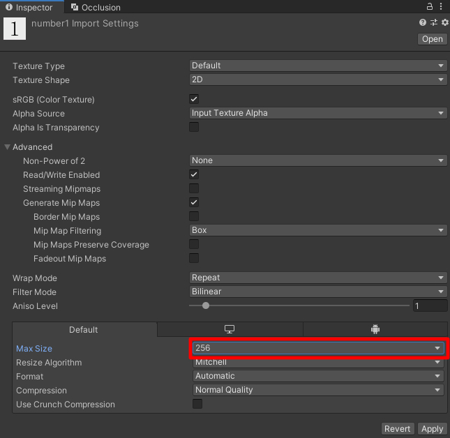

# Texture Compression

On Vket Cloud, the initial load time can be optimized by compressing the texture size used by world objects and avatars.

As future updates may involve automatic compression/formatting by server, the world creator should consider optimizing their texture to enable better performance on diverse PC/smartphone environments.

## How to do a texture compression

VketCloudSDK has a texture compression/formatting tool named as [Export Compressed Texture](../SDKTools/ExportCompressedTexture.md).

This tool will generate a compressed texture image according to the [MaxSize](https://docs.unity3d.com/ja/2019.4/Manual/class-TextureImporter.html){target=_blank} set on the texture settings.

If the image is a non-png format or width-height size is not set to power of 2, it will be reformatted. Optionally, if the original image is referenced by materials, it can be replaced automatically to the generated image.

For instructions, refer to [Export Compressed Texture](../SDKTools/ExportCompressedTexture.md).

Alternative compression methods are also considered, such as using free png-compression tools (e.g. [PNGGauntlet](https://pnggauntlet.com/){target=_blank}), or editing the image on Photoshop and other editing softwares.

Feel free to use your own tools!
