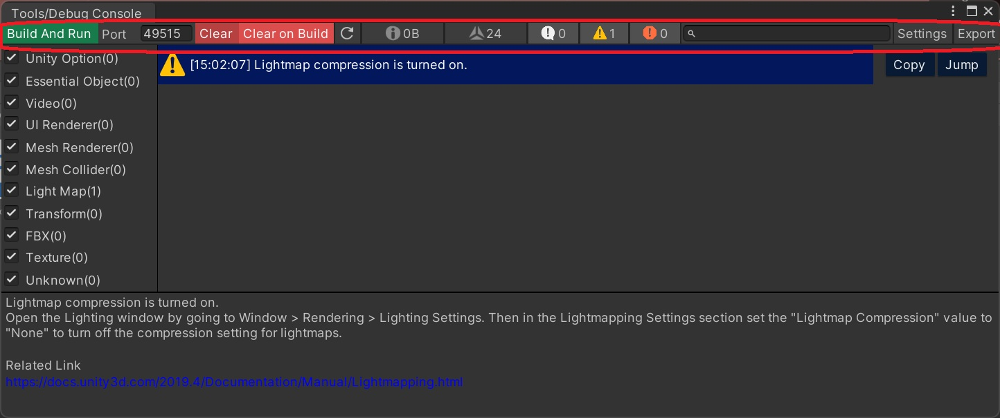
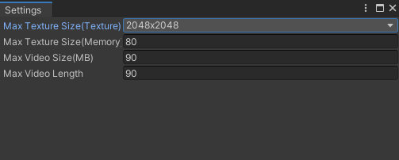
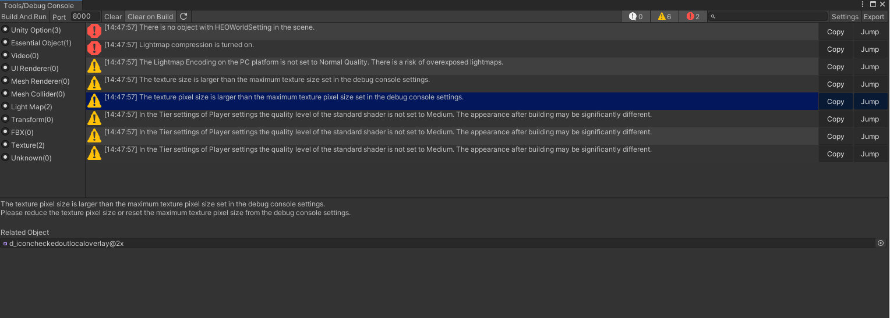
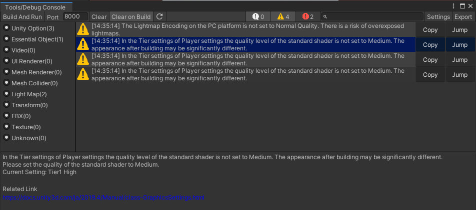

# Debug Console

The debug console is the tool for troubleshooting issues and debugging when developing worlds on VketCloudSDK.  
Main purpose of the console is to provide realtime information about function behaviour and status of running programs.

Main features of the debug console are the following:

1. **Displaying logs and filtering**: Log messages generated from the running application will be shown on the debug console.  The logs may be filtered by type. (e.g. messages, warnings, and errors)
2. **Searching logs**: The log entry containing a certain keyword or phrase may be searched. This enables swift access to the important information.
3. **Copying logs**: Log messages and stack traces may be copied on the clipboard.  This provides easy sharing of important information, and analyzing on other tools.
4. **Exporting logs**: Log data may be exported as an external file (e.g. JSON format).  This provides log data backup and analysis on other environments.

The debug console is useful for the developers' need to watch log information generated during the application execution, to find the cause of issues and debug. 
This tool is vital especially for developing complex systems and large-scale projects.

## How to open the Debug Console
Select the `Tools` on the VketCloudSDK tab, and open the debug console window by selecting `Debug Console`.

## Differences between the Unity Console
1. **Built-in support** especially for world developing on VketCloudSDK, including specialized display, filtering, originally implemented error types
2. **Reinforced search feature**: The debug console provides searching for log messages.   The developer may access the related information by swift searching the log containing a certain keyword/phrase.  This feature allows easier finding of information from massive log data.
3. **Log copying**: The debug console allows easy copy of log messages and stack traces.  The developer may share the information via copying on the clipboard, or analyzing it by pasting it on other tools.
4. **Log exporting**: The debug console provides exporting log data as an external file.  The developer may take backup of log data, and share the log in a handier way. 

The debug console contains flexible customization and advanced features which are unable on the default Unity console. 
This provides the developer an environment for effective debugging and problem solving.

## UI Details
### Toolbar Details

| Label | Function |
|----|----|
| Build and Run | Builds the world, and runs the result on the local environment. |
| Port | Enter the port number for running the world locally. (Initially set to 8000) |
| Clear | Clears all log entries.  Unsolved issues will re-appear if unsolved. |
| Clear on Build | Toggle setting for automatic log cleanup on build. |
| World Size | Displays the total size of world on build. |
| Texture Size | Displays the total size of textures included in the world. |
| Log | Toggle filter for log display, also showing the total of logs. | 
| Warning | Toggle filter for Warning display, also showing the total of Warnings. | 
| Error | Toggle filter for Error display, also showing the total of Errors. | 
| Search Box | Search box for searching log entries by keyword/phrases.  |
| Settings | Button for opening the Settings.  Settings details are on the following passage. |
| Export | Exports the console log on a json file. |

### Debug Console Settings

The debug console settings may be accessed via the `Settings` button on the console toolbar.
The developer may designate a limit value on world resources, to generate a warning entry on the debug console when a resource overwhelms a limit value.

| Label | Function | Initial Value |
|----|----|----|
| Max Texture Size (Texture) | Designates a maximum pixel-area size of textures by the power of 2. | 2048*2048 |
| Max Texture Size (Memory) | Designates a maximum memory size of textures. | 80 |
| Max Video Size (MB) | Designates a maximum file size for video files by MB. | 90 |
| Max Video Length | Designates a maximum length for video files by seconds. | 90 |

### Log-type Panel (Panel on left-side)

The log-type panel filters log entries by originally defined log types.  
Each radio button toggles the filters. 
Errors unknown by the SDK (Compile Error, Runtime Error, etc. ) will be filtered to the Unknown type.

### Log Entry List (Panel on right-side)

The log entry list displays the errors and log entries. 
Clicking each entry will show the details on the bottom panel. 
The `Copy` button copies the log details on the clipboard. 
The `Jump` button opens the related script or GameObject if set. 
Also, the related link will open on the browser if set.

### Log Details (Panel on bottom)

The log details contains the following information: 
(Log may not contain Related Object, Related Link, and Related Log if there is nothing set.)

| Label | Meaning |
|----|----|
| `Message` | Shows the message in the selected log entry. |
| `StackTrace` | Shows the stack trace in the selected log entry. |
| `Hint` | Shows the hint information in the selected log entry.  |
| `Related Object` | Shows the related object in the selected log entry.  The field for selecting the GameObject will be shown. |
| `Related Link` | Shows the related link, opening the link when clicked. |
| `Related Log` | Shows the details of the related log.   The log group, type, message, stack trace, etc. will be shown. |

### Examples of Log Details:

